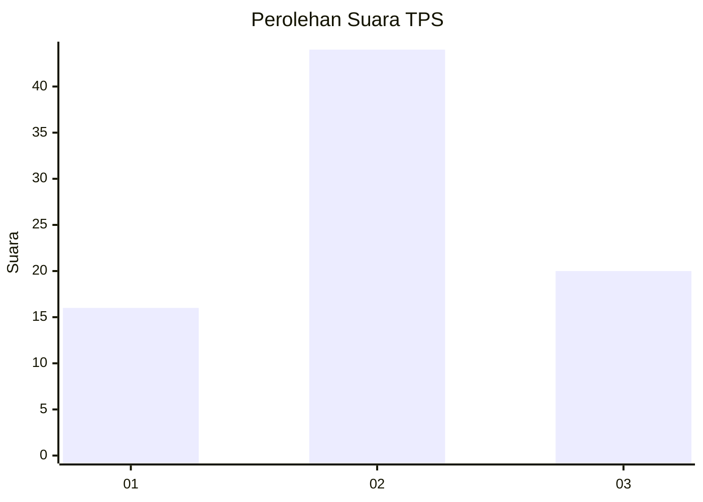
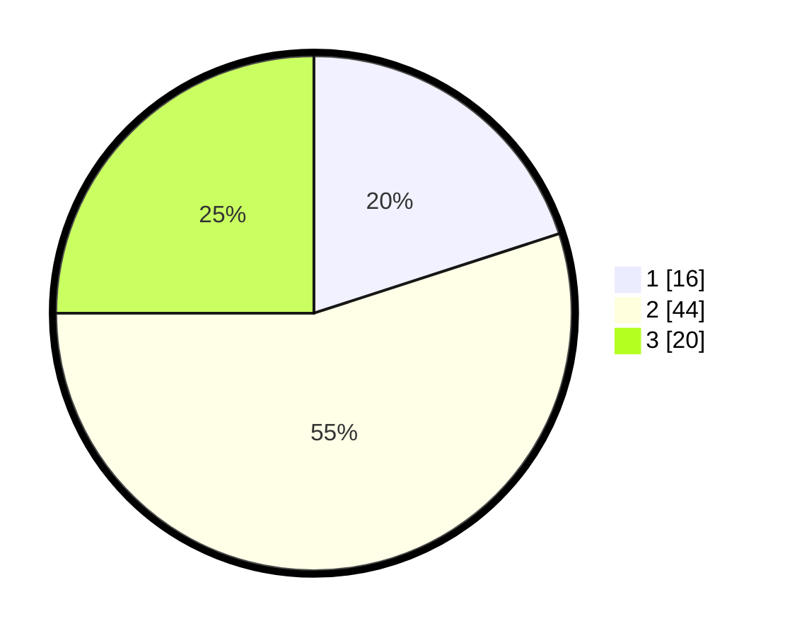

# Hasil

## Grafik

## Tabel

| No. | Nama Paslon    | Suara | Suara (raw) | Persentase |
|:--- |:-------------- | -----:| -----------:| ----------:|
| 1   | ANIES MUHAIMIN | 16    | [16][p-1]   | 20,00      |
| 2   | PRABOWO GIBRAN | 44    | [44][p-2]   | 55,00      |
| 3   | GANJAR MAHFUD  | 20    | [20][p-3]   | 25,00      |

[p-1]: https://github.com/gigit-pemilu/pemilu-2024-16-sumatera-selatan/blob/main/pilpres/hitung-suara/sub/16-sumatera-selatan/sub/02-ogan-komering-ilir/sub/15-sungai-menang/sub/2011-bumi-pratama-mandira/sub/016-tps/sub/paslon-1.txt
[p-2]: https://github.com/gigit-pemilu/pemilu-2024-16-sumatera-selatan/blob/main/pilpres/hitung-suara/sub/16-sumatera-selatan/sub/02-ogan-komering-ilir/sub/15-sungai-menang/sub/2011-bumi-pratama-mandira/sub/016-tps/sub/paslon-2.txt
[p-3]: https://github.com/gigit-pemilu/pemilu-2024-16-sumatera-selatan/blob/main/pilpres/hitung-suara/sub/16-sumatera-selatan/sub/02-ogan-komering-ilir/sub/15-sungai-menang/sub/2011-bumi-pratama-mandira/sub/016-tps/sub/paslon-3.txt

## Foto C Plano

https://sirekap-obj-formc.kpu.go.id/a9a2/pemilu/ppwp/16/02/15/20/11/1602152011016-20240214-235549--1955f76e-7057-4d66-84d6-aa6dc002839c.jpg

https://sirekap-obj-formc.kpu.go.id/a9a2/pemilu/ppwp/16/02/15/20/11/1602152011016-20240214-235907--268f3711-ce74-4f06-8ebb-dbcb7cd3e44c.jpg

https://sirekap-obj-formc.kpu.go.id/a9a2/pemilu/ppwp/16/02/15/20/11/1602152011016-20240215-000111--02c22524-e125-4028-bb22-fbf2dd6483d1.jpg

## Metadata

| Key        | Value               |
| ---------- | ------------------- |
| Time Stamp | 2024-02-19 18:00:00 |

