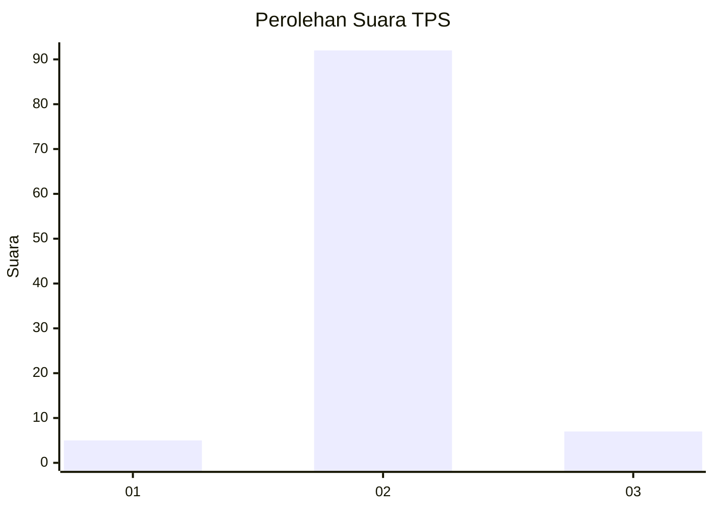
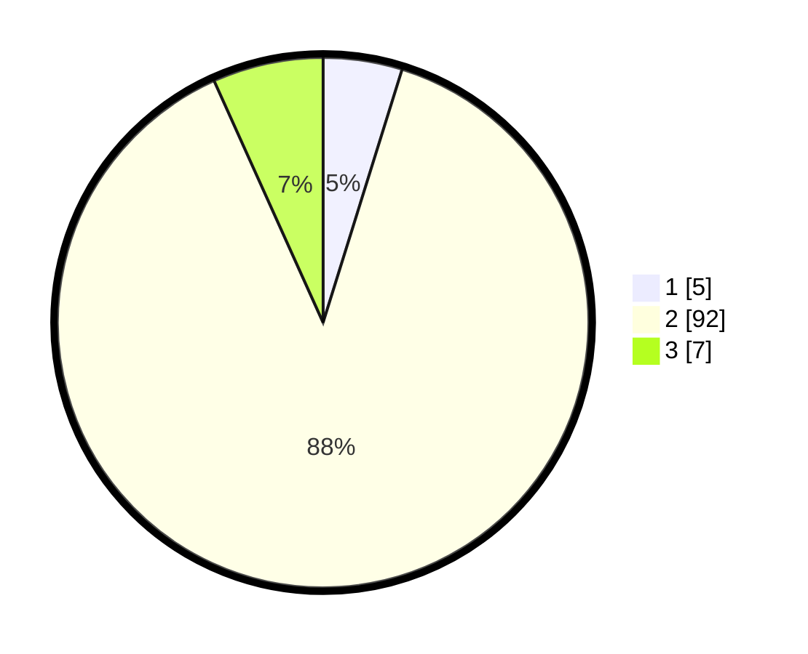

# Hasil

## Grafik

## Tabel

| No. | Nama Paslon    | Suara | Suara (raw) | Persentase |
|:--- |:-------------- | -----:| -----------:| ----------:|
| 1   | ANIES MUHAIMIN | 5     | [5][p-1]    | 4,81       |
| 2   | PRABOWO GIBRAN | 92    | [92][p-2]   | 88,46      |
| 3   | GANJAR MAHFUD  | 7     | [7][p-3]    | 6,73       |

[p-1]: https://github.com/gigit-pemilu/pemilu-2024-16-sumatera-selatan/blob/main/pilpres/hitung-suara/sub/16-sumatera-selatan/sub/02-ogan-komering-ilir/sub/17-jejawi/sub/2001-tanjung-aur/sub/004-tps/sub/paslon-1.txt
[p-2]: https://github.com/gigit-pemilu/pemilu-2024-16-sumatera-selatan/blob/main/pilpres/hitung-suara/sub/16-sumatera-selatan/sub/02-ogan-komering-ilir/sub/17-jejawi/sub/2001-tanjung-aur/sub/004-tps/sub/paslon-2.txt
[p-3]: https://github.com/gigit-pemilu/pemilu-2024-16-sumatera-selatan/blob/main/pilpres/hitung-suara/sub/16-sumatera-selatan/sub/02-ogan-komering-ilir/sub/17-jejawi/sub/2001-tanjung-aur/sub/004-tps/sub/paslon-3.txt

## Foto C Plano

https://sirekap-obj-formc.kpu.go.id/fd15/pemilu/ppwp/16/02/17/20/01/1602172001004-20240214-222518--730cb35b-3cb6-4a5e-960e-c70b1acf9ea6.jpg

https://sirekap-obj-formc.kpu.go.id/fd15/pemilu/ppwp/16/02/17/20/01/1602172001004-20240214-222532--de658b9d-97fb-4c69-ace7-2e6b89b8f15b.jpg

https://sirekap-obj-formc.kpu.go.id/fd15/pemilu/ppwp/16/02/17/20/01/1602172001004-20240214-222541--f18db3e3-5c64-4131-9869-5886a9014aaf.jpg

## Metadata

| Key        | Value               |
| ---------- | ------------------- |
| Time Stamp | 2024-02-19 11:00:00 |

