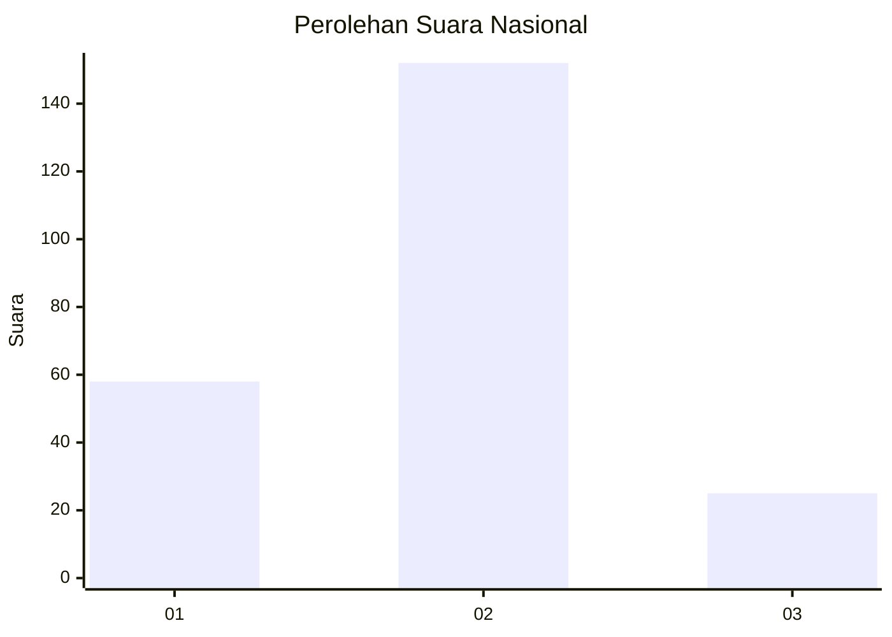
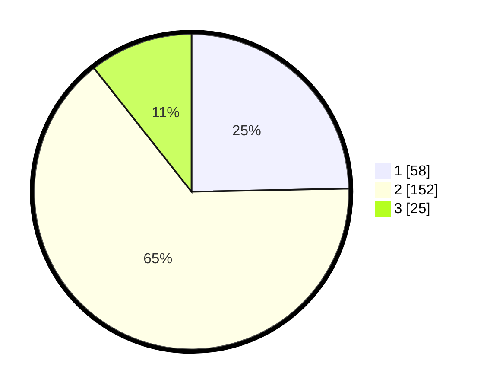

# Hasil

## Grafik

## Tabel

| No. | Nama Paslon    | Suara | Suara (raw) | Persentase |
|:--- |:-------------- | -----:| -----------:| ----------:|
| 1   | ANIES MUHAIMIN | 58    | [58][p-1]   | 24,68      |
| 2   | PRABOWO GIBRAN | 152   | [152][p-2]  | 64,68      |
| 3   | GANJAR MAHFUD  | 25    | [25][p-3]   | 10,64      |

[p-1]: https://github.com/gigit-pemilu/pemilu-2024/blob/main/pilpres/hitung-suara/sub/16-sumatera-selatan/sub/02-ogan-komering-ilir/sub/17-jejawi/sub/2002-lubuk-ketepeng/sub/001-tps/sub/paslon-1.txt
[p-2]: https://github.com/gigit-pemilu/pemilu-2024/blob/main/pilpres/hitung-suara/sub/16-sumatera-selatan/sub/02-ogan-komering-ilir/sub/17-jejawi/sub/2002-lubuk-ketepeng/sub/001-tps/sub/paslon-2.txt
[p-3]: https://github.com/gigit-pemilu/pemilu-2024/blob/main/pilpres/hitung-suara/sub/16-sumatera-selatan/sub/02-ogan-komering-ilir/sub/17-jejawi/sub/2002-lubuk-ketepeng/sub/001-tps/sub/paslon-3.txt

## Foto C Plano

https://sirekap-obj-formc.kpu.go.id/d551/pemilu/ppwp/16/02/17/20/02/1602172002001-20240215-020759--c2bec38b-77bb-491b-a433-91e9876d9cab.jpg

https://sirekap-obj-formc.kpu.go.id/d551/pemilu/ppwp/16/02/17/20/02/1602172002001-20240215-020922--faf394f6-98ad-49d8-98ef-9c2e488028e8.jpg

https://sirekap-obj-formc.kpu.go.id/d551/pemilu/ppwp/16/02/17/20/02/1602172002001-20240215-021014--042e5021-9100-4be2-9c26-fbde11668ab2.jpg

## Metadata

| Key        | Value               |
| ---------- | ------------------- |
| Time Stamp | 2024-02-19 06:16:00 |

