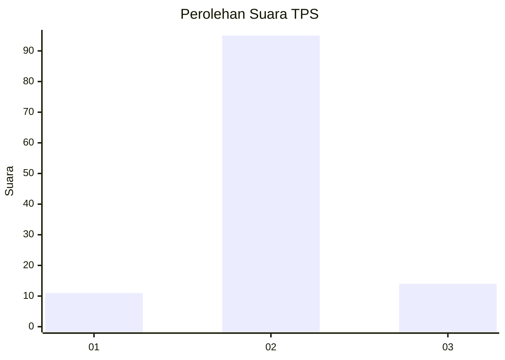
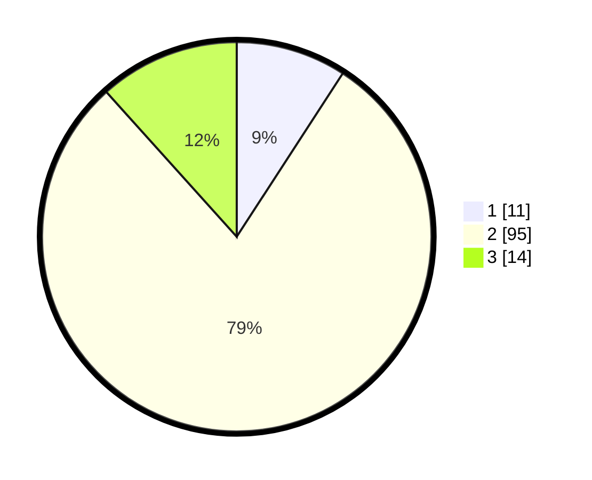

# Hasil

## Grafik

## Tabel

| No. | Nama Paslon    | Suara | Suara (raw) | Persentase |
|:--- |:-------------- | -----:| -----------:| ----------:|
| 1   | ANIES MUHAIMIN | 11    | [11][p-1]   | 9,17       |
| 2   | PRABOWO GIBRAN | 95    | [95][p-2]   | 79,17      |
| 3   | GANJAR MAHFUD  | 14    | [14][p-3]   | 11,67      |

[p-1]: https://github.com/gigit-pemilu/pemilu-2024-16-sumatera-selatan/blob/main/pilpres/hitung-suara/sub/16-sumatera-selatan/sub/02-ogan-komering-ilir/sub/17-jejawi/sub/2006-jejawi/sub/007-tps/sub/paslon-1.txt
[p-2]: https://github.com/gigit-pemilu/pemilu-2024-16-sumatera-selatan/blob/main/pilpres/hitung-suara/sub/16-sumatera-selatan/sub/02-ogan-komering-ilir/sub/17-jejawi/sub/2006-jejawi/sub/007-tps/sub/paslon-2.txt
[p-3]: https://github.com/gigit-pemilu/pemilu-2024-16-sumatera-selatan/blob/main/pilpres/hitung-suara/sub/16-sumatera-selatan/sub/02-ogan-komering-ilir/sub/17-jejawi/sub/2006-jejawi/sub/007-tps/sub/paslon-3.txt

## Foto C Plano

https://sirekap-obj-formc.kpu.go.id/b748/pemilu/ppwp/16/02/17/20/06/1602172006007-20240214-130326--f928668a-30e3-4895-a026-dcc5f62db225.jpg

https://sirekap-obj-formc.kpu.go.id/b748/pemilu/ppwp/16/02/17/20/06/1602172006007-20240214-130715--b2fb9d15-e860-48ae-bac6-4f70c0f53886.jpg

https://sirekap-obj-formc.kpu.go.id/b748/pemilu/ppwp/16/02/17/20/06/1602172006007-20240214-130858--bed1fbbd-720c-4aa4-a75d-623ee0409f80.jpg

## Metadata

| Key        | Value               |
| ---------- | ------------------- |
| Time Stamp | 2024-02-14 21:46:01 |

## DATA PEMILIH TETAP

Jumlah pemilih dalam DPT: **132**.
 * L: **68**.
 * P: **64**.

## DATA PENGGUNA HAK PILIH

Jumlah pengguna hak pilih dalam DPT: **114**.
 * L: **57**.
 * P: **57**.

Jumlah pengguna hak pilih dalam DPTb: **0**.
 * L: **0**.
 * P: **0**.

Jumlah pengguna hak pilih dalam DPK: **21**.
 * L: **14**.
 * P: **7**.

Jumlah pengguna hak pilih: **135**.
 * L: **71**.
 * P: **64**.

## JUMLAH SUARA SAH DAN TIDAK SAH

JUMLAH SELURUH SUARA SAH: **120**.

JUMLAH SUARA TIDAK SAH: **15**.

JUMLAH SELURUH SUARA SAH DAN SUARA TIDAK SAH: **135**.

