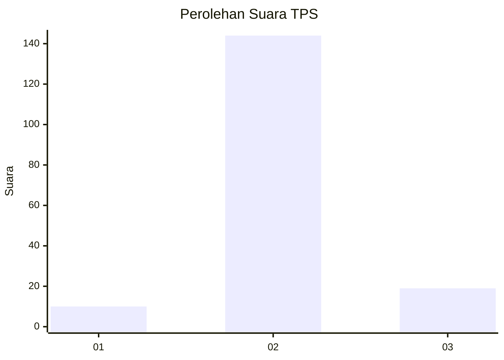
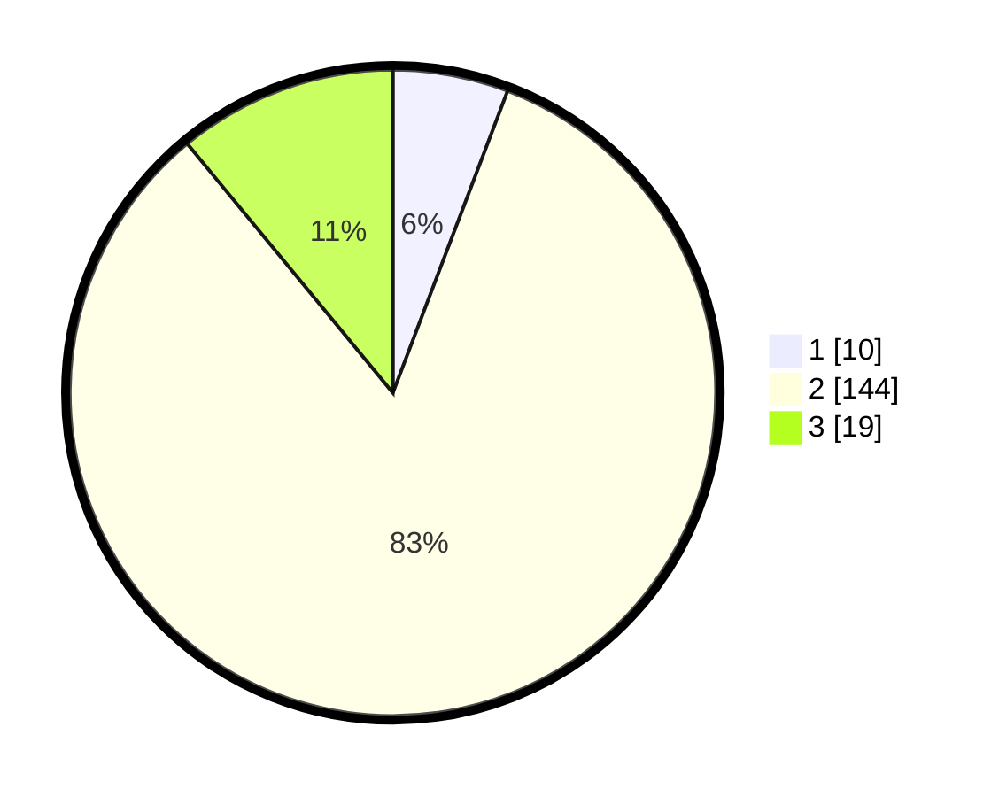

# Hasil

## Grafik

## Tabel

| No. | Nama Paslon    | Suara | Suara (raw) | Persentase |
|:--- |:-------------- | -----:| -----------:| ----------:|
| 1   | ANIES MUHAIMIN | 10    | [10][p-1]   | 5,78       |
| 2   | PRABOWO GIBRAN | 144   | [144][p-2]  | 83,24      |
| 3   | GANJAR MAHFUD  | 19    | [19][p-3]   | 10,98      |

[p-1]: https://github.com/gigit-pemilu/pemilu-2024-16-sumatera-selatan/blob/main/pilpres/hitung-suara/sub/16-sumatera-selatan/sub/02-ogan-komering-ilir/sub/17-jejawi/sub/2008-muara-batun/sub/002-tps/sub/paslon-1.txt
[p-2]: https://github.com/gigit-pemilu/pemilu-2024-16-sumatera-selatan/blob/main/pilpres/hitung-suara/sub/16-sumatera-selatan/sub/02-ogan-komering-ilir/sub/17-jejawi/sub/2008-muara-batun/sub/002-tps/sub/paslon-2.txt
[p-3]: https://github.com/gigit-pemilu/pemilu-2024-16-sumatera-selatan/blob/main/pilpres/hitung-suara/sub/16-sumatera-selatan/sub/02-ogan-komering-ilir/sub/17-jejawi/sub/2008-muara-batun/sub/002-tps/sub/paslon-3.txt

## Foto C Plano

https://sirekap-obj-formc.kpu.go.id/b73d/pemilu/ppwp/16/02/17/20/08/1602172008002-20240215-022636--4572381d-d4ad-4c40-b5b5-69f61764e785.jpg

https://sirekap-obj-formc.kpu.go.id/b73d/pemilu/ppwp/16/02/17/20/08/1602172008002-20240215-022832--20b6bda3-f8a9-41ae-bd5f-d8bb9547a11e.jpg

https://sirekap-obj-formc.kpu.go.id/b73d/pemilu/ppwp/16/02/17/20/08/1602172008002-20240215-022838--283b39d9-44b0-413b-be4e-9d2cf4c10b97.jpg

## Metadata

| Key        | Value               |
| ---------- | ------------------- |
| Time Stamp | 2024-02-19 12:00:00 |

