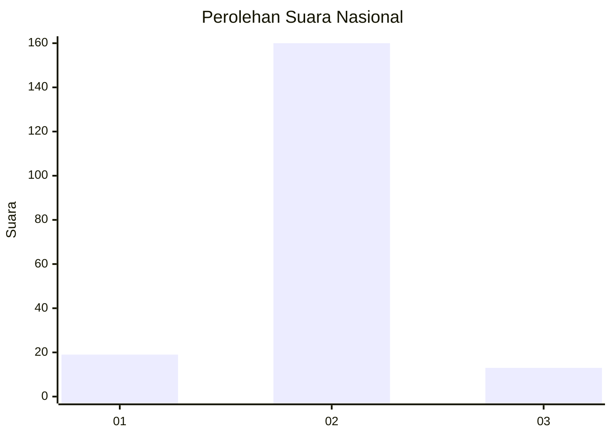
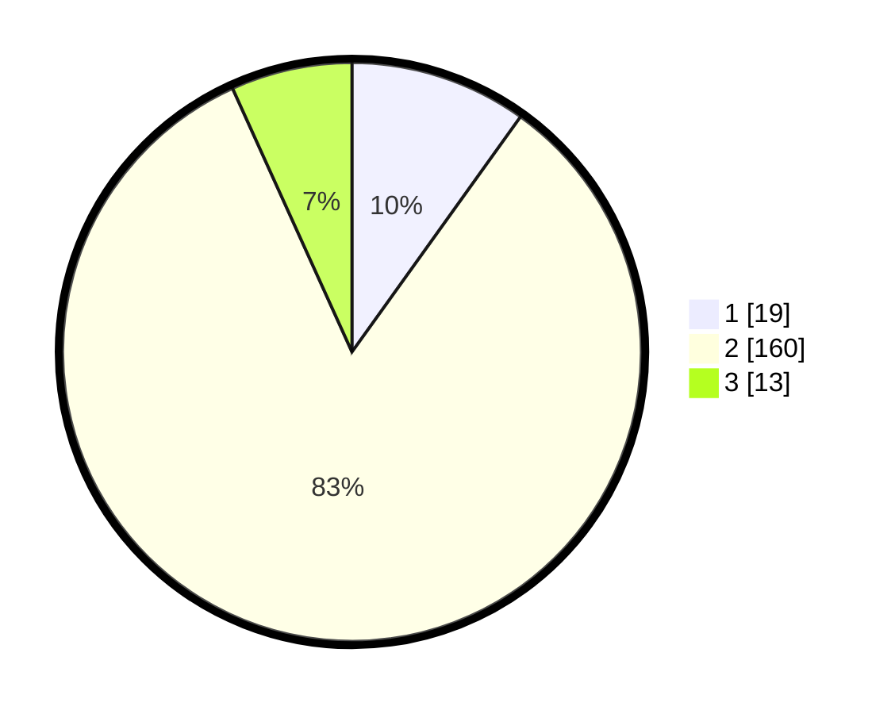

# Hasil

## Grafik

## Tabel

| No. | Nama Paslon    | Suara | Suara (raw) | Persentase |
|:--- |:-------------- | -----:| -----------:| ----------:|
| 1   | ANIES MUHAIMIN | 19    | [19][p-1]   | 9,90       |
| 2   | PRABOWO GIBRAN | 160   | [160][p-2]  | 83,33      |
| 3   | GANJAR MAHFUD  | 13    | [13][p-3]   | 6,77       |

[p-1]: https://github.com/gigit-pemilu/pemilu-2024/blob/main/pilpres/hitung-suara/sub/16-sumatera-selatan/sub/02-ogan-komering-ilir/sub/17-jejawi/sub/2008-muara-batun/sub/004-tps/sub/paslon-1.txt
[p-2]: https://github.com/gigit-pemilu/pemilu-2024/blob/main/pilpres/hitung-suara/sub/16-sumatera-selatan/sub/02-ogan-komering-ilir/sub/17-jejawi/sub/2008-muara-batun/sub/004-tps/sub/paslon-2.txt
[p-3]: https://github.com/gigit-pemilu/pemilu-2024/blob/main/pilpres/hitung-suara/sub/16-sumatera-selatan/sub/02-ogan-komering-ilir/sub/17-jejawi/sub/2008-muara-batun/sub/004-tps/sub/paslon-3.txt

## Foto C Plano

https://sirekap-obj-formc.kpu.go.id/b845/pemilu/ppwp/16/02/17/20/08/1602172008004-20240215-004910--29a8d08f-7730-4371-ac38-4f241f6596cd.jpg

https://sirekap-obj-formc.kpu.go.id/b845/pemilu/ppwp/16/02/17/20/08/1602172008004-20240215-031600--9b9a971d-18e1-4d2c-a886-a30a88b6de22.jpg

https://sirekap-obj-formc.kpu.go.id/b845/pemilu/ppwp/16/02/17/20/08/1602172008004-20240215-004859--7291f16c-a667-4a89-8a38-e4b67a4b3f83.jpg

## Metadata

| Key        | Value               |
| ---------- | ------------------- |
| Time Stamp | 2024-02-19 06:16:00 |

