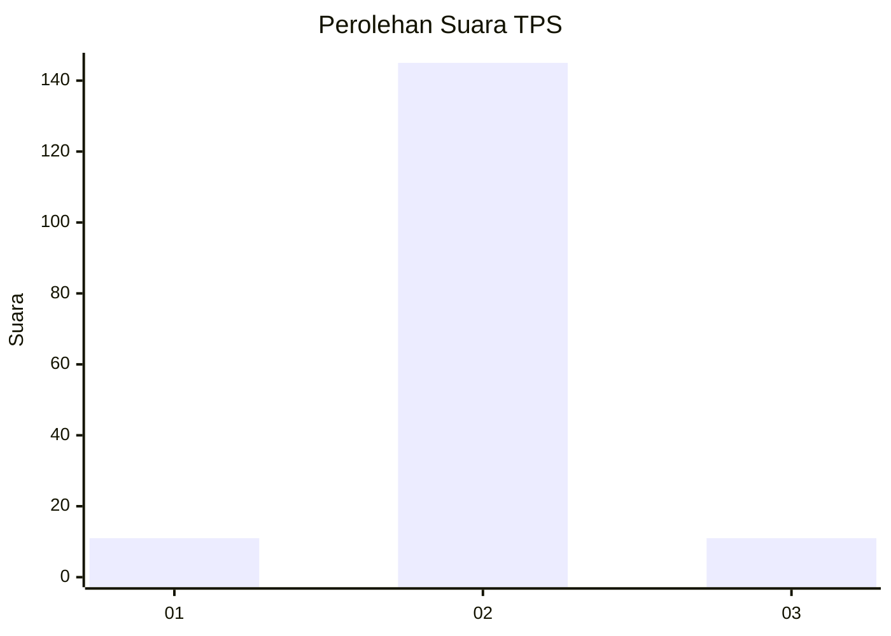
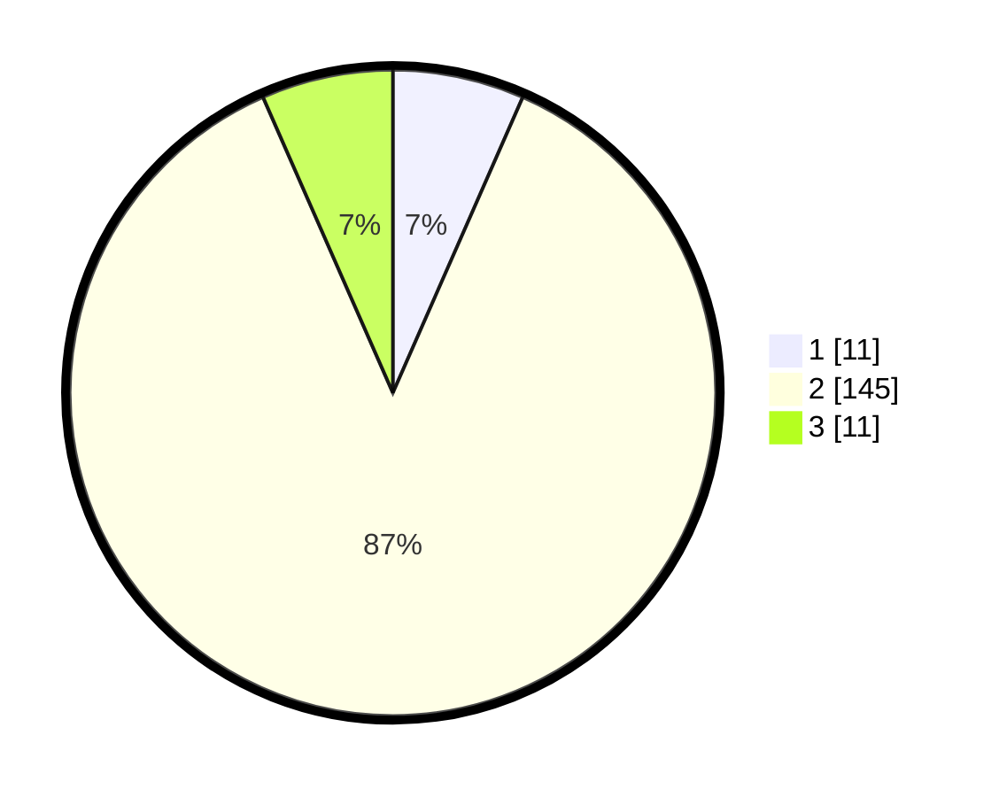

# Hasil

## Grafik

## Tabel

| No. | Nama Paslon    | Suara | Suara (raw) | Persentase |
|:--- |:-------------- | -----:| -----------:| ----------:|
| 1   | ANIES MUHAIMIN | 11    | [11][p-1]   | 6,59       |
| 2   | PRABOWO GIBRAN | 145   | [145][p-2]  | 86,83      |
| 3   | GANJAR MAHFUD  | 11    | [11][p-3]   | 6,59       |

[p-1]: https://github.com/gigit-pemilu/pemilu-2024-16-sumatera-selatan/blob/main/pilpres/hitung-suara/sub/16-sumatera-selatan/sub/02-ogan-komering-ilir/sub/17-jejawi/sub/2008-muara-batun/sub/005-tps/sub/paslon-1.txt
[p-2]: https://github.com/gigit-pemilu/pemilu-2024-16-sumatera-selatan/blob/main/pilpres/hitung-suara/sub/16-sumatera-selatan/sub/02-ogan-komering-ilir/sub/17-jejawi/sub/2008-muara-batun/sub/005-tps/sub/paslon-2.txt
[p-3]: https://github.com/gigit-pemilu/pemilu-2024-16-sumatera-selatan/blob/main/pilpres/hitung-suara/sub/16-sumatera-selatan/sub/02-ogan-komering-ilir/sub/17-jejawi/sub/2008-muara-batun/sub/005-tps/sub/paslon-3.txt

## Foto C Plano

https://sirekap-obj-formc.kpu.go.id/fbe7/pemilu/ppwp/16/02/17/20/08/1602172008005-20240215-145946--fc62959f-c3ba-4302-aff5-dffbd8f817c1.jpg

https://sirekap-obj-formc.kpu.go.id/fbe7/pemilu/ppwp/16/02/17/20/08/1602172008005-20240215-001909--b8863ef5-b4d1-49f9-a87c-611151221963.jpg

https://sirekap-obj-formc.kpu.go.id/fbe7/pemilu/ppwp/16/02/17/20/08/1602172008005-20240215-001918--7285d0f6-ef08-4d1c-b9d2-992fe50ce336.jpg

## Metadata

| Key        | Value               |
| ---------- | ------------------- |
| Time Stamp | 2024-02-19 06:16:00 |

