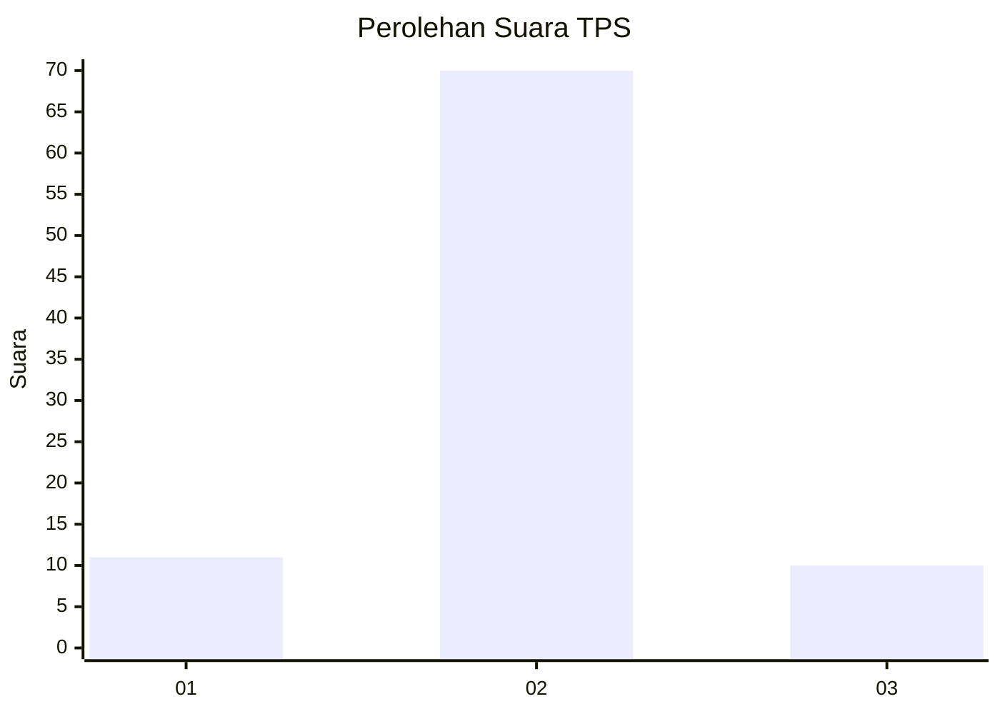
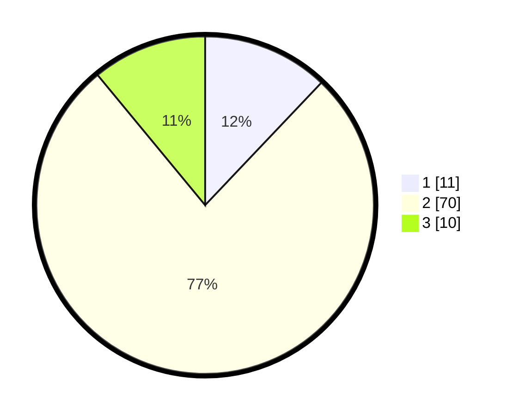

# Hasil

## Grafik

## Tabel

| No. | Nama Paslon    | Suara | Suara (raw) | Persentase |
|:--- |:-------------- | -----:| -----------:| ----------:|
| 1   | ANIES MUHAIMIN | 11    | [11][p-1]   | 12,09      |
| 2   | PRABOWO GIBRAN | 70    | [70][p-2]   | 76,92      |
| 3   | GANJAR MAHFUD  | 10    | [10][p-3]   | 10,99      |

[p-1]: https://github.com/gigit-pemilu/pemilu-2024-16-sumatera-selatan/blob/main/pilpres/hitung-suara/sub/16-sumatera-selatan/sub/02-ogan-komering-ilir/sub/17-jejawi/sub/2010-terusan-jawa/sub/004-tps/sub/paslon-1.txt
[p-2]: https://github.com/gigit-pemilu/pemilu-2024-16-sumatera-selatan/blob/main/pilpres/hitung-suara/sub/16-sumatera-selatan/sub/02-ogan-komering-ilir/sub/17-jejawi/sub/2010-terusan-jawa/sub/004-tps/sub/paslon-2.txt
[p-3]: https://github.com/gigit-pemilu/pemilu-2024-16-sumatera-selatan/blob/main/pilpres/hitung-suara/sub/16-sumatera-selatan/sub/02-ogan-komering-ilir/sub/17-jejawi/sub/2010-terusan-jawa/sub/004-tps/sub/paslon-3.txt

## Foto C Plano

https://sirekap-obj-formc.kpu.go.id/2f55/pemilu/ppwp/16/02/17/20/10/1602172010004-20240214-211034--25a9e05a-2358-436a-8caa-2da8b9064c45.jpg

https://sirekap-obj-formc.kpu.go.id/2f55/pemilu/ppwp/16/02/17/20/10/1602172010004-20240215-104217--790811df-7ea3-436a-8cc8-069b07a4b08c.jpg

https://sirekap-obj-formc.kpu.go.id/2f55/pemilu/ppwp/16/02/17/20/10/1602172010004-20240214-222633--b67f6abc-7759-4579-9d79-f570c4b836da.jpg

## Metadata

| Key        | Value               |
| ---------- | ------------------- |
| Time Stamp | 2024-02-19 06:16:00 |

