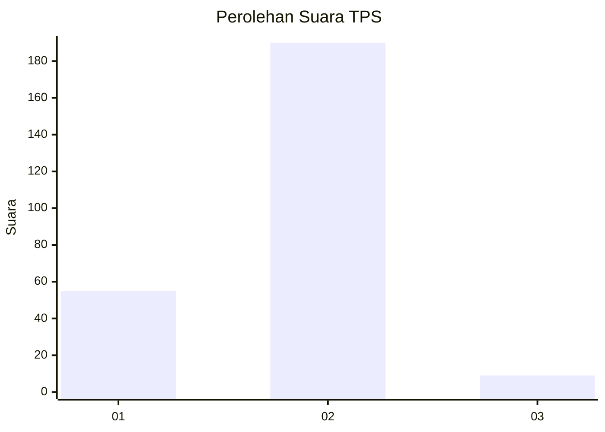

# Hasil

## Grafik

## Tabel

| No. | Nama Paslon    | Suara | Suara (raw) | Persentase |
|:--- |:-------------- | -----:| -----------:| ----------:|
| 1   | ANIES MUHAIMIN | 55    | [55][p-1]   | 21,65      |
| 2   | PRABOWO GIBRAN | 190   | [190][p-2]  | 74,80      |
| 3   | GANJAR MAHFUD  | 9     | [9][p-3]    | 3,54       |

[p-1]: https://github.com/gigit-pemilu/pemilu-2024-16-sumatera-selatan/blob/main/pilpres/hitung-suara/sub/16-sumatera-selatan/sub/02-ogan-komering-ilir/sub/17-jejawi/sub/2013-ulak-tembaga/sub/001-tps/sub/paslon-1.txt
[p-2]: https://github.com/gigit-pemilu/pemilu-2024-16-sumatera-selatan/blob/main/pilpres/hitung-suara/sub/16-sumatera-selatan/sub/02-ogan-komering-ilir/sub/17-jejawi/sub/2013-ulak-tembaga/sub/001-tps/sub/paslon-2.txt
[p-3]: https://github.com/gigit-pemilu/pemilu-2024-16-sumatera-selatan/blob/main/pilpres/hitung-suara/sub/16-sumatera-selatan/sub/02-ogan-komering-ilir/sub/17-jejawi/sub/2013-ulak-tembaga/sub/001-tps/sub/paslon-3.txt

## Foto C Plano

https://sirekap-obj-formc.kpu.go.id/ddff/pemilu/ppwp/16/02/17/20/13/1602172013001-20240214-222957--f180390b-b110-4649-89ba-c3d828e05ea1.jpg

https://sirekap-obj-formc.kpu.go.id/ddff/pemilu/ppwp/16/02/17/20/13/1602172013001-20240214-224142--9d5fb506-07aa-4fea-86e4-8aadc80a5bf1.jpg

https://sirekap-obj-formc.kpu.go.id/ddff/pemilu/ppwp/16/02/17/20/13/1602172013001-20240214-224523--42d7cae0-dcad-4a42-b997-a22eded398e6.jpg

## Metadata

| Key        | Value               |
| ---------- | ------------------- |
| Time Stamp | 2024-02-19 18:00:00 |

