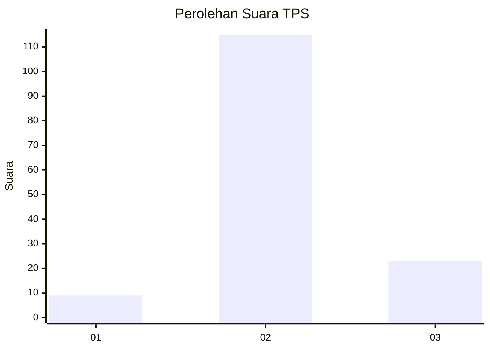
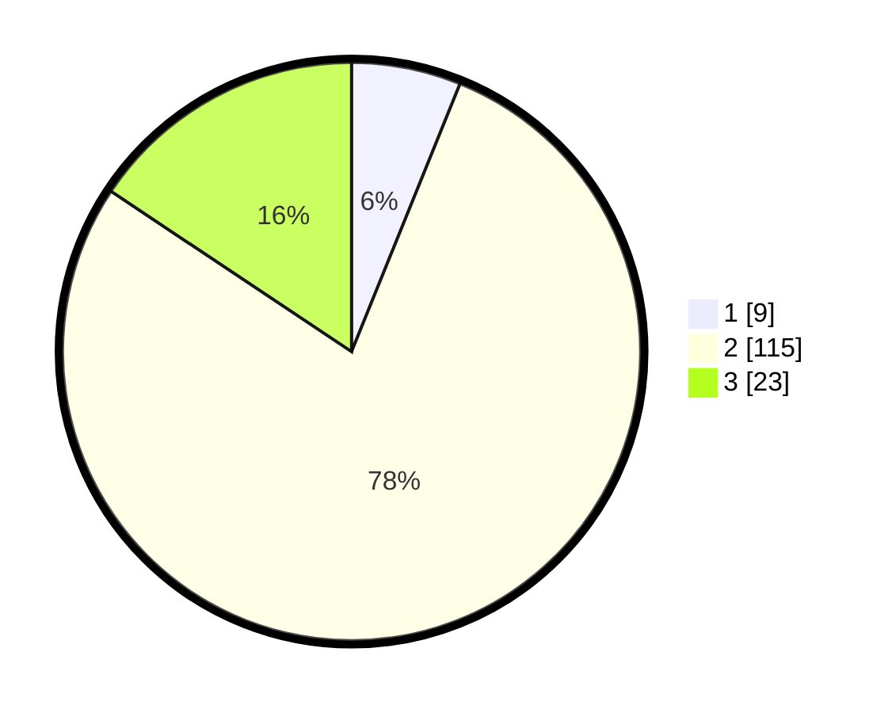

# Hasil

## Grafik

## Tabel

| No. | Nama Paslon    | Suara | Suara (raw) | Persentase |
|:--- |:-------------- | -----:| -----------:| ----------:|
| 1   | ANIES MUHAIMIN | 9     | [9][p-1]    | 6,12       |
| 2   | PRABOWO GIBRAN | 115   | [115][p-2]  | 78,23      |
| 3   | GANJAR MAHFUD  | 23    | [23][p-3]   | 15,65      |

[p-1]: https://github.com/gigit-pemilu/pemilu-2024-16-sumatera-selatan/blob/main/pilpres/hitung-suara/sub/16-sumatera-selatan/sub/02-ogan-komering-ilir/sub/18-cengal/sub/2001-sungai-somor/sub/001-tps/sub/paslon-1.txt
[p-2]: https://github.com/gigit-pemilu/pemilu-2024-16-sumatera-selatan/blob/main/pilpres/hitung-suara/sub/16-sumatera-selatan/sub/02-ogan-komering-ilir/sub/18-cengal/sub/2001-sungai-somor/sub/001-tps/sub/paslon-2.txt
[p-3]: https://github.com/gigit-pemilu/pemilu-2024-16-sumatera-selatan/blob/main/pilpres/hitung-suara/sub/16-sumatera-selatan/sub/02-ogan-komering-ilir/sub/18-cengal/sub/2001-sungai-somor/sub/001-tps/sub/paslon-3.txt

## Foto C Plano

https://sirekap-obj-formc.kpu.go.id/55e8/pemilu/ppwp/16/02/18/20/01/1602182001001-20240215-001213--1bc2780d-cb48-4347-bf16-0f998fbc6a19.jpg

https://sirekap-obj-formc.kpu.go.id/55e8/pemilu/ppwp/16/02/18/20/01/1602182001001-20240215-001627--37b4ed03-69a3-444c-81bf-43b5b23278d9.jpg

https://sirekap-obj-formc.kpu.go.id/55e8/pemilu/ppwp/16/02/18/20/01/1602182001001-20240215-001725--56719aec-b198-4a6e-a325-0bf928125e77.jpg

## Metadata

| Key        | Value               |
| ---------- | ------------------- |
| Time Stamp | 2024-02-17 14:45:18 |

