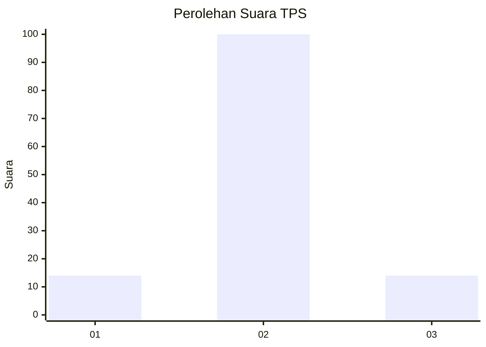
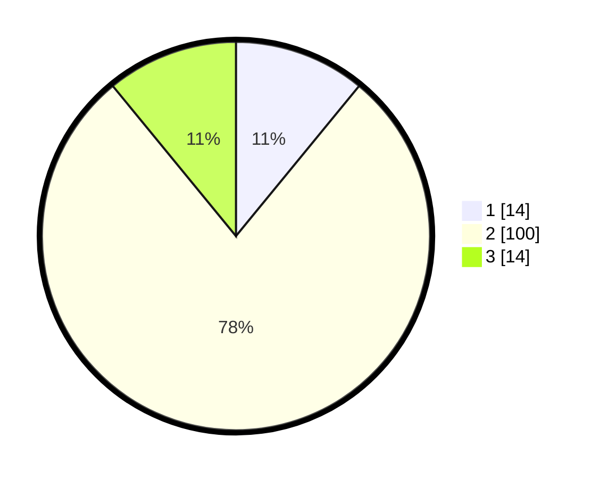

# Hasil

## Grafik

## Tabel

| No. | Nama Paslon    | Suara | Suara (raw) | Persentase |
|:--- |:-------------- | -----:| -----------:| ----------:|
| 1   | ANIES MUHAIMIN | 14    | [14][p-1]   | 10,94      |
| 2   | PRABOWO GIBRAN | 100   | [100][p-2]  | 78,13      |
| 3   | GANJAR MAHFUD  | 14    | [14][p-3]   | 10,94      |

[p-1]: https://github.com/gigit-pemilu/pemilu-2024-16-sumatera-selatan/blob/main/pilpres/hitung-suara/sub/16-sumatera-selatan/sub/02-ogan-komering-ilir/sub/18-cengal/sub/2001-sungai-somor/sub/003-tps/sub/paslon-1.txt
[p-2]: https://github.com/gigit-pemilu/pemilu-2024-16-sumatera-selatan/blob/main/pilpres/hitung-suara/sub/16-sumatera-selatan/sub/02-ogan-komering-ilir/sub/18-cengal/sub/2001-sungai-somor/sub/003-tps/sub/paslon-2.txt
[p-3]: https://github.com/gigit-pemilu/pemilu-2024-16-sumatera-selatan/blob/main/pilpres/hitung-suara/sub/16-sumatera-selatan/sub/02-ogan-komering-ilir/sub/18-cengal/sub/2001-sungai-somor/sub/003-tps/sub/paslon-3.txt

## Foto C Plano

https://sirekap-obj-formc.kpu.go.id/0f79/pemilu/ppwp/16/02/18/20/01/1602182001003-20240215-012049--89b95fda-6d2c-4d33-a3c2-a405a4747c0b.jpg

https://sirekap-obj-formc.kpu.go.id/0f79/pemilu/ppwp/16/02/18/20/01/1602182001003-20240215-012208--fa2a5fb9-27d8-4536-afb3-c18ea6d1465b.jpg

https://sirekap-obj-formc.kpu.go.id/0f79/pemilu/ppwp/16/02/18/20/01/1602182001003-20240215-012330--ea175dba-a61f-4334-94ed-c2b0607a4ecf.jpg

## Metadata

| Key        | Value               |
| ---------- | ------------------- |
| Time Stamp | 2024-02-19 06:16:00 |

