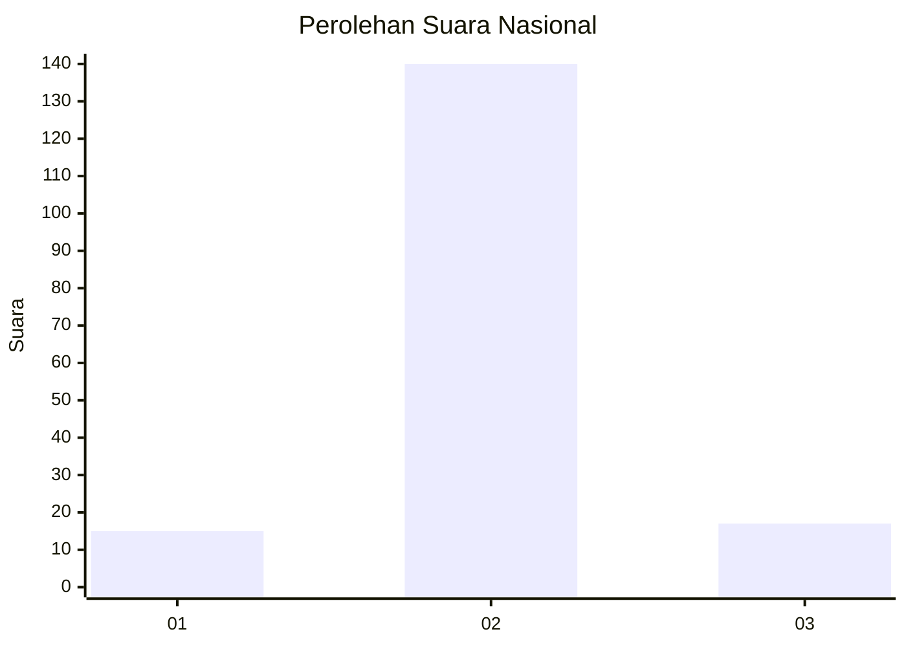
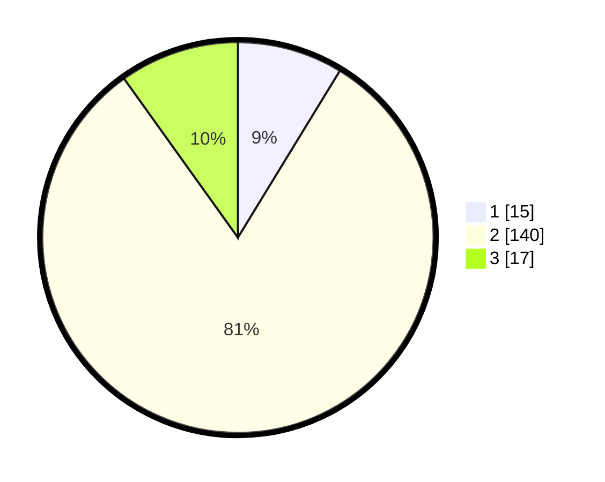

# Hasil

## Grafik

## Tabel

| No. | Nama Paslon    | Suara | Suara (raw) | Persentase |
|:--- |:-------------- | -----:| -----------:| ----------:|
| 1   | ANIES MUHAIMIN | 15    | [15][p-1]   | 8,72       |
| 2   | PRABOWO GIBRAN | 140   | [140][p-2]  | 81,40      |
| 3   | GANJAR MAHFUD  | 17    | [17][p-3]   | 9,88       |

[p-1]: https://github.com/gigit-pemilu/pemilu-2024/blob/main/pilpres/hitung-suara/sub/16-sumatera-selatan/sub/02-ogan-komering-ilir/sub/18-cengal/sub/2001-sungai-somor/sub/005-tps/sub/paslon-1.txt
[p-2]: https://github.com/gigit-pemilu/pemilu-2024/blob/main/pilpres/hitung-suara/sub/16-sumatera-selatan/sub/02-ogan-komering-ilir/sub/18-cengal/sub/2001-sungai-somor/sub/005-tps/sub/paslon-2.txt
[p-3]: https://github.com/gigit-pemilu/pemilu-2024/blob/main/pilpres/hitung-suara/sub/16-sumatera-selatan/sub/02-ogan-komering-ilir/sub/18-cengal/sub/2001-sungai-somor/sub/005-tps/sub/paslon-3.txt

## Foto C Plano

https://sirekap-obj-formc.kpu.go.id/2abf/pemilu/ppwp/16/02/18/20/01/1602182001005-20240215-141924--2197e015-9ec8-4dc2-98fa-f13f0d35b846.jpg

https://sirekap-obj-formc.kpu.go.id/2abf/pemilu/ppwp/16/02/18/20/01/1602182001005-20240215-142108--b44a13ed-ef38-4b01-b4a2-0f51eac9a38e.jpg

https://sirekap-obj-formc.kpu.go.id/2abf/pemilu/ppwp/16/02/18/20/01/1602182001005-20240215-142233--84fdd0b1-ab64-426a-865d-04955687ef71.jpg

## Metadata

| Key        | Value               |
| ---------- | ------------------- |
| Time Stamp | 2024-02-19 06:16:00 |

