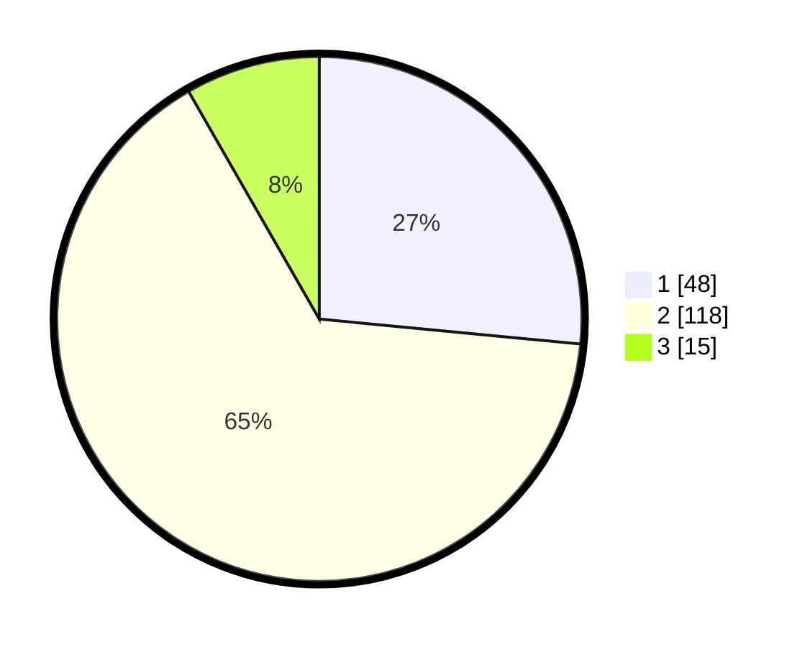

# Hasil

## Grafik

## Tabel

| No. | Nama Paslon    | Suara | Suara (raw) | Persentase |
|:--- |:-------------- | -----:| -----------:| ----------:|
| 1   | ANIES MUHAIMIN | 48    | [48][p-1]   | 26,52      |
| 2   | PRABOWO GIBRAN | 118   | [118][p-2]  | 65,19      |
| 3   | GANJAR MAHFUD  | 15    | [15][p-3]   | 8,29       |

[p-1]: https://github.com/gigit-pemilu/pemilu-2024-16-sumatera-selatan/blob/main/pilpres/hitung-suara/sub/16-sumatera-selatan/sub/02-ogan-komering-ilir/sub/18-cengal/sub/2001-sungai-somor/sub/006-tps/sub/paslon-1.txt
[p-2]: https://github.com/gigit-pemilu/pemilu-2024-16-sumatera-selatan/blob/main/pilpres/hitung-suara/sub/16-sumatera-selatan/sub/02-ogan-komering-ilir/sub/18-cengal/sub/2001-sungai-somor/sub/006-tps/sub/paslon-2.txt
[p-3]: https://github.com/gigit-pemilu/pemilu-2024-16-sumatera-selatan/blob/main/pilpres/hitung-suara/sub/16-sumatera-selatan/sub/02-ogan-komering-ilir/sub/18-cengal/sub/2001-sungai-somor/sub/006-tps/sub/paslon-3.txt

## Foto C Plano

https://sirekap-obj-formc.kpu.go.id/563e/pemilu/ppwp/16/02/18/20/01/1602182001006-20240215-150147--ebfff686-e3f9-45a3-95e0-b2aebc5bfa4f.jpg

https://sirekap-obj-formc.kpu.go.id/563e/pemilu/ppwp/16/02/18/20/01/1602182001006-20240215-150301--bd2e123b-9d4f-461e-ba3a-64614cc10f11.jpg

https://sirekap-obj-formc.kpu.go.id/563e/pemilu/ppwp/16/02/18/20/01/1602182001006-20240215-150352--5651e032-813f-4a92-be9a-f828fe00c8bb.jpg

## Metadata

| Key        | Value               |
| ---------- | ------------------- |
| Time Stamp | 2024-02-19 18:00:00 |

