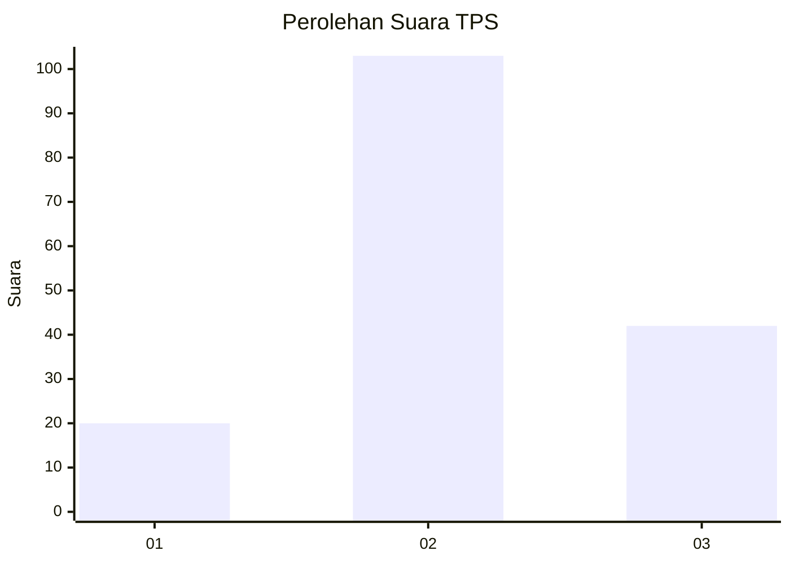
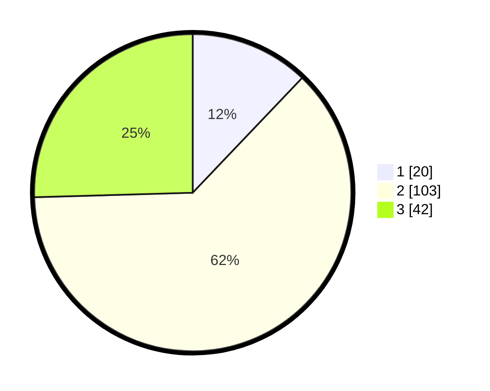

# Hasil

## Grafik

## Tabel

| No. | Nama Paslon    | Suara | Suara (raw) | Persentase |
|:--- |:-------------- | -----:| -----------:| ----------:|
| 1   | ANIES MUHAIMIN | 20    | [20][p-1]   | 12,12      |
| 2   | PRABOWO GIBRAN | 103   | [103][p-2]  | 62,42      |
| 3   | GANJAR MAHFUD  | 42    | [42][p-3]   | 25,45      |

[p-1]: https://github.com/gigit-pemilu/pemilu-2024-16-sumatera-selatan/blob/main/pilpres/hitung-suara/sub/16-sumatera-selatan/sub/02-ogan-komering-ilir/sub/18-cengal/sub/2002-sungai-lumpur/sub/006-tps/sub/paslon-1.txt
[p-2]: https://github.com/gigit-pemilu/pemilu-2024-16-sumatera-selatan/blob/main/pilpres/hitung-suara/sub/16-sumatera-selatan/sub/02-ogan-komering-ilir/sub/18-cengal/sub/2002-sungai-lumpur/sub/006-tps/sub/paslon-2.txt
[p-3]: https://github.com/gigit-pemilu/pemilu-2024-16-sumatera-selatan/blob/main/pilpres/hitung-suara/sub/16-sumatera-selatan/sub/02-ogan-komering-ilir/sub/18-cengal/sub/2002-sungai-lumpur/sub/006-tps/sub/paslon-3.txt

## Foto C Plano

https://sirekap-obj-formc.kpu.go.id/8b2a/pemilu/ppwp/16/02/18/20/02/1602182002006-20240214-233642--db4cef00-602b-465e-b2e3-92dfcc2e7ba5.jpg

https://sirekap-obj-formc.kpu.go.id/8b2a/pemilu/ppwp/16/02/18/20/02/1602182002006-20240214-234115--124255e5-3976-4c10-8ec1-835d31fea1e4.jpg

https://sirekap-obj-formc.kpu.go.id/8b2a/pemilu/ppwp/16/02/18/20/02/1602182002006-20240214-234255--5c6d5f95-af22-4a18-9b0c-0c2f0bca2894.jpg

## Metadata

| Key        | Value               |
| ---------- | ------------------- |
| Time Stamp | 2024-02-19 06:16:00 |

