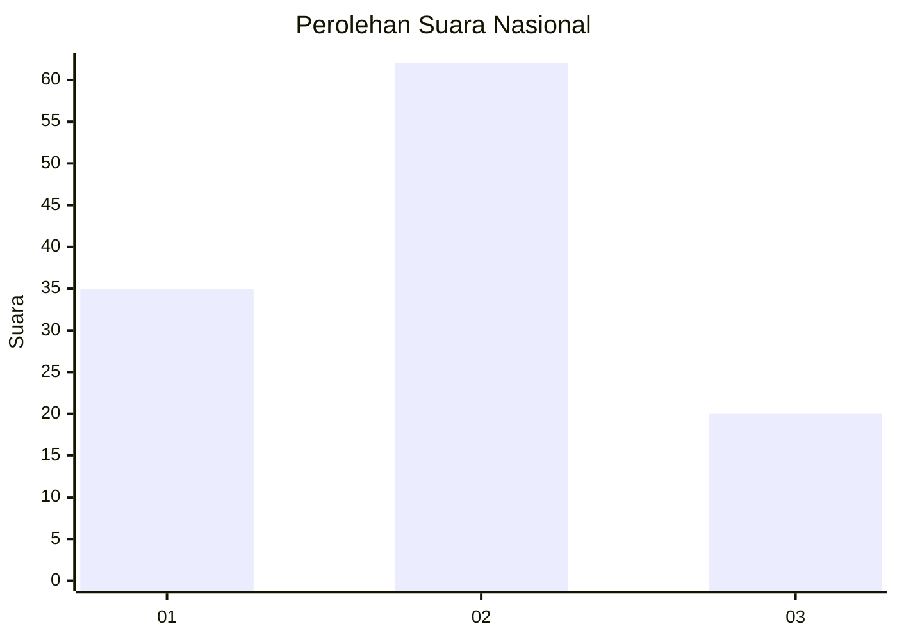
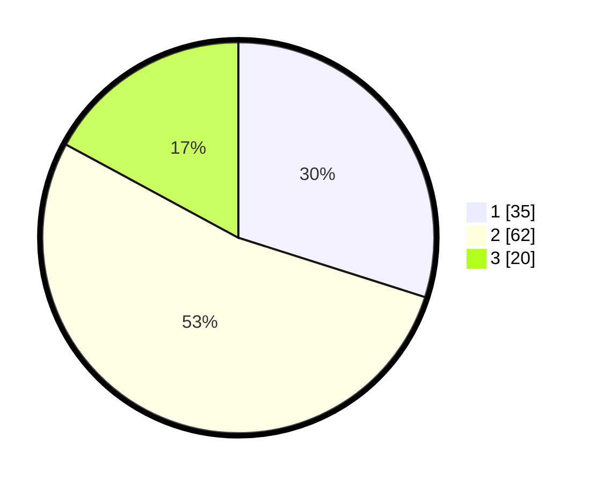

# Hasil

## Grafik

## Tabel

| No. | Nama Paslon    | Suara | Suara (raw) | Persentase |
|:--- |:-------------- | -----:| -----------:| ----------:|
| 1   | ANIES MUHAIMIN | 35    | [35][p-1]   | 29,91      |
| 2   | PRABOWO GIBRAN | 62    | [62][p-2]   | 52,99      |
| 3   | GANJAR MAHFUD  | 20    | [20][p-3]   | 17,09      |

[p-1]: https://github.com/gigit-pemilu/pemilu-2024/blob/main/pilpres/hitung-suara/sub/16-sumatera-selatan/sub/02-ogan-komering-ilir/sub/18-cengal/sub/2002-sungai-lumpur/sub/007-tps/sub/paslon-1.txt
[p-2]: https://github.com/gigit-pemilu/pemilu-2024/blob/main/pilpres/hitung-suara/sub/16-sumatera-selatan/sub/02-ogan-komering-ilir/sub/18-cengal/sub/2002-sungai-lumpur/sub/007-tps/sub/paslon-2.txt
[p-3]: https://github.com/gigit-pemilu/pemilu-2024/blob/main/pilpres/hitung-suara/sub/16-sumatera-selatan/sub/02-ogan-komering-ilir/sub/18-cengal/sub/2002-sungai-lumpur/sub/007-tps/sub/paslon-3.txt

## Foto C Plano

https://sirekap-obj-formc.kpu.go.id/82f0/pemilu/ppwp/16/02/18/20/02/1602182002007-20240215-092918--8dd98021-dcd3-46ad-a447-a9f62503c7ed.jpg

https://sirekap-obj-formc.kpu.go.id/82f0/pemilu/ppwp/16/02/18/20/02/1602182002007-20240215-093235--26b1340d-def2-4312-a75e-a2f2779f59db.jpg

https://sirekap-obj-formc.kpu.go.id/82f0/pemilu/ppwp/16/02/18/20/02/1602182002007-20240215-093415--1c827ec4-d1d7-4ff5-9636-2aefaaded214.jpg

## Metadata

| Key        | Value               |
| ---------- | ------------------- |
| Time Stamp | 2024-02-16 00:30:27 |

