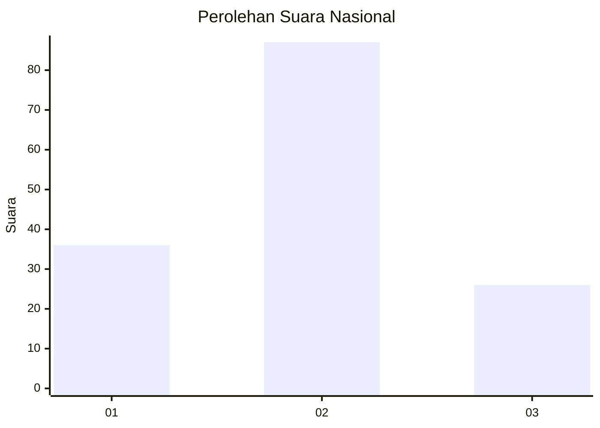
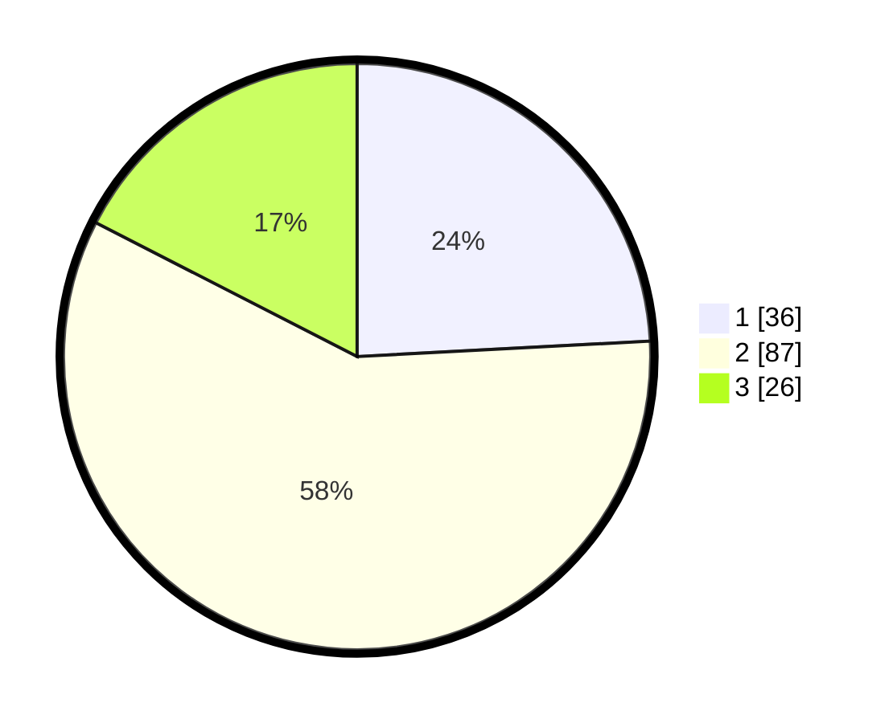

# Hasil

## Grafik

## Tabel

| No. | Nama Paslon    | Suara | Suara (raw) | Persentase |
|:--- |:-------------- | -----:| -----------:| ----------:|
| 1   | ANIES MUHAIMIN | 36    | [36][p-1]   | 24,16      |
| 2   | PRABOWO GIBRAN | 87    | [87][p-2]   | 58,39      |
| 3   | GANJAR MAHFUD  | 26    | [26][p-3]   | 17,45      |

[p-1]: https://github.com/gigit-pemilu/pemilu-2024/blob/main/pilpres/hitung-suara/sub/16-sumatera-selatan/sub/02-ogan-komering-ilir/sub/18-cengal/sub/2004-sungai-ketupak/sub/003-tps/sub/paslon-1.txt
[p-2]: https://github.com/gigit-pemilu/pemilu-2024/blob/main/pilpres/hitung-suara/sub/16-sumatera-selatan/sub/02-ogan-komering-ilir/sub/18-cengal/sub/2004-sungai-ketupak/sub/003-tps/sub/paslon-2.txt
[p-3]: https://github.com/gigit-pemilu/pemilu-2024/blob/main/pilpres/hitung-suara/sub/16-sumatera-selatan/sub/02-ogan-komering-ilir/sub/18-cengal/sub/2004-sungai-ketupak/sub/003-tps/sub/paslon-3.txt

## Foto C Plano

https://sirekap-obj-formc.kpu.go.id/371e/pemilu/ppwp/16/02/18/20/04/1602182004003-20240215-100423--3417efe2-2bb8-4ae0-bd57-3612e1ad6160.jpg

https://sirekap-obj-formc.kpu.go.id/371e/pemilu/ppwp/16/02/18/20/04/1602182004003-20240215-100634--3bed6b2c-a90b-4757-bfd6-05a90eddfb43.jpg

https://sirekap-obj-formc.kpu.go.id/371e/pemilu/ppwp/16/02/18/20/04/1602182004003-20240215-100814--d61b725d-656c-4fb2-a1d8-f7e9391d78c9.jpg

## Metadata

| Key        | Value               |
| ---------- | ------------------- |
| Time Stamp | 2024-02-20 02:00:00 |

