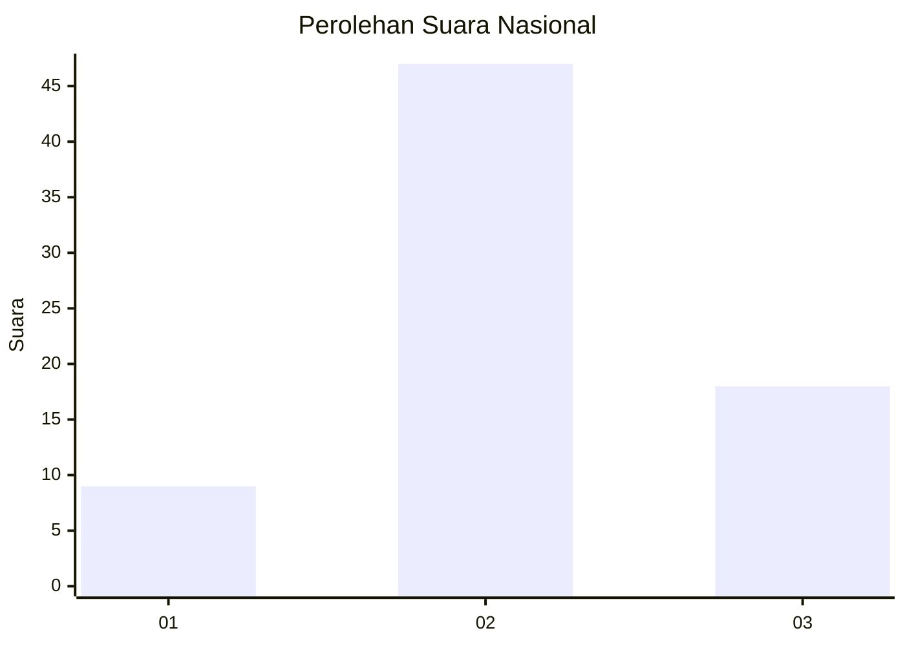
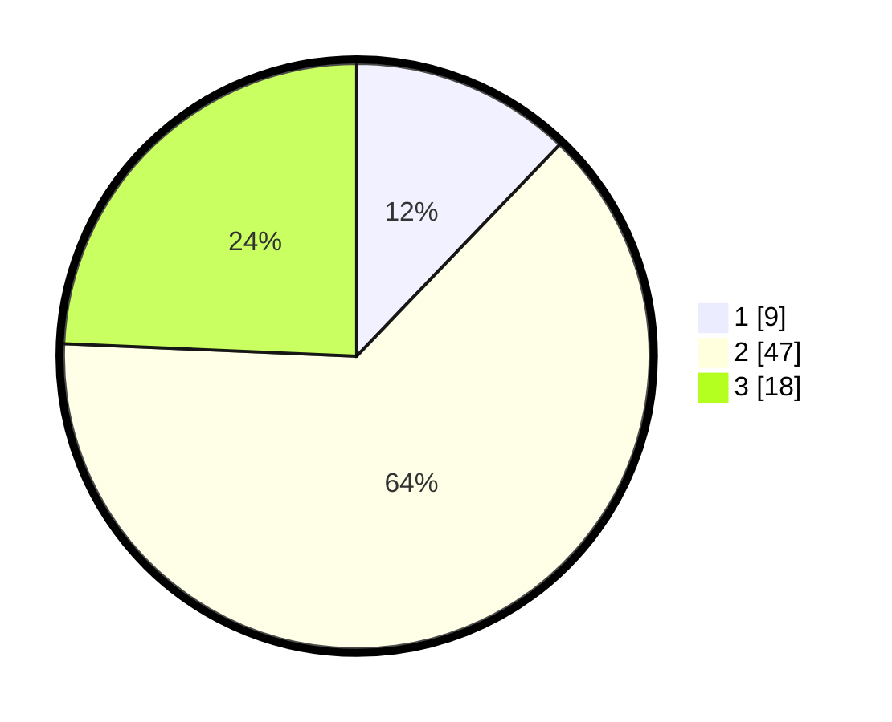

# Hasil

## Grafik

## Tabel

| No. | Nama Paslon    | Suara | Suara (raw) | Persentase |
|:--- |:-------------- | -----:| -----------:| ----------:|
| 1   | ANIES MUHAIMIN | 9     | [9][p-1]    | 12,16      |
| 2   | PRABOWO GIBRAN | 47    | [47][p-2]   | 63,51      |
| 3   | GANJAR MAHFUD  | 18    | [18][p-3]   | 24,32      |

[p-1]: https://github.com/gigit-pemilu/pemilu-2024/blob/main/pilpres/hitung-suara/sub/16-sumatera-selatan/sub/02-ogan-komering-ilir/sub/18-cengal/sub/2005-ulak-kedondong/sub/004-tps/sub/paslon-1.txt
[p-2]: https://github.com/gigit-pemilu/pemilu-2024/blob/main/pilpres/hitung-suara/sub/16-sumatera-selatan/sub/02-ogan-komering-ilir/sub/18-cengal/sub/2005-ulak-kedondong/sub/004-tps/sub/paslon-2.txt
[p-3]: https://github.com/gigit-pemilu/pemilu-2024/blob/main/pilpres/hitung-suara/sub/16-sumatera-selatan/sub/02-ogan-komering-ilir/sub/18-cengal/sub/2005-ulak-kedondong/sub/004-tps/sub/paslon-3.txt

## Foto C Plano

https://sirekap-obj-formc.kpu.go.id/5ddf/pemilu/ppwp/16/02/18/20/05/1602182005004-20240214-141646--865a148b-d089-4d61-9132-7c64e5829de2.jpg

https://sirekap-obj-formc.kpu.go.id/5ddf/pemilu/ppwp/16/02/18/20/05/1602182005004-20240215-125959--28aa4e1b-54a6-4bc5-bb64-f1eeda7c86e9.jpg

https://sirekap-obj-formc.kpu.go.id/5ddf/pemilu/ppwp/16/02/18/20/05/1602182005004-20240214-210950--e864a0a1-9aa5-4061-8245-8da71440fb42.jpg

## Metadata

| Key        | Value               |
| ---------- | ------------------- |
| Time Stamp | 2024-02-19 06:16:00 |

