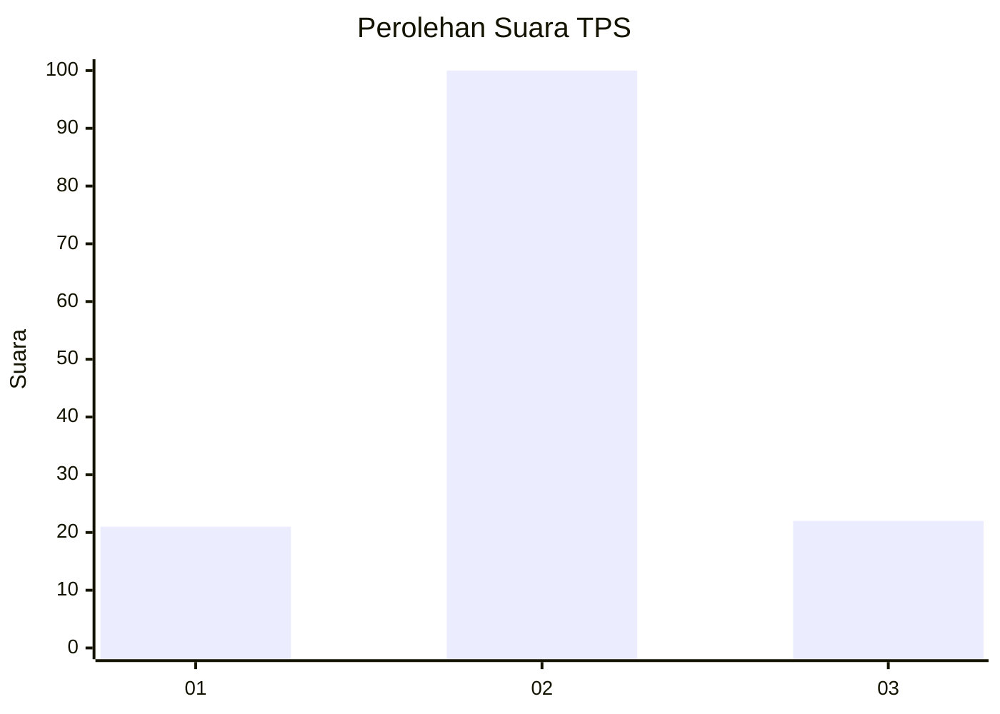

# Hasil

## Grafik

## Tabel

| No. | Nama Paslon    | Suara | Suara (raw) | Persentase |
|:--- |:-------------- | -----:| -----------:| ----------:|
| 1   | ANIES MUHAIMIN | 21    | [21][p-1]   | 14,69      |
| 2   | PRABOWO GIBRAN | 100   | [100][p-2]  | 69,93      |
| 3   | GANJAR MAHFUD  | 22    | [22][p-3]   | 15,38      |

[p-1]: https://github.com/gigit-pemilu/pemilu-2024-16-sumatera-selatan/blob/main/pilpres/hitung-suara/sub/16-sumatera-selatan/sub/02-ogan-komering-ilir/sub/18-cengal/sub/2007-cengal/sub/006-tps/sub/paslon-1.txt
[p-2]: https://github.com/gigit-pemilu/pemilu-2024-16-sumatera-selatan/blob/main/pilpres/hitung-suara/sub/16-sumatera-selatan/sub/02-ogan-komering-ilir/sub/18-cengal/sub/2007-cengal/sub/006-tps/sub/paslon-2.txt
[p-3]: https://github.com/gigit-pemilu/pemilu-2024-16-sumatera-selatan/blob/main/pilpres/hitung-suara/sub/16-sumatera-selatan/sub/02-ogan-komering-ilir/sub/18-cengal/sub/2007-cengal/sub/006-tps/sub/paslon-3.txt

## Foto C Plano

https://sirekap-obj-formc.kpu.go.id/59fe/pemilu/ppwp/16/02/18/20/07/1602182007006-20240215-020312--a072d24e-b3c1-4048-be36-a0385cf39076.jpg

https://sirekap-obj-formc.kpu.go.id/59fe/pemilu/ppwp/16/02/18/20/07/1602182007006-20240215-015721--e612011b-96c2-43b2-9707-4d8ae469886d.jpg

https://sirekap-obj-formc.kpu.go.id/59fe/pemilu/ppwp/16/02/18/20/07/1602182007006-20240215-015924--dd28dcf8-abeb-40de-b07a-8058d5ec21d9.jpg

## Metadata

| Key        | Value               |
| ---------- | ------------------- |
| Time Stamp | 2024-02-20 02:00:00 |

