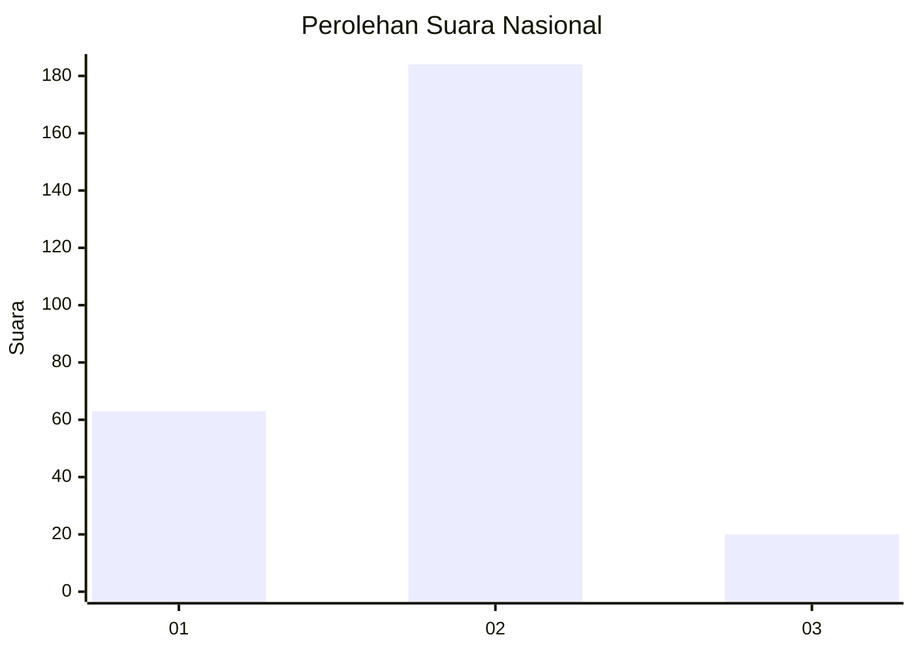
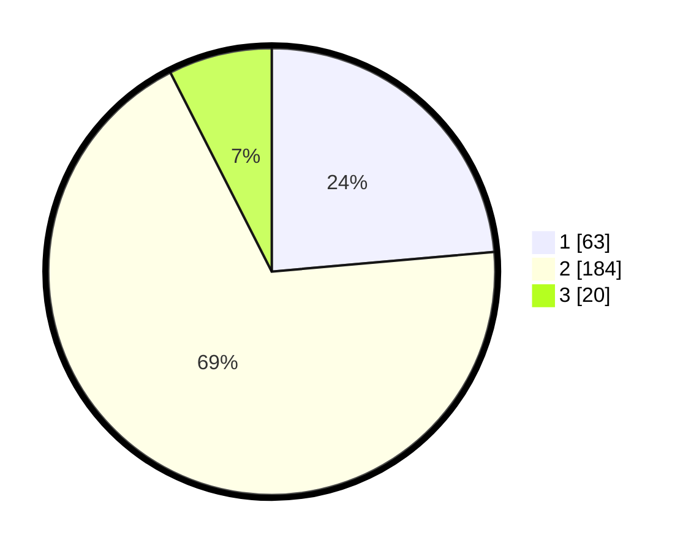

# Hasil

## Grafik

## Tabel

| No. | Nama Paslon    | Suara | Suara (raw) | Persentase |
|:--- |:-------------- | -----:| -----------:| ----------:|
| 1   | ANIES MUHAIMIN | 63    | [63][p-1]   | 23,60      |
| 2   | PRABOWO GIBRAN | 184   | [184][p-2]  | 68,91      |
| 3   | GANJAR MAHFUD  | 20    | [20][p-3]   | 7,49       |

[p-1]: https://github.com/gigit-pemilu/pemilu-2024/blob/main/pilpres/hitung-suara/sub/16-sumatera-selatan/sub/02-ogan-komering-ilir/sub/18-cengal/sub/2007-cengal/sub/009-tps/sub/paslon-1.txt
[p-2]: https://github.com/gigit-pemilu/pemilu-2024/blob/main/pilpres/hitung-suara/sub/16-sumatera-selatan/sub/02-ogan-komering-ilir/sub/18-cengal/sub/2007-cengal/sub/009-tps/sub/paslon-2.txt
[p-3]: https://github.com/gigit-pemilu/pemilu-2024/blob/main/pilpres/hitung-suara/sub/16-sumatera-selatan/sub/02-ogan-komering-ilir/sub/18-cengal/sub/2007-cengal/sub/009-tps/sub/paslon-3.txt

## Foto C Plano

https://sirekap-obj-formc.kpu.go.id/111e/pemilu/ppwp/16/02/18/20/07/1602182007009-20240215-121420--0ed14dac-9e51-428c-a09c-0dde212d1ce7.jpg

https://sirekap-obj-formc.kpu.go.id/111e/pemilu/ppwp/16/02/18/20/07/1602182007009-20240215-014457--1a057676-1039-4734-b4b0-83f925c1d32f.jpg

https://sirekap-obj-formc.kpu.go.id/111e/pemilu/ppwp/16/02/18/20/07/1602182007009-20240215-091833--66fab4cd-1816-4f60-af8c-713c98f477e4.jpg

## Metadata

| Key        | Value               |
| ---------- | ------------------- |
| Time Stamp | 2024-02-19 06:16:00 |

