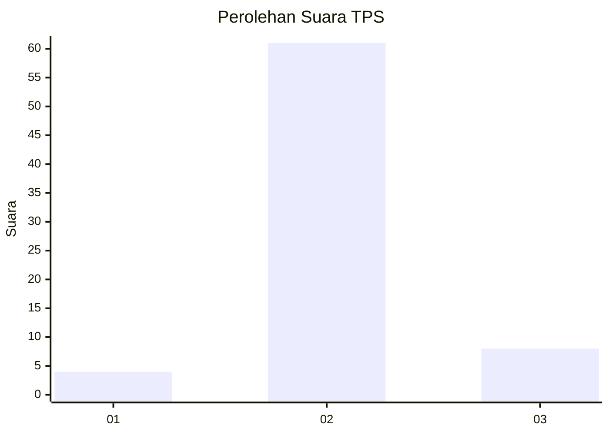
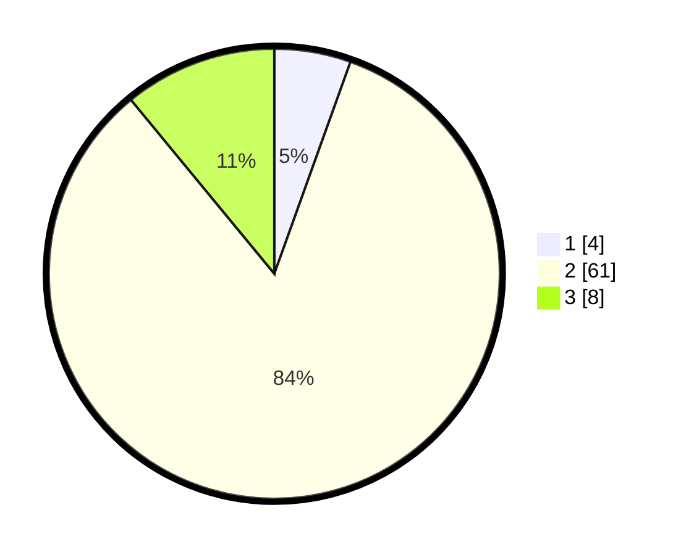

# Hasil

## Grafik

## Tabel

| No. | Nama Paslon    | Suara | Suara (raw) | Persentase |
|:--- |:-------------- | -----:| -----------:| ----------:|
| 1   | ANIES MUHAIMIN | 4     | [4][p-1]    | 5,48       |
| 2   | PRABOWO GIBRAN | 61    | [61][p-2]   | 83,56      |
| 3   | GANJAR MAHFUD  | 8     | [8][p-3]    | 10,96      |

[p-1]: https://github.com/gigit-pemilu/pemilu-2024-16-sumatera-selatan/blob/main/pilpres/hitung-suara/sub/16-sumatera-selatan/sub/02-ogan-komering-ilir/sub/18-cengal/sub/2010-kuala-sungai-jeruju/sub/004-tps/sub/paslon-1.txt
[p-2]: https://github.com/gigit-pemilu/pemilu-2024-16-sumatera-selatan/blob/main/pilpres/hitung-suara/sub/16-sumatera-selatan/sub/02-ogan-komering-ilir/sub/18-cengal/sub/2010-kuala-sungai-jeruju/sub/004-tps/sub/paslon-2.txt
[p-3]: https://github.com/gigit-pemilu/pemilu-2024-16-sumatera-selatan/blob/main/pilpres/hitung-suara/sub/16-sumatera-selatan/sub/02-ogan-komering-ilir/sub/18-cengal/sub/2010-kuala-sungai-jeruju/sub/004-tps/sub/paslon-3.txt

## Foto C Plano

https://sirekap-obj-formc.kpu.go.id/19f5/pemilu/ppwp/16/02/18/20/10/1602182010004-20240216-105925--f8574aee-6ae6-4c9b-a223-b5d5c77b9fc2.jpg

https://sirekap-obj-formc.kpu.go.id/19f5/pemilu/ppwp/16/02/18/20/10/1602182010004-20240216-105928--258c4a35-5a82-4f34-82cd-1094e5e18f29.jpg

https://sirekap-obj-formc.kpu.go.id/19f5/pemilu/ppwp/16/02/18/20/10/1602182010004-20240216-105926--ec989484-1da1-4012-b765-6779feff4135.jpg

## Metadata

| Key        | Value               |
| ---------- | ------------------- |
| Time Stamp | 2024-02-17 14:45:18 |

## DATA PEMILIH TETAP

Jumlah pemilih dalam DPT: **148**.
 * L: **81**.
 * P: **67**.

## DATA PENGGUNA HAK PILIH

Jumlah pengguna hak pilih dalam DPT: **75**.
 * L: **40**.
 * P: **35**.

Jumlah pengguna hak pilih dalam DPTb: **1**.
 * L: **0**.
 * P: **1**.

Jumlah pengguna hak pilih dalam DPK: **0**.
 * L: **0**.
 * P: **0**.

Jumlah pengguna hak pilih: **76**.
 * L: **40**.
 * P: **36**.

## JUMLAH SUARA SAH DAN TIDAK SAH

JUMLAH SELURUH SUARA SAH: **73**.

JUMLAH SUARA TIDAK SAH: **3**.

JUMLAH SELURUH SUARA SAH DAN SUARA TIDAK SAH: **76**.

