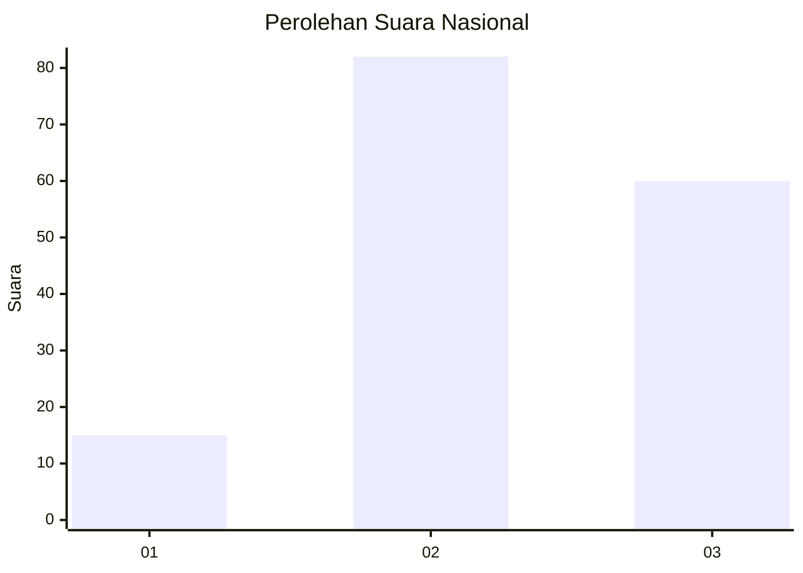
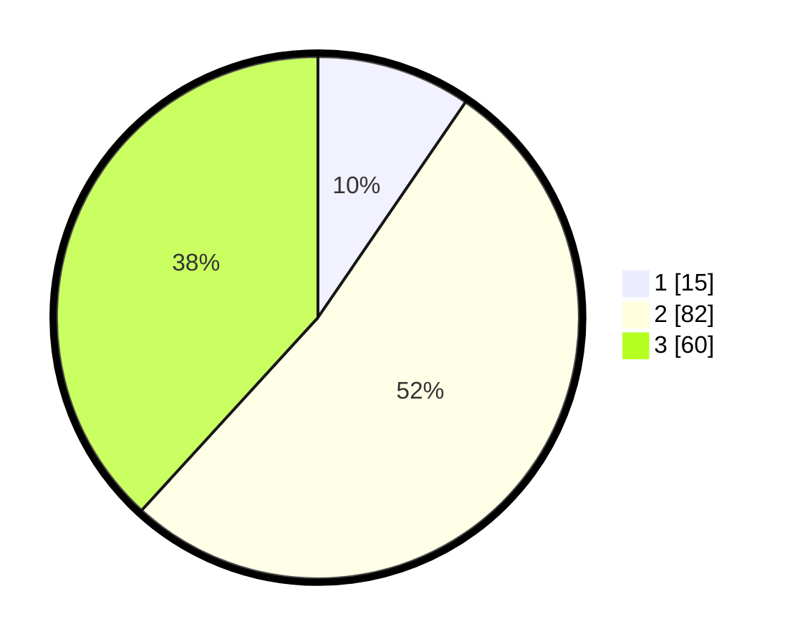

# Hasil

## Grafik

## Tabel

| No. | Nama Paslon    | Suara | Suara (raw) | Persentase |
|:--- |:-------------- | -----:| -----------:| ----------:|
| 1   | ANIES MUHAIMIN | 15    | [15][p-1]   | 9,55       |
| 2   | PRABOWO GIBRAN | 82    | [82][p-2]   | 52,23      |
| 3   | GANJAR MAHFUD  | 60    | [60][p-3]   | 38,22      |

[p-1]: https://github.com/gigit-pemilu/pemilu-2024/blob/main/pilpres/hitung-suara/sub/16-sumatera-selatan/sub/02-ogan-komering-ilir/sub/18-cengal/sub/2014-balam-jeruju/sub/003-tps/sub/paslon-1.txt
[p-2]: https://github.com/gigit-pemilu/pemilu-2024/blob/main/pilpres/hitung-suara/sub/16-sumatera-selatan/sub/02-ogan-komering-ilir/sub/18-cengal/sub/2014-balam-jeruju/sub/003-tps/sub/paslon-2.txt
[p-3]: https://github.com/gigit-pemilu/pemilu-2024/blob/main/pilpres/hitung-suara/sub/16-sumatera-selatan/sub/02-ogan-komering-ilir/sub/18-cengal/sub/2014-balam-jeruju/sub/003-tps/sub/paslon-3.txt

## Foto C Plano

https://sirekap-obj-formc.kpu.go.id/63da/pemilu/ppwp/16/02/18/20/14/1602182014003-20240215-095255--a0707a16-85ee-49a6-96cd-3995fdeeee6a.jpg

https://sirekap-obj-formc.kpu.go.id/63da/pemilu/ppwp/16/02/18/20/14/1602182014003-20240215-095525--d51fd360-1f72-4579-ab30-4a445a1a46da.jpg

https://sirekap-obj-formc.kpu.go.id/63da/pemilu/ppwp/16/02/18/20/14/1602182014003-20240215-095859--cda9c7af-bc49-4a82-b8ef-8fe520e043fc.jpg

## Metadata

| Key        | Value               |
| ---------- | ------------------- |
| Time Stamp | 2024-02-19 06:16:00 |

