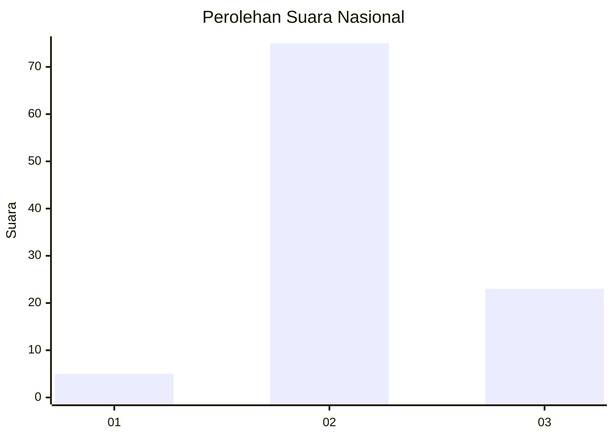
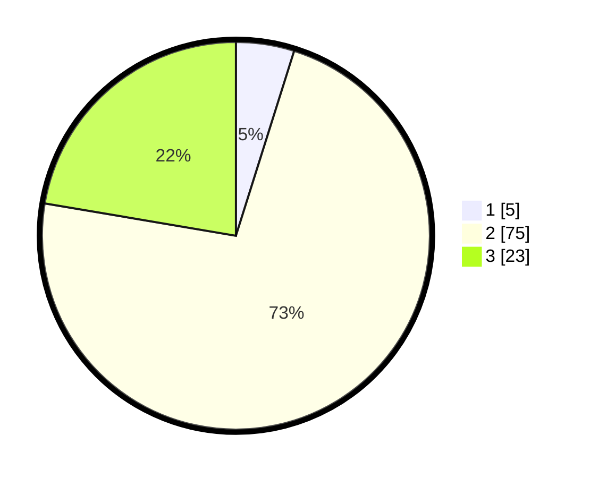

# Hasil

## Grafik

## Tabel

| No. | Nama Paslon    | Suara | Suara (raw) | Persentase |
|:--- |:-------------- | -----:| -----------:| ----------:|
| 1   | ANIES MUHAIMIN | 5     | [5][p-1]    | 4,85       |
| 2   | PRABOWO GIBRAN | 75    | [75][p-2]   | 72,82      |
| 3   | GANJAR MAHFUD  | 23    | [23][p-3]   | 22,33      |

[p-1]: https://github.com/gigit-pemilu/pemilu-2024/blob/main/pilpres/hitung-suara/sub/16-sumatera-selatan/sub/02-ogan-komering-ilir/sub/18-cengal/sub/2015-kebun-cabe/sub/003-tps/sub/paslon-1.txt
[p-2]: https://github.com/gigit-pemilu/pemilu-2024/blob/main/pilpres/hitung-suara/sub/16-sumatera-selatan/sub/02-ogan-komering-ilir/sub/18-cengal/sub/2015-kebun-cabe/sub/003-tps/sub/paslon-2.txt
[p-3]: https://github.com/gigit-pemilu/pemilu-2024/blob/main/pilpres/hitung-suara/sub/16-sumatera-selatan/sub/02-ogan-komering-ilir/sub/18-cengal/sub/2015-kebun-cabe/sub/003-tps/sub/paslon-3.txt

## Foto C Plano

https://sirekap-obj-formc.kpu.go.id/0e9f/pemilu/ppwp/16/02/18/20/15/1602182015003-20240214-232813--5b6c92e9-f4a4-4de0-8ae6-6306df7b559f.jpg

https://sirekap-obj-formc.kpu.go.id/0e9f/pemilu/ppwp/16/02/18/20/15/1602182015003-20240215-023659--3470eed1-2351-4404-bd69-817f431f4385.jpg

https://sirekap-obj-formc.kpu.go.id/0e9f/pemilu/ppwp/16/02/18/20/15/1602182015003-20240215-023916--f728d04a-6d27-417d-bcaf-d4850e1a3e14.jpg

## Metadata

| Key        | Value               |
| ---------- | ------------------- |
| Time Stamp | 2024-02-16 09:30:28 |

