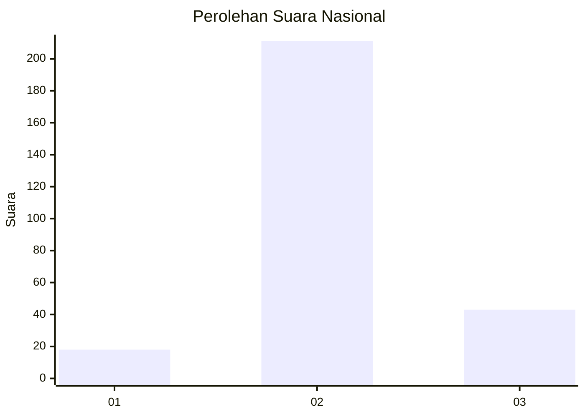
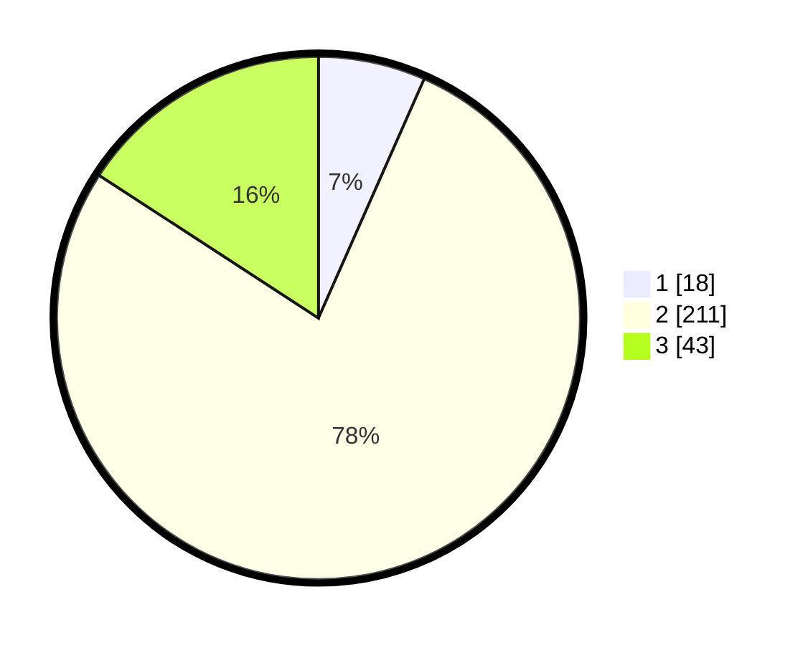

# Hasil

## Grafik

## Tabel

| No. | Nama Paslon    | Suara | Suara (raw) | Persentase |
|:--- |:-------------- | -----:| -----------:| ----------:|
| 1   | ANIES MUHAIMIN | 18    | [18][p-1]   | 6,62       |
| 2   | PRABOWO GIBRAN | 211   | [211][p-2]  | 77,57      |
| 3   | GANJAR MAHFUD  | 43    | [43][p-3]   | 15,81      |

[p-1]: https://github.com/gigit-pemilu/pemilu-2024/blob/main/pilpres/hitung-suara/sub/16-sumatera-selatan/sub/02-ogan-komering-ilir/sub/20-mesuji-makmur/sub/2007-kampung-baru/sub/002-tps/sub/paslon-1.txt
[p-2]: https://github.com/gigit-pemilu/pemilu-2024/blob/main/pilpres/hitung-suara/sub/16-sumatera-selatan/sub/02-ogan-komering-ilir/sub/20-mesuji-makmur/sub/2007-kampung-baru/sub/002-tps/sub/paslon-2.txt
[p-3]: https://github.com/gigit-pemilu/pemilu-2024/blob/main/pilpres/hitung-suara/sub/16-sumatera-selatan/sub/02-ogan-komering-ilir/sub/20-mesuji-makmur/sub/2007-kampung-baru/sub/002-tps/sub/paslon-3.txt

## Foto C Plano

https://sirekap-obj-formc.kpu.go.id/3710/pemilu/ppwp/16/02/20/20/07/1602202007002-20240214-220555--ee49719d-a4a8-4d82-ae63-d0697e3abed5.jpg

https://sirekap-obj-formc.kpu.go.id/3710/pemilu/ppwp/16/02/20/20/07/1602202007002-20240214-214235--c52b8255-e404-418c-81c0-66c15ccd5b88.jpg

https://sirekap-obj-formc.kpu.go.id/3710/pemilu/ppwp/16/02/20/20/07/1602202007002-20240214-214354--5823160e-8d0d-4821-889b-50411d0a6db5.jpg

## Metadata

| Key        | Value               |
| ---------- | ------------------- |
| Time Stamp | 2024-02-19 12:00:00 |

