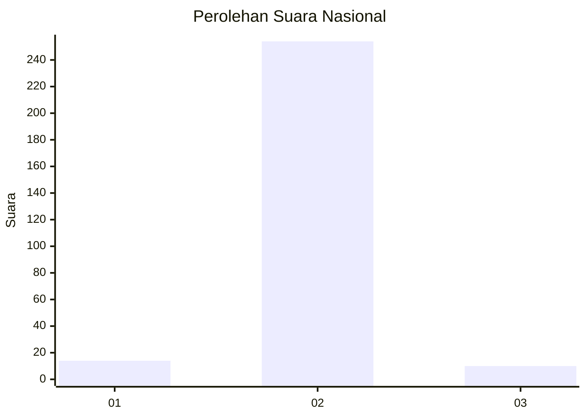
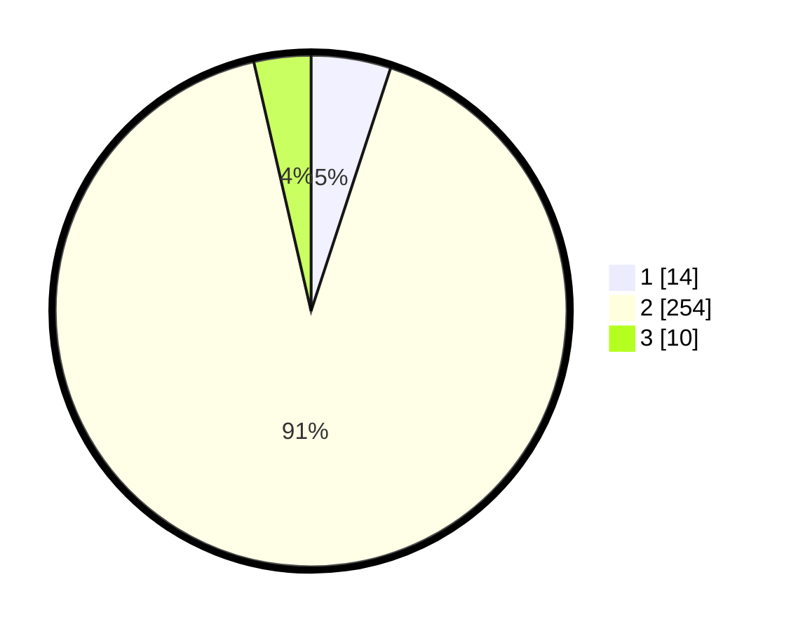

# Hasil

## Grafik

## Tabel

| No. | Nama Paslon    | Suara | Suara (raw) | Persentase |
|:--- |:-------------- | -----:| -----------:| ----------:|
| 1   | ANIES MUHAIMIN | 14    | [14][p-1]   | 5,04       |
| 2   | PRABOWO GIBRAN | 254   | [254][p-2]  | 91,37      |
| 3   | GANJAR MAHFUD  | 10    | [10][p-3]   | 3,60       |

[p-1]: https://github.com/gigit-pemilu/pemilu-2024/blob/main/pilpres/hitung-suara/sub/16-sumatera-selatan/sub/02-ogan-komering-ilir/sub/20-mesuji-makmur/sub/2007-kampung-baru/sub/003-tps/sub/paslon-1.txt
[p-2]: https://github.com/gigit-pemilu/pemilu-2024/blob/main/pilpres/hitung-suara/sub/16-sumatera-selatan/sub/02-ogan-komering-ilir/sub/20-mesuji-makmur/sub/2007-kampung-baru/sub/003-tps/sub/paslon-2.txt
[p-3]: https://github.com/gigit-pemilu/pemilu-2024/blob/main/pilpres/hitung-suara/sub/16-sumatera-selatan/sub/02-ogan-komering-ilir/sub/20-mesuji-makmur/sub/2007-kampung-baru/sub/003-tps/sub/paslon-3.txt

## Foto C Plano

https://sirekap-obj-formc.kpu.go.id/c900/pemilu/ppwp/16/02/20/20/07/1602202007003-20240214-213430--d70a9d40-41bf-48fe-9877-7c01257df7a6.jpg

https://sirekap-obj-formc.kpu.go.id/c900/pemilu/ppwp/16/02/20/20/07/1602202007003-20240214-213511--ce7e0371-dace-4fd1-8b56-d1bf706f368f.jpg

https://sirekap-obj-formc.kpu.go.id/c900/pemilu/ppwp/16/02/20/20/07/1602202007003-20240214-212256--d9427724-4ba3-4ceb-b034-9b47eac893cc.jpg

## Metadata

| Key        | Value               |
| ---------- | ------------------- |
| Time Stamp | 2024-02-19 12:00:00 |

