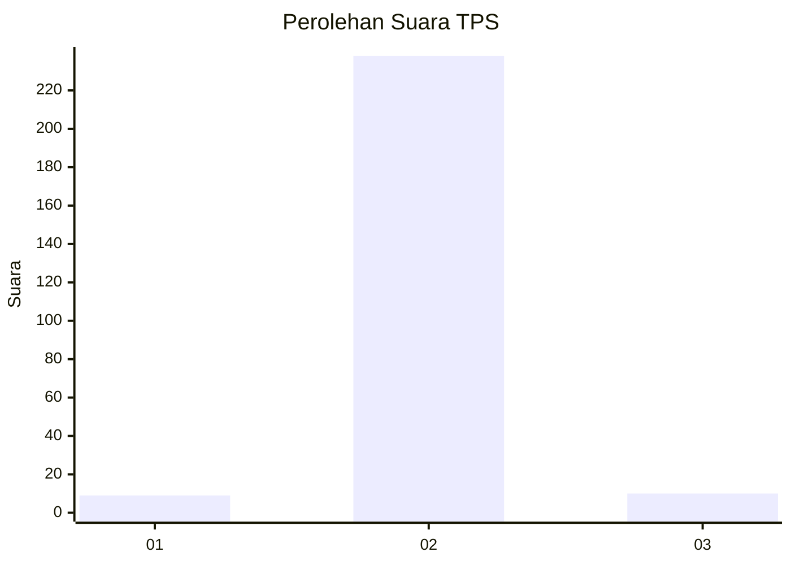
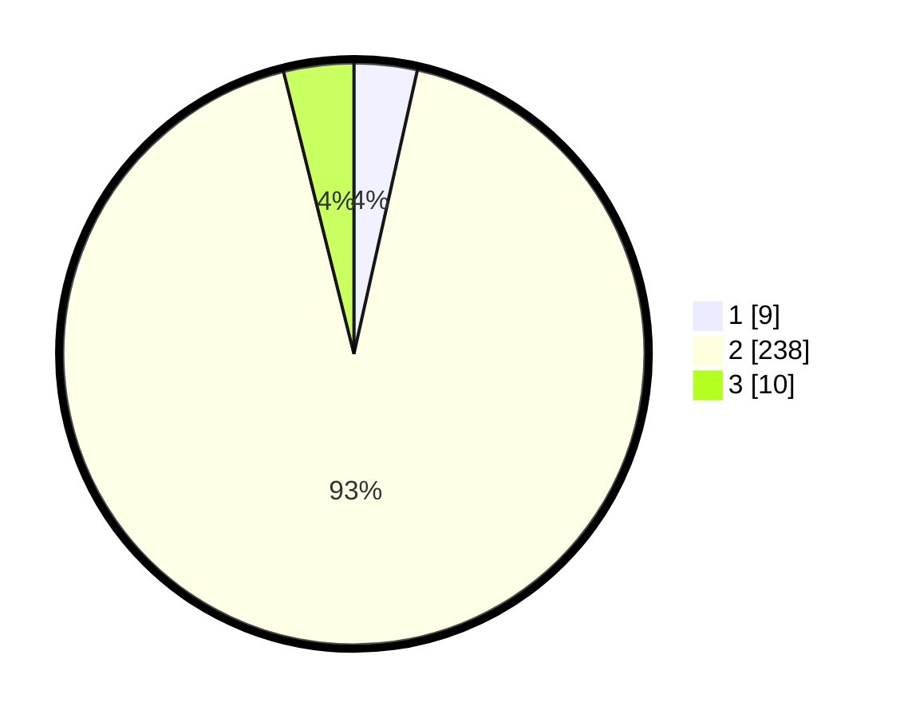

# Hasil

## Grafik

## Tabel

| No. | Nama Paslon    | Suara | Suara (raw) | Persentase |
|:--- |:-------------- | -----:| -----------:| ----------:|
| 1   | ANIES MUHAIMIN | 9     | [9][p-1]    | 3,50       |
| 2   | PRABOWO GIBRAN | 238   | [238][p-2]  | 92,61      |
| 3   | GANJAR MAHFUD  | 10    | [10][p-3]   | 3,89       |

[p-1]: https://github.com/gigit-pemilu/pemilu-2024-16-sumatera-selatan/blob/main/pilpres/hitung-suara/sub/16-sumatera-selatan/sub/02-ogan-komering-ilir/sub/20-mesuji-makmur/sub/2007-kampung-baru/sub/012-tps/sub/paslon-1.txt
[p-2]: https://github.com/gigit-pemilu/pemilu-2024-16-sumatera-selatan/blob/main/pilpres/hitung-suara/sub/16-sumatera-selatan/sub/02-ogan-komering-ilir/sub/20-mesuji-makmur/sub/2007-kampung-baru/sub/012-tps/sub/paslon-2.txt
[p-3]: https://github.com/gigit-pemilu/pemilu-2024-16-sumatera-selatan/blob/main/pilpres/hitung-suara/sub/16-sumatera-selatan/sub/02-ogan-komering-ilir/sub/20-mesuji-makmur/sub/2007-kampung-baru/sub/012-tps/sub/paslon-3.txt

## Foto C Plano

https://sirekap-obj-formc.kpu.go.id/0873/pemilu/ppwp/16/02/20/20/07/1602202007012-20240214-234843--4d2b664a-47f4-4d1b-8b75-574605221abe.jpg

https://sirekap-obj-formc.kpu.go.id/0873/pemilu/ppwp/16/02/20/20/07/1602202007012-20240214-234857--97a30486-e3b0-470b-a359-698dfda18799.jpg

https://sirekap-obj-formc.kpu.go.id/0873/pemilu/ppwp/16/02/20/20/07/1602202007012-20240214-234930--b8a5f439-31bb-4690-92fe-3813ff28e7e7.jpg

## Metadata

| Key        | Value               |
| ---------- | ------------------- |
| Time Stamp | 2024-02-19 06:16:00 |

