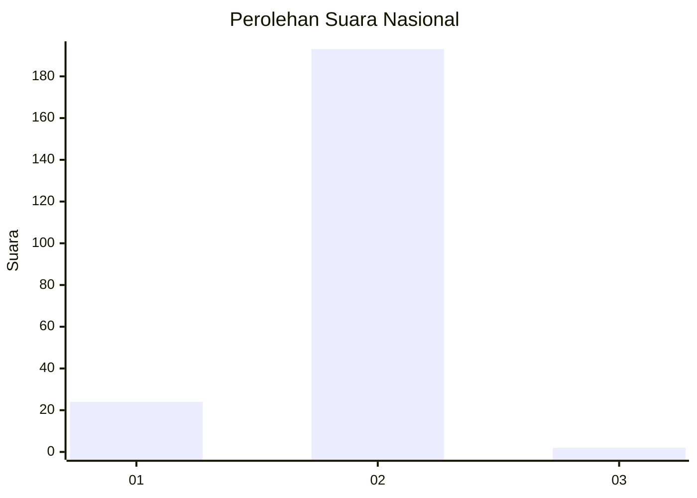
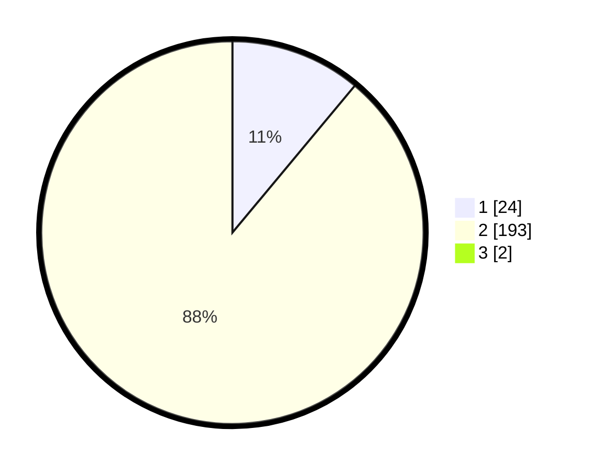

# Hasil

## Grafik

## Tabel

| No. | Nama Paslon    | Suara | Suara (raw) | Persentase |
|:--- |:-------------- | -----:| -----------:| ----------:|
| 1   | ANIES MUHAIMIN | 24    | [24][p-1]   | 10,96      |
| 2   | PRABOWO GIBRAN | 193   | [193][p-2]  | 88,13      |
| 3   | GANJAR MAHFUD  | 2     | [2][p-3]    | 0,91       |

[p-1]: https://github.com/gigit-pemilu/pemilu-2024/blob/main/pilpres/hitung-suara/sub/16-sumatera-selatan/sub/02-ogan-komering-ilir/sub/21-mesuji-raya/sub/2001-embacang/sub/002-tps/sub/paslon-1.txt
[p-2]: https://github.com/gigit-pemilu/pemilu-2024/blob/main/pilpres/hitung-suara/sub/16-sumatera-selatan/sub/02-ogan-komering-ilir/sub/21-mesuji-raya/sub/2001-embacang/sub/002-tps/sub/paslon-2.txt
[p-3]: https://github.com/gigit-pemilu/pemilu-2024/blob/main/pilpres/hitung-suara/sub/16-sumatera-selatan/sub/02-ogan-komering-ilir/sub/21-mesuji-raya/sub/2001-embacang/sub/002-tps/sub/paslon-3.txt

## Foto C Plano

https://sirekap-obj-formc.kpu.go.id/2dca/pemilu/ppwp/16/02/21/20/01/1602212001002-20240215-004449--05710d0a-b69e-43df-a7ce-0f07154256ae.jpg

https://sirekap-obj-formc.kpu.go.id/2dca/pemilu/ppwp/16/02/21/20/01/1602212001002-20240215-004619--d9dbc7eb-c0b8-49f7-b263-35f32ef62173.jpg

https://sirekap-obj-formc.kpu.go.id/2dca/pemilu/ppwp/16/02/21/20/01/1602212001002-20240215-004740--0b0a30e8-866e-4657-8f40-abc366cba42d.jpg

## Metadata

| Key        | Value               |
| ---------- | ------------------- |
| Time Stamp | 2024-02-19 14:00:00 |

