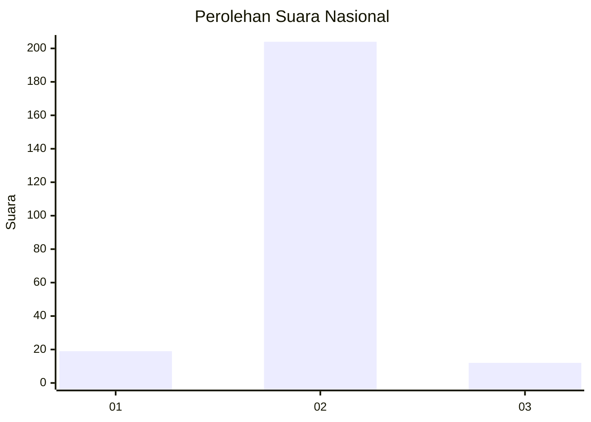
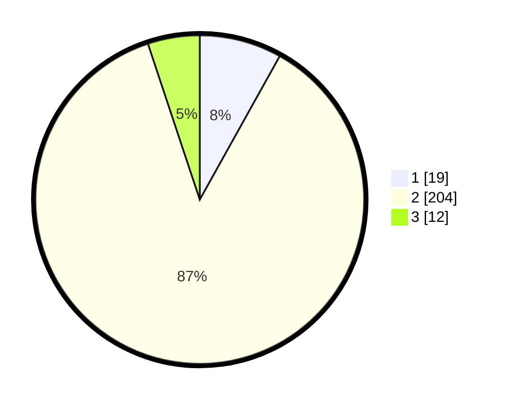

# Hasil

## Grafik

## Tabel

| No. | Nama Paslon    | Suara | Suara (raw) | Persentase |
|:--- |:-------------- | -----:| -----------:| ----------:|
| 1   | ANIES MUHAIMIN | 19    | [19][p-1]   | 8,09       |
| 2   | PRABOWO GIBRAN | 204   | [204][p-2]  | 86,81      |
| 3   | GANJAR MAHFUD  | 12    | [12][p-3]   | 5,11       |

[p-1]: https://github.com/gigit-pemilu/pemilu-2024/blob/main/pilpres/hitung-suara/sub/16-sumatera-selatan/sub/02-ogan-komering-ilir/sub/21-mesuji-raya/sub/2001-embacang/sub/003-tps/sub/paslon-1.txt
[p-2]: https://github.com/gigit-pemilu/pemilu-2024/blob/main/pilpres/hitung-suara/sub/16-sumatera-selatan/sub/02-ogan-komering-ilir/sub/21-mesuji-raya/sub/2001-embacang/sub/003-tps/sub/paslon-2.txt
[p-3]: https://github.com/gigit-pemilu/pemilu-2024/blob/main/pilpres/hitung-suara/sub/16-sumatera-selatan/sub/02-ogan-komering-ilir/sub/21-mesuji-raya/sub/2001-embacang/sub/003-tps/sub/paslon-3.txt

## Foto C Plano

https://sirekap-obj-formc.kpu.go.id/b016/pemilu/ppwp/16/02/21/20/01/1602212001003-20240215-003500--85b90b78-5ce3-417a-82a3-1accee1fb7c9.jpg

https://sirekap-obj-formc.kpu.go.id/b016/pemilu/ppwp/16/02/21/20/01/1602212001003-20240215-003537--cd4a9054-7af3-4f23-a148-2c576116120a.jpg

https://sirekap-obj-formc.kpu.go.id/b016/pemilu/ppwp/16/02/21/20/01/1602212001003-20240215-003626--32c1168c-f0ce-4267-8522-494db20d0c30.jpg

## Metadata

| Key        | Value               |
| ---------- | ------------------- |
| Time Stamp | 2024-02-19 06:16:00 |

