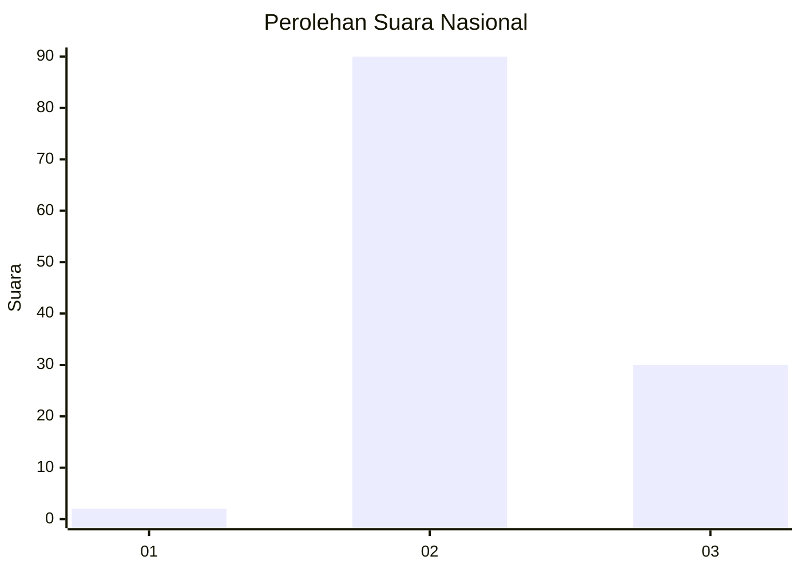
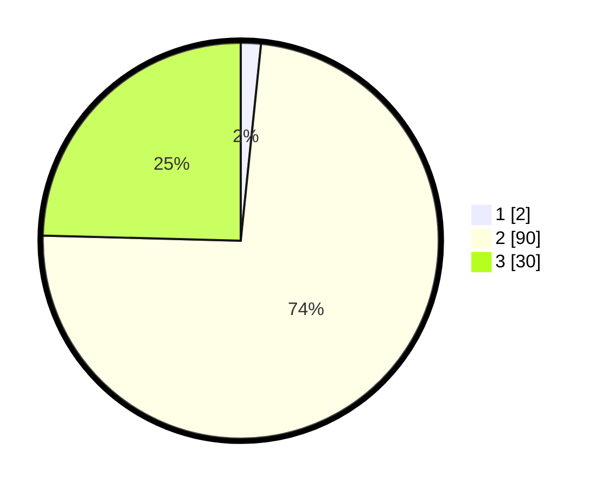

# Hasil

## Grafik

## Tabel

| No. | Nama Paslon    | Suara | Suara (raw) | Persentase |
|:--- |:-------------- | -----:| -----------:| ----------:|
| 1   | ANIES MUHAIMIN | 2     | [2][p-1]    | 1,64       |
| 2   | PRABOWO GIBRAN | 90    | [90][p-2]   | 73,77      |
| 3   | GANJAR MAHFUD  | 30    | [30][p-3]   | 24,59      |

[p-1]: https://github.com/gigit-pemilu/pemilu-2024/blob/main/pilpres/hitung-suara/sub/16-sumatera-selatan/sub/02-ogan-komering-ilir/sub/21-mesuji-raya/sub/2001-embacang/sub/005-tps/sub/paslon-1.txt
[p-2]: https://github.com/gigit-pemilu/pemilu-2024/blob/main/pilpres/hitung-suara/sub/16-sumatera-selatan/sub/02-ogan-komering-ilir/sub/21-mesuji-raya/sub/2001-embacang/sub/005-tps/sub/paslon-2.txt
[p-3]: https://github.com/gigit-pemilu/pemilu-2024/blob/main/pilpres/hitung-suara/sub/16-sumatera-selatan/sub/02-ogan-komering-ilir/sub/21-mesuji-raya/sub/2001-embacang/sub/005-tps/sub/paslon-3.txt

## Foto C Plano

https://sirekap-obj-formc.kpu.go.id/9dae/pemilu/ppwp/16/02/21/20/01/1602212001005-20240214-214943--7db1b44b-a4fa-4da2-a74c-b929f2c4ec5f.jpg

https://sirekap-obj-formc.kpu.go.id/9dae/pemilu/ppwp/16/02/21/20/01/1602212001005-20240214-215304--ab679999-6350-452a-b201-d52de4f6c774.jpg

https://sirekap-obj-formc.kpu.go.id/9dae/pemilu/ppwp/16/02/21/20/01/1602212001005-20240214-215433--2d8ca6cb-3d18-497b-8e48-5d11b827b578.jpg

## Metadata

| Key        | Value               |
| ---------- | ------------------- |
| Time Stamp | 2024-02-19 06:16:00 |

