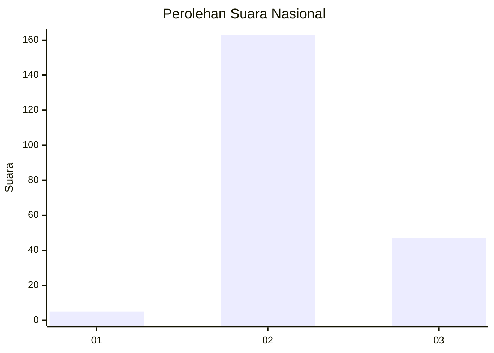

# Hasil

## Grafik

## Tabel

| No. | Nama Paslon    | Suara | Suara (raw) | Persentase |
|:--- |:-------------- | -----:| -----------:| ----------:|
| 1   | ANIES MUHAIMIN | 5     | [5][p-1]    | 2,33       |
| 2   | PRABOWO GIBRAN | 163   | [163][p-2]  | 75,81      |
| 3   | GANJAR MAHFUD  | 47    | [47][p-3]   | 21,86      |

[p-1]: https://github.com/gigit-pemilu/pemilu-2024/blob/main/pilpres/hitung-suara/sub/16-sumatera-selatan/sub/02-ogan-komering-ilir/sub/21-mesuji-raya/sub/2001-embacang/sub/006-tps/sub/paslon-1.txt
[p-2]: https://github.com/gigit-pemilu/pemilu-2024/blob/main/pilpres/hitung-suara/sub/16-sumatera-selatan/sub/02-ogan-komering-ilir/sub/21-mesuji-raya/sub/2001-embacang/sub/006-tps/sub/paslon-2.txt
[p-3]: https://github.com/gigit-pemilu/pemilu-2024/blob/main/pilpres/hitung-suara/sub/16-sumatera-selatan/sub/02-ogan-komering-ilir/sub/21-mesuji-raya/sub/2001-embacang/sub/006-tps/sub/paslon-3.txt

## Foto C Plano

https://sirekap-obj-formc.kpu.go.id/0c64/pemilu/ppwp/16/02/21/20/01/1602212001006-20240214-222906--3d896b2a-4c54-4181-83d2-ecac4ea2b136.jpg

https://sirekap-obj-formc.kpu.go.id/0c64/pemilu/ppwp/16/02/21/20/01/1602212001006-20240214-223040--7ee7d5d2-1c05-4e72-90a0-f9e0bab2608d.jpg

https://sirekap-obj-formc.kpu.go.id/0c64/pemilu/ppwp/16/02/21/20/01/1602212001006-20240214-223153--ea620793-4106-4db7-ad00-844c859f09db.jpg

## Metadata

| Key        | Value               |
| ---------- | ------------------- |
| Time Stamp | 2024-02-19 14:00:00 |

