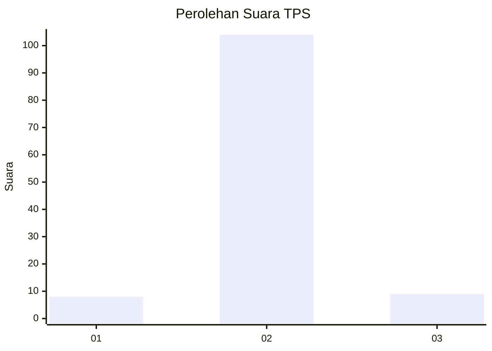
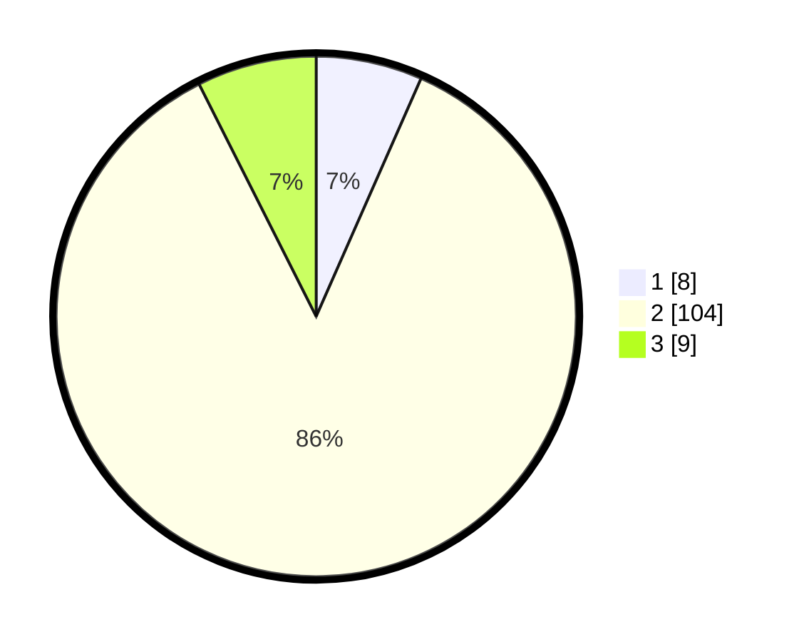

# Hasil

## Grafik

## Tabel

| No. | Nama Paslon    | Suara | Suara (raw) | Persentase |
|:--- |:-------------- | -----:| -----------:| ----------:|
| 1   | ANIES MUHAIMIN | 8     | [8][p-1]    | 6,61       |
| 2   | PRABOWO GIBRAN | 104   | [104][p-2]  | 85,95      |
| 3   | GANJAR MAHFUD  | 9     | [9][p-3]    | 7,44       |

[p-1]: https://github.com/gigit-pemilu/pemilu-2024-16-sumatera-selatan/blob/main/pilpres/hitung-suara/sub/16-sumatera-selatan/sub/02-ogan-komering-ilir/sub/21-mesuji-raya/sub/2001-embacang/sub/007-tps/sub/paslon-1.txt
[p-2]: https://github.com/gigit-pemilu/pemilu-2024-16-sumatera-selatan/blob/main/pilpres/hitung-suara/sub/16-sumatera-selatan/sub/02-ogan-komering-ilir/sub/21-mesuji-raya/sub/2001-embacang/sub/007-tps/sub/paslon-2.txt
[p-3]: https://github.com/gigit-pemilu/pemilu-2024-16-sumatera-selatan/blob/main/pilpres/hitung-suara/sub/16-sumatera-selatan/sub/02-ogan-komering-ilir/sub/21-mesuji-raya/sub/2001-embacang/sub/007-tps/sub/paslon-3.txt

## Foto C Plano

https://sirekap-obj-formc.kpu.go.id/8c4d/pemilu/ppwp/16/02/21/20/01/1602212001007-20240214-230155--abe173c3-0fac-4f0b-b3dd-6c6dbbe5c9f9.jpg

https://sirekap-obj-formc.kpu.go.id/8c4d/pemilu/ppwp/16/02/21/20/01/1602212001007-20240214-230248--8c1eaa75-fb6a-45b3-9956-8324fadaeac4.jpg

https://sirekap-obj-formc.kpu.go.id/8c4d/pemilu/ppwp/16/02/21/20/01/1602212001007-20240214-230335--dc3fe0a7-8b15-4d36-ae79-a1129d600af9.jpg

## Metadata

| Key        | Value               |
| ---------- | ------------------- |
| Time Stamp | 2024-02-19 06:16:00 |

