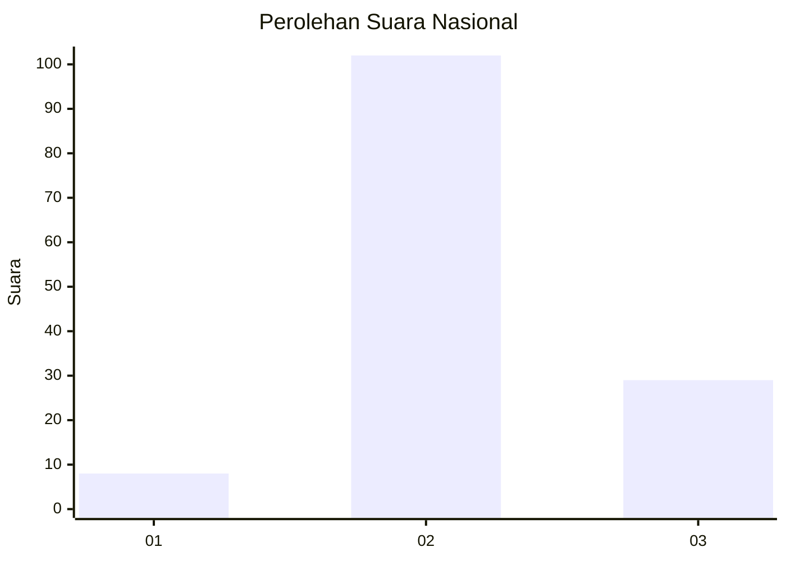

# Hasil

## Grafik

## Tabel

| No. | Nama Paslon    | Suara | Suara (raw) | Persentase |
|:--- |:-------------- | -----:| -----------:| ----------:|
| 1   | ANIES MUHAIMIN | 8     | [8][p-1]    | 5,76       |
| 2   | PRABOWO GIBRAN | 102   | [102][p-2]  | 73,38      |
| 3   | GANJAR MAHFUD  | 29    | [29][p-3]   | 20,86      |

[p-1]: https://github.com/gigit-pemilu/pemilu-2024/blob/main/pilpres/hitung-suara/sub/16-sumatera-selatan/sub/02-ogan-komering-ilir/sub/21-mesuji-raya/sub/2002-balian/sub/008-tps/sub/paslon-1.txt
[p-2]: https://github.com/gigit-pemilu/pemilu-2024/blob/main/pilpres/hitung-suara/sub/16-sumatera-selatan/sub/02-ogan-komering-ilir/sub/21-mesuji-raya/sub/2002-balian/sub/008-tps/sub/paslon-2.txt
[p-3]: https://github.com/gigit-pemilu/pemilu-2024/blob/main/pilpres/hitung-suara/sub/16-sumatera-selatan/sub/02-ogan-komering-ilir/sub/21-mesuji-raya/sub/2002-balian/sub/008-tps/sub/paslon-3.txt

## Foto C Plano

https://sirekap-obj-formc.kpu.go.id/f696/pemilu/ppwp/16/02/21/20/02/1602212002008-20240215-022200--15cb41a4-12d9-4d3d-9802-a80f8b70abb1.jpg

https://sirekap-obj-formc.kpu.go.id/f696/pemilu/ppwp/16/02/21/20/02/1602212002008-20240215-013616--5038a08d-26f2-4db2-a0d8-890fb0abd8af.jpg

https://sirekap-obj-formc.kpu.go.id/f696/pemilu/ppwp/16/02/21/20/02/1602212002008-20240215-022424--78225a82-3271-464d-acbd-d1a88ff66b67.jpg

## Metadata

| Key        | Value               |
| ---------- | ------------------- |
| Time Stamp | 2024-02-19 14:00:00 |

