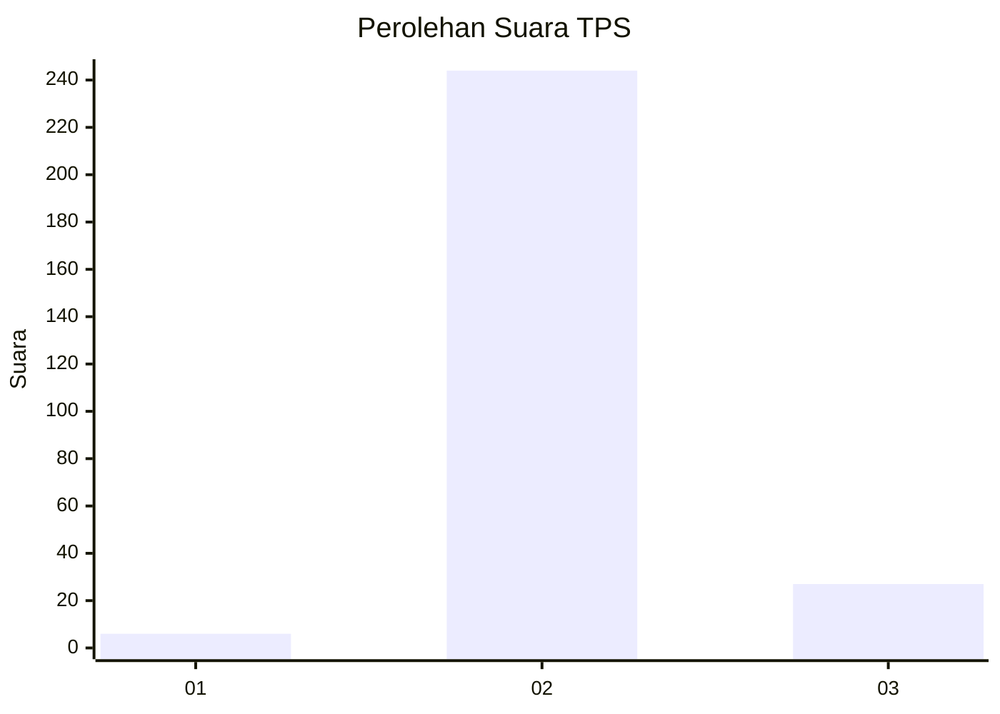
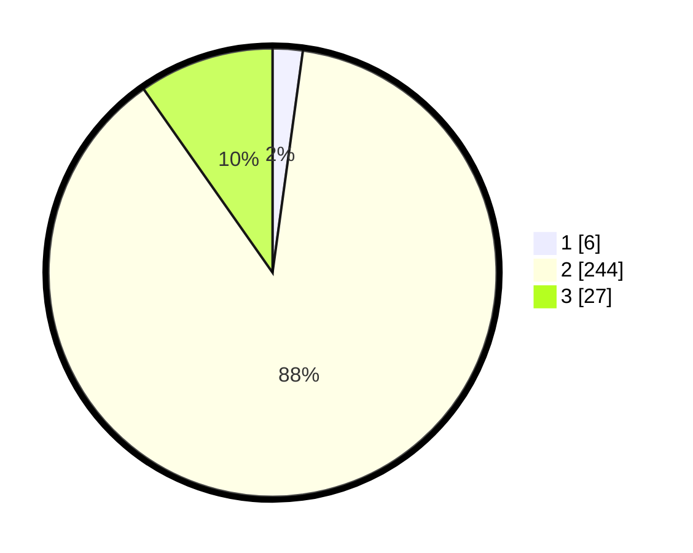

# Hasil

## Grafik

## Tabel

| No. | Nama Paslon    | Suara | Suara (raw) | Persentase |
|:--- |:-------------- | -----:| -----------:| ----------:|
| 1   | ANIES MUHAIMIN | 6     | [6][p-1]    | 2,17       |
| 2   | PRABOWO GIBRAN | 244   | [244][p-2]  | 88,09      |
| 3   | GANJAR MAHFUD  | 27    | [27][p-3]   | 9,75       |

[p-1]: https://github.com/gigit-pemilu/pemilu-2024-16-sumatera-selatan/blob/main/pilpres/hitung-suara/sub/16-sumatera-selatan/sub/02-ogan-komering-ilir/sub/21-mesuji-raya/sub/2006-mataram-jaya/sub/004-tps/sub/paslon-1.txt
[p-2]: https://github.com/gigit-pemilu/pemilu-2024-16-sumatera-selatan/blob/main/pilpres/hitung-suara/sub/16-sumatera-selatan/sub/02-ogan-komering-ilir/sub/21-mesuji-raya/sub/2006-mataram-jaya/sub/004-tps/sub/paslon-2.txt
[p-3]: https://github.com/gigit-pemilu/pemilu-2024-16-sumatera-selatan/blob/main/pilpres/hitung-suara/sub/16-sumatera-selatan/sub/02-ogan-komering-ilir/sub/21-mesuji-raya/sub/2006-mataram-jaya/sub/004-tps/sub/paslon-3.txt

## Foto C Plano

https://sirekap-obj-formc.kpu.go.id/f649/pemilu/ppwp/16/02/21/20/06/1602212006004-20240215-102213--17f6ae8b-5cb9-4425-8df5-4fc3a38f8017.jpg

https://sirekap-obj-formc.kpu.go.id/f649/pemilu/ppwp/16/02/21/20/06/1602212006004-20240215-102259--4dd5b112-b5fc-4658-adba-dc40ccbcda9f.jpg

https://sirekap-obj-formc.kpu.go.id/f649/pemilu/ppwp/16/02/21/20/06/1602212006004-20240215-102330--78b293c5-027e-40e7-a498-92ac985b7850.jpg

## Metadata

| Key        | Value               |
| ---------- | ------------------- |
| Time Stamp | 2024-02-19 06:16:00 |

