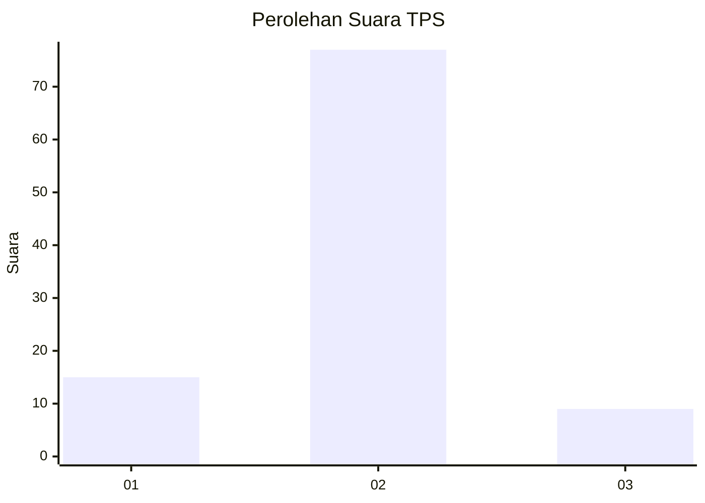
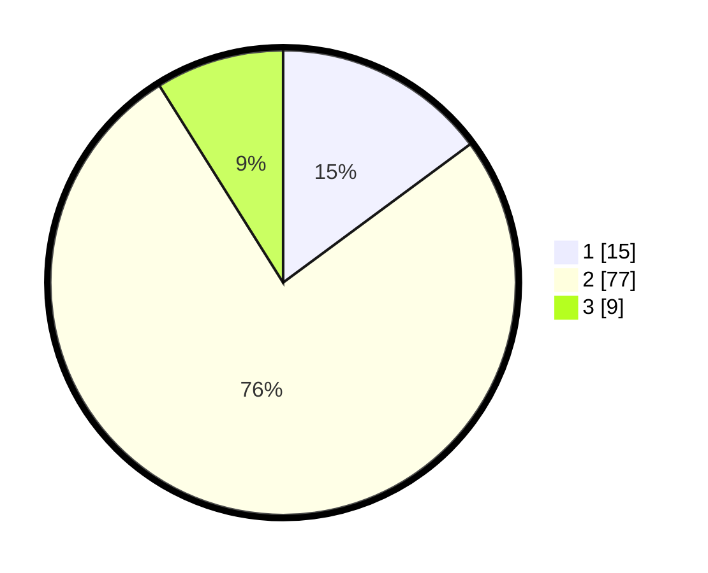

# Hasil

## Grafik

## Tabel

| No. | Nama Paslon    | Suara | Suara (raw) | Persentase |
|:--- |:-------------- | -----:| -----------:| ----------:|
| 1   | ANIES MUHAIMIN | 15    | [15][p-1]   | 14,85      |
| 2   | PRABOWO GIBRAN | 77    | [77][p-2]   | 76,24      |
| 3   | GANJAR MAHFUD  | 9     | [9][p-3]    | 8,91       |

[p-1]: https://github.com/gigit-pemilu/pemilu-2024-16-sumatera-selatan/blob/main/pilpres/hitung-suara/sub/16-sumatera-selatan/sub/02-ogan-komering-ilir/sub/21-mesuji-raya/sub/2008-sumber-baru/sub/007-tps/sub/paslon-1.txt
[p-2]: https://github.com/gigit-pemilu/pemilu-2024-16-sumatera-selatan/blob/main/pilpres/hitung-suara/sub/16-sumatera-selatan/sub/02-ogan-komering-ilir/sub/21-mesuji-raya/sub/2008-sumber-baru/sub/007-tps/sub/paslon-2.txt
[p-3]: https://github.com/gigit-pemilu/pemilu-2024-16-sumatera-selatan/blob/main/pilpres/hitung-suara/sub/16-sumatera-selatan/sub/02-ogan-komering-ilir/sub/21-mesuji-raya/sub/2008-sumber-baru/sub/007-tps/sub/paslon-3.txt

## Foto C Plano

https://sirekap-obj-formc.kpu.go.id/0432/pemilu/ppwp/16/02/21/20/08/1602212008007-20240215-001230--a3498187-ea02-41e0-a232-f9e12f93c22a.jpg

https://sirekap-obj-formc.kpu.go.id/0432/pemilu/ppwp/16/02/21/20/08/1602212008007-20240215-120733--bb1a2596-ee93-4f23-937a-f00724d70b5b.jpg

https://sirekap-obj-formc.kpu.go.id/0432/pemilu/ppwp/16/02/21/20/08/1602212008007-20240215-002811--ce87a903-aa04-4120-a6fe-6e327bc90db8.jpg

## Metadata

| Key        | Value               |
| ---------- | ------------------- |
| Time Stamp | 2024-02-19 15:00:00 |

