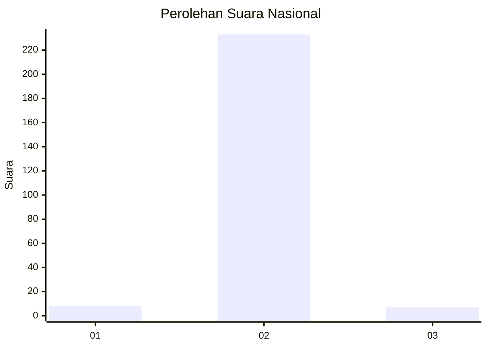
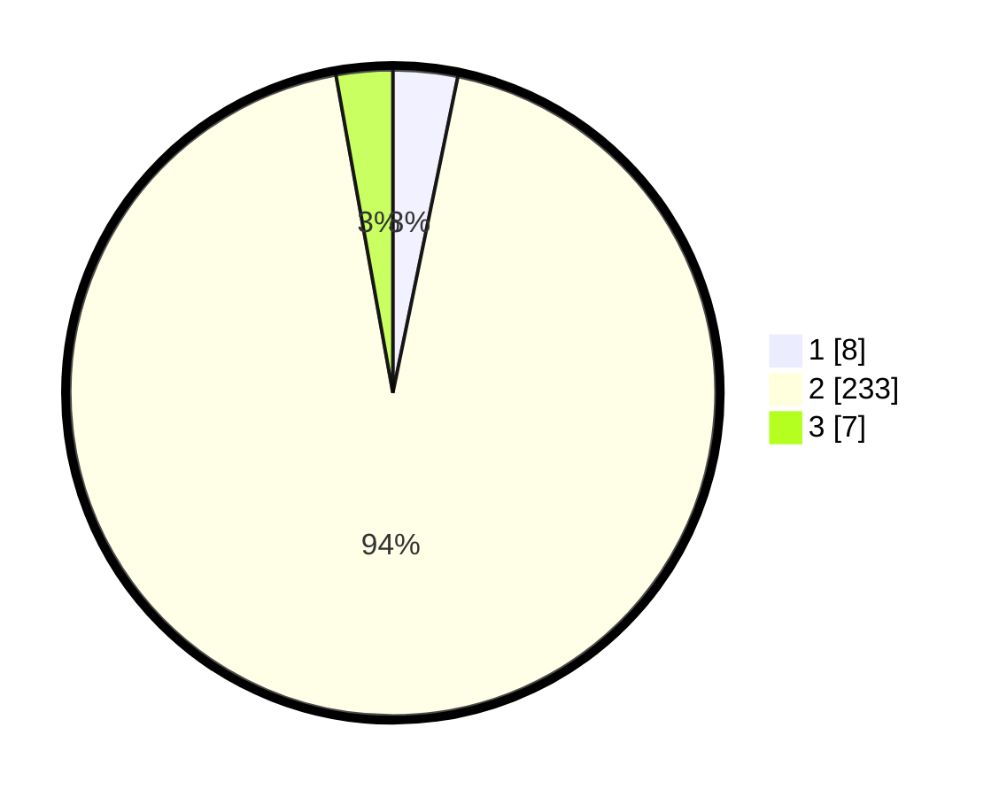

# Hasil

## Grafik

## Tabel

| No. | Nama Paslon    | Suara | Suara (raw) | Persentase |
|:--- |:-------------- | -----:| -----------:| ----------:|
| 1   | ANIES MUHAIMIN | 8     | [8][p-1]    | 3,23       |
| 2   | PRABOWO GIBRAN | 233   | [233][p-2]  | 93,95      |
| 3   | GANJAR MAHFUD  | 7     | [7][p-3]    | 2,82       |

[p-1]: https://github.com/gigit-pemilu/pemilu-2024/blob/main/pilpres/hitung-suara/sub/16-sumatera-selatan/sub/02-ogan-komering-ilir/sub/21-mesuji-raya/sub/2017-dabuk-makmur/sub/003-tps/sub/paslon-1.txt
[p-2]: https://github.com/gigit-pemilu/pemilu-2024/blob/main/pilpres/hitung-suara/sub/16-sumatera-selatan/sub/02-ogan-komering-ilir/sub/21-mesuji-raya/sub/2017-dabuk-makmur/sub/003-tps/sub/paslon-2.txt
[p-3]: https://github.com/gigit-pemilu/pemilu-2024/blob/main/pilpres/hitung-suara/sub/16-sumatera-selatan/sub/02-ogan-komering-ilir/sub/21-mesuji-raya/sub/2017-dabuk-makmur/sub/003-tps/sub/paslon-3.txt

## Foto C Plano

https://sirekap-obj-formc.kpu.go.id/a85e/pemilu/ppwp/16/02/21/20/17/1602212017003-20240215-014100--45eca686-fbb8-4556-9a79-5511ed46ed2e.jpg

https://sirekap-obj-formc.kpu.go.id/a85e/pemilu/ppwp/16/02/21/20/17/1602212017003-20240215-014337--bc4e0d41-9891-499a-90db-23bd479f8a6d.jpg

https://sirekap-obj-formc.kpu.go.id/a85e/pemilu/ppwp/16/02/21/20/17/1602212017003-20240215-014459--5d9942a7-1290-407d-b451-12760e386b97.jpg

## Metadata

| Key        | Value               |
| ---------- | ------------------- |
| Time Stamp | 2024-02-20 02:00:00 |

