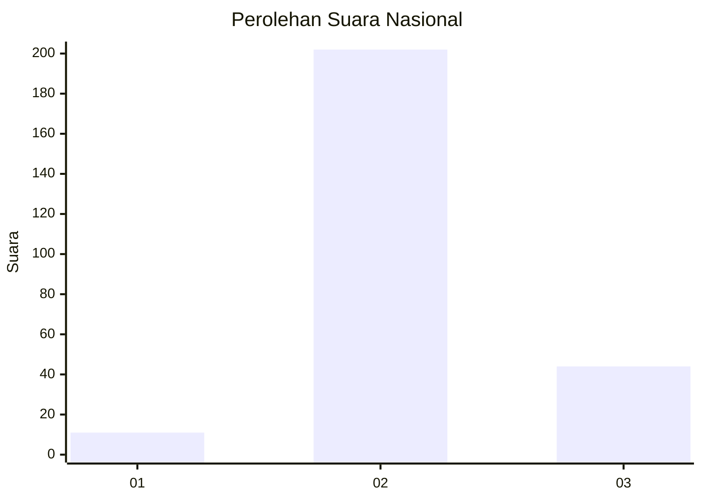

# Hasil

## Grafik

## Tabel

| No. | Nama Paslon    | Suara | Suara (raw) | Persentase |
|:--- |:-------------- | -----:| -----------:| ----------:|
| 1   | ANIES MUHAIMIN | 11    | [11][p-1]   | 4,28       |
| 2   | PRABOWO GIBRAN | 202   | [202][p-2]  | 78,60      |
| 3   | GANJAR MAHFUD  | 44    | [44][p-3]   | 17,12      |

[p-1]: https://github.com/gigit-pemilu/pemilu-2024/blob/main/pilpres/hitung-suara/sub/16-sumatera-selatan/sub/02-ogan-komering-ilir/sub/22-lempuing-jaya/sub/2002-lubuk-seberuk/sub/006-tps/sub/paslon-1.txt
[p-2]: https://github.com/gigit-pemilu/pemilu-2024/blob/main/pilpres/hitung-suara/sub/16-sumatera-selatan/sub/02-ogan-komering-ilir/sub/22-lempuing-jaya/sub/2002-lubuk-seberuk/sub/006-tps/sub/paslon-2.txt
[p-3]: https://github.com/gigit-pemilu/pemilu-2024/blob/main/pilpres/hitung-suara/sub/16-sumatera-selatan/sub/02-ogan-komering-ilir/sub/22-lempuing-jaya/sub/2002-lubuk-seberuk/sub/006-tps/sub/paslon-3.txt

## Foto C Plano

https://sirekap-obj-formc.kpu.go.id/55c5/pemilu/ppwp/16/02/22/20/02/1602222002006-20240214-230948--016313d3-a652-45f2-82e8-72e447867198.jpg

https://sirekap-obj-formc.kpu.go.id/55c5/pemilu/ppwp/16/02/22/20/02/1602222002006-20240214-231418--f93b345c-edf8-4c7a-adb6-010c5bde10b0.jpg

https://sirekap-obj-formc.kpu.go.id/55c5/pemilu/ppwp/16/02/22/20/02/1602222002006-20240214-231702--f5380b67-38db-40ec-8e6c-6fc21d6c7480.jpg

## Metadata

| Key        | Value               |
| ---------- | ------------------- |
| Time Stamp | 2024-02-19 12:00:00 |

