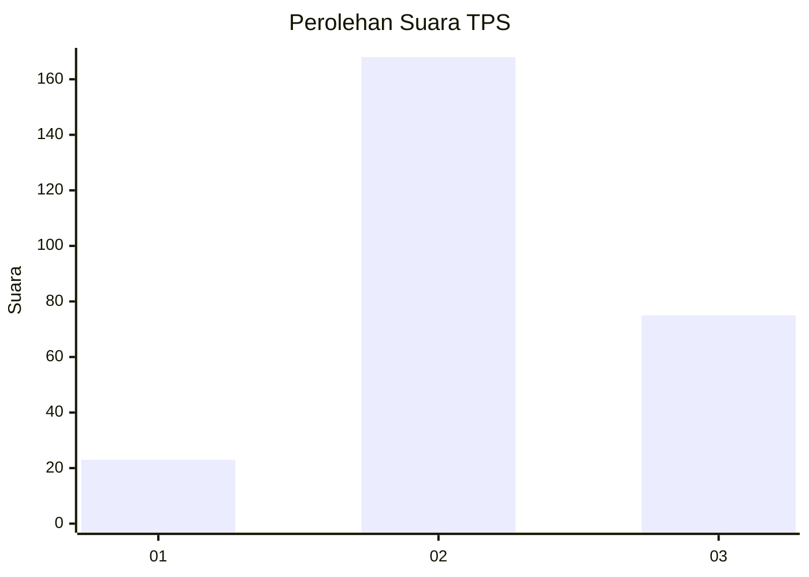
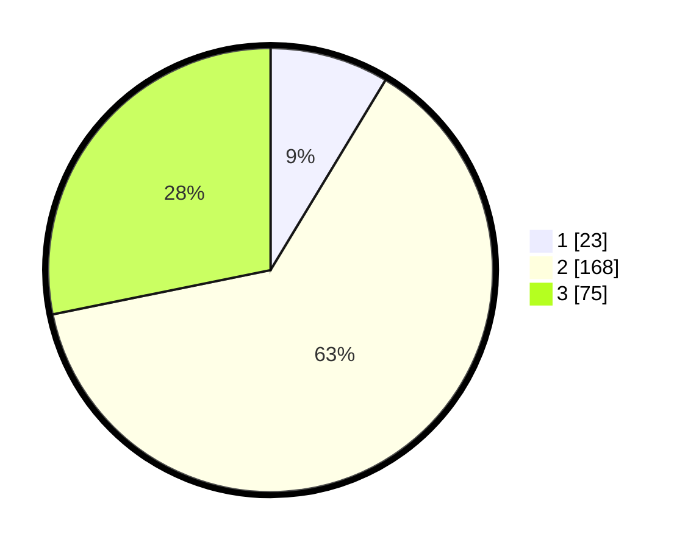

# Hasil

## Grafik

## Tabel

| No. | Nama Paslon    | Suara | Suara (raw) | Persentase |
|:--- |:-------------- | -----:| -----------:| ----------:|
| 1   | ANIES MUHAIMIN | 23    | [23][p-1]   | 8,65       |
| 2   | PRABOWO GIBRAN | 168   | [168][p-2]  | 63,16      |
| 3   | GANJAR MAHFUD  | 75    | [75][p-3]   | 28,20      |

[p-1]: https://github.com/gigit-pemilu/pemilu-2024-16-sumatera-selatan/blob/main/pilpres/hitung-suara/sub/16-sumatera-selatan/sub/02-ogan-komering-ilir/sub/22-lempuing-jaya/sub/2009-muara-burnai-ii/sub/011-tps/sub/paslon-1.txt
[p-2]: https://github.com/gigit-pemilu/pemilu-2024-16-sumatera-selatan/blob/main/pilpres/hitung-suara/sub/16-sumatera-selatan/sub/02-ogan-komering-ilir/sub/22-lempuing-jaya/sub/2009-muara-burnai-ii/sub/011-tps/sub/paslon-2.txt
[p-3]: https://github.com/gigit-pemilu/pemilu-2024-16-sumatera-selatan/blob/main/pilpres/hitung-suara/sub/16-sumatera-selatan/sub/02-ogan-komering-ilir/sub/22-lempuing-jaya/sub/2009-muara-burnai-ii/sub/011-tps/sub/paslon-3.txt

## Foto C Plano

https://sirekap-obj-formc.kpu.go.id/12b0/pemilu/ppwp/16/02/22/20/09/1602222009011-20240215-004757--3aaf40d7-34b5-42cf-a73e-dcf1b20455c4.jpg

https://sirekap-obj-formc.kpu.go.id/12b0/pemilu/ppwp/16/02/22/20/09/1602222009011-20240215-004823--e3db8b62-dade-4998-ac21-fa5a0e83bb72.jpg

https://sirekap-obj-formc.kpu.go.id/12b0/pemilu/ppwp/16/02/22/20/09/1602222009011-20240215-004851--9d2d6606-110c-4041-aa3d-ed1497e53f76.jpg

## Metadata

| Key        | Value               |
| ---------- | ------------------- |
| Time Stamp | 2024-02-15 15:00:29 |

