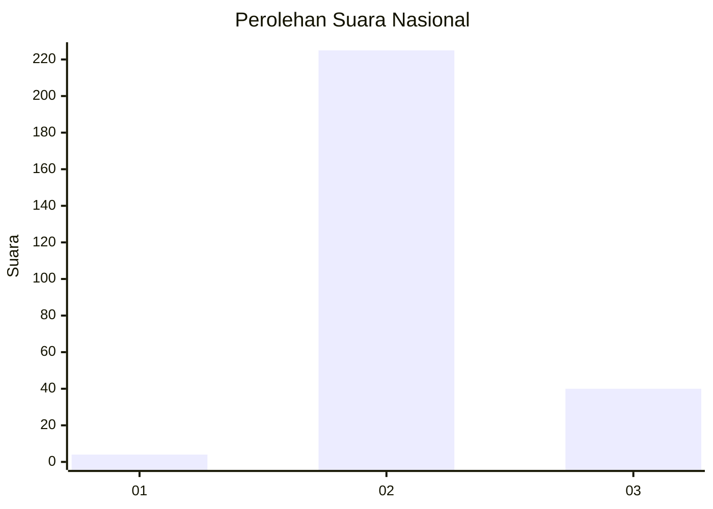
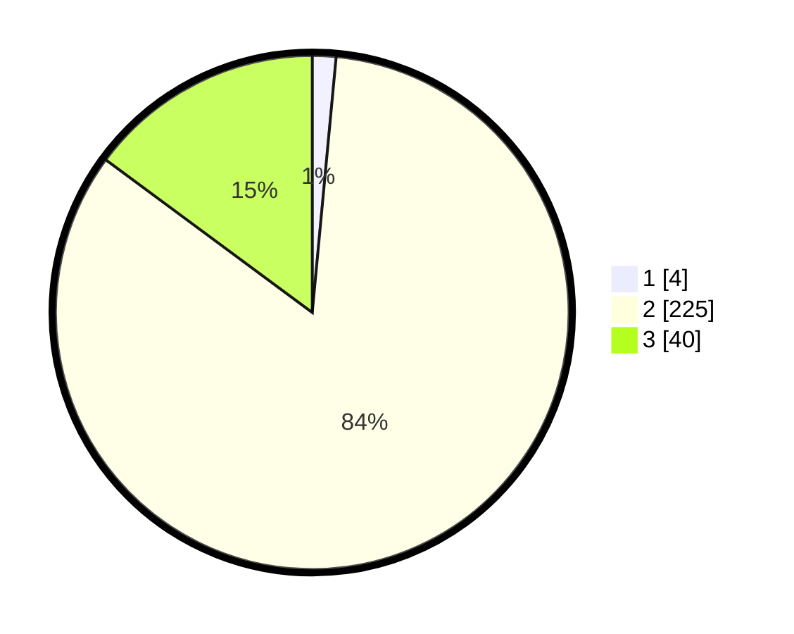

# Hasil

## Grafik

## Tabel

| No. | Nama Paslon    | Suara | Suara (raw) | Persentase |
|:--- |:-------------- | -----:| -----------:| ----------:|
| 1   | ANIES MUHAIMIN | 4     | [4][p-1]    | 1,49       |
| 2   | PRABOWO GIBRAN | 225   | [225][p-2]  | 83,64      |
| 3   | GANJAR MAHFUD  | 40    | [40][p-3]   | 14,87      |

[p-1]: https://github.com/gigit-pemilu/pemilu-2024/blob/main/pilpres/hitung-suara/sub/16-sumatera-selatan/sub/02-ogan-komering-ilir/sub/22-lempuing-jaya/sub/2009-muara-burnai-ii/sub/027-tps/sub/paslon-1.txt
[p-2]: https://github.com/gigit-pemilu/pemilu-2024/blob/main/pilpres/hitung-suara/sub/16-sumatera-selatan/sub/02-ogan-komering-ilir/sub/22-lempuing-jaya/sub/2009-muara-burnai-ii/sub/027-tps/sub/paslon-2.txt
[p-3]: https://github.com/gigit-pemilu/pemilu-2024/blob/main/pilpres/hitung-suara/sub/16-sumatera-selatan/sub/02-ogan-komering-ilir/sub/22-lempuing-jaya/sub/2009-muara-burnai-ii/sub/027-tps/sub/paslon-3.txt

## Foto C Plano

https://sirekap-obj-formc.kpu.go.id/3030/pemilu/ppwp/16/02/22/20/09/1602222009027-20240214-232752--f805c2df-8ed4-498f-b1e3-66d63ceebf85.jpg

https://sirekap-obj-formc.kpu.go.id/3030/pemilu/ppwp/16/02/22/20/09/1602222009027-20240214-232515--8b117603-dc76-441e-b069-3d27a3dd3fca.jpg

https://sirekap-obj-formc.kpu.go.id/3030/pemilu/ppwp/16/02/22/20/09/1602222009027-20240214-232308--5bcf559c-4152-4a24-955d-5b3f32ad5bcd.jpg

## Metadata

| Key        | Value               |
| ---------- | ------------------- |
| Time Stamp | 2024-02-19 06:16:00 |

