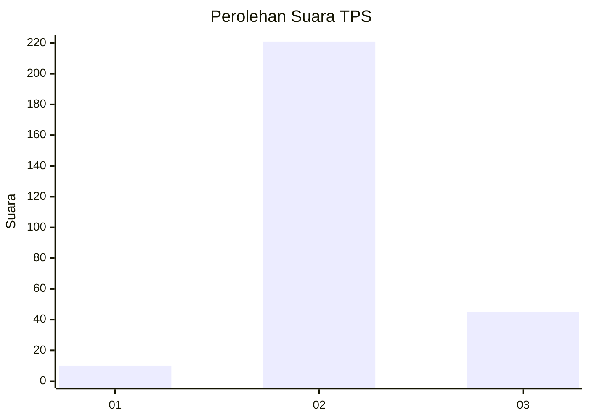
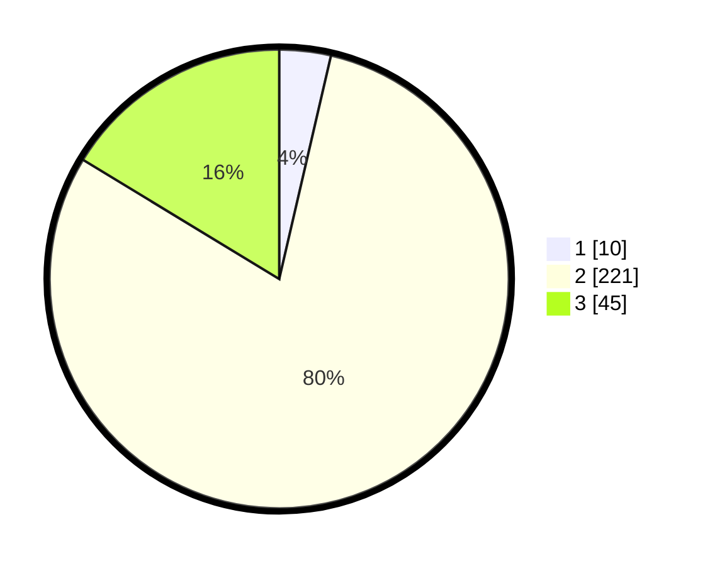

# Hasil

## Grafik

## Tabel

| No. | Nama Paslon    | Suara | Suara (raw) | Persentase |
|:--- |:-------------- | -----:| -----------:| ----------:|
| 1   | ANIES MUHAIMIN | 10    | [10][p-1]   | 3,62       |
| 2   | PRABOWO GIBRAN | 221   | [221][p-2]  | 80,07      |
| 3   | GANJAR MAHFUD  | 45    | [45][p-3]   | 16,30      |

[p-1]: https://github.com/gigit-pemilu/pemilu-2024-16-sumatera-selatan/blob/main/pilpres/hitung-suara/sub/16-sumatera-selatan/sub/02-ogan-komering-ilir/sub/22-lempuing-jaya/sub/2009-muara-burnai-ii/sub/030-tps/sub/paslon-1.txt
[p-2]: https://github.com/gigit-pemilu/pemilu-2024-16-sumatera-selatan/blob/main/pilpres/hitung-suara/sub/16-sumatera-selatan/sub/02-ogan-komering-ilir/sub/22-lempuing-jaya/sub/2009-muara-burnai-ii/sub/030-tps/sub/paslon-2.txt
[p-3]: https://github.com/gigit-pemilu/pemilu-2024-16-sumatera-selatan/blob/main/pilpres/hitung-suara/sub/16-sumatera-selatan/sub/02-ogan-komering-ilir/sub/22-lempuing-jaya/sub/2009-muara-burnai-ii/sub/030-tps/sub/paslon-3.txt

## Foto C Plano

https://sirekap-obj-formc.kpu.go.id/b476/pemilu/ppwp/16/02/22/20/09/1602222009030-20240215-000341--03ae7672-85ad-42ec-81ee-c4af0a118d46.jpg

https://sirekap-obj-formc.kpu.go.id/b476/pemilu/ppwp/16/02/22/20/09/1602222009030-20240215-010016--ed181069-8340-4810-bc1f-4e83951ab34a.jpg

https://sirekap-obj-formc.kpu.go.id/b476/pemilu/ppwp/16/02/22/20/09/1602222009030-20240215-010143--f5c431a7-c8dc-488b-a302-42b140625c3f.jpg

## Metadata

| Key        | Value               |
| ---------- | ------------------- |
| Time Stamp | 2024-02-19 15:00:00 |

