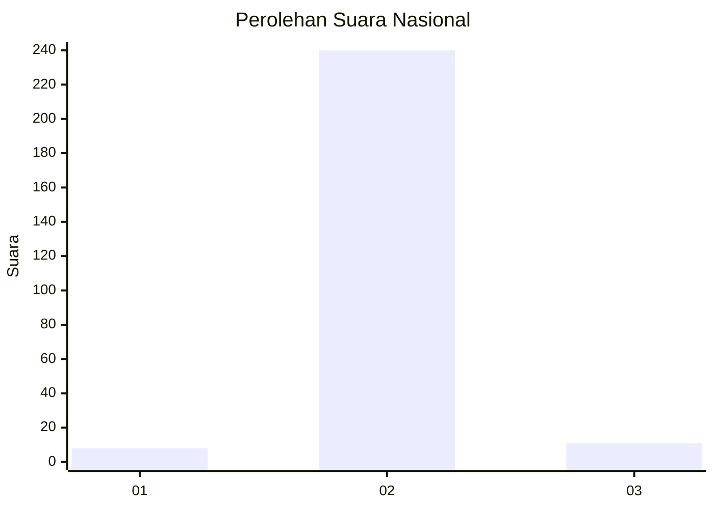
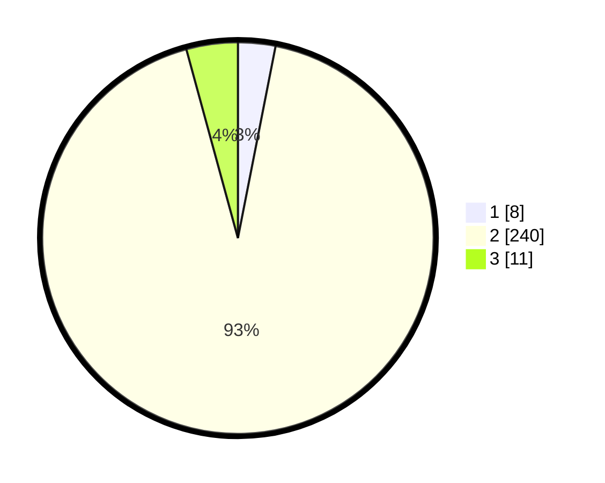

# Hasil

## Grafik

## Tabel

| No. | Nama Paslon    | Suara | Suara (raw) | Persentase |
|:--- |:-------------- | -----:| -----------:| ----------:|
| 1   | ANIES MUHAIMIN | 8     | [8][p-1]    | 3,09       |
| 2   | PRABOWO GIBRAN | 240   | [240][p-2]  | 92,66      |
| 3   | GANJAR MAHFUD  | 11    | [11][p-3]   | 4,25       |

[p-1]: https://github.com/gigit-pemilu/pemilu-2024/blob/main/pilpres/hitung-suara/sub/16-sumatera-selatan/sub/02-ogan-komering-ilir/sub/22-lempuing-jaya/sub/2009-muara-burnai-ii/sub/032-tps/sub/paslon-1.txt
[p-2]: https://github.com/gigit-pemilu/pemilu-2024/blob/main/pilpres/hitung-suara/sub/16-sumatera-selatan/sub/02-ogan-komering-ilir/sub/22-lempuing-jaya/sub/2009-muara-burnai-ii/sub/032-tps/sub/paslon-2.txt
[p-3]: https://github.com/gigit-pemilu/pemilu-2024/blob/main/pilpres/hitung-suara/sub/16-sumatera-selatan/sub/02-ogan-komering-ilir/sub/22-lempuing-jaya/sub/2009-muara-burnai-ii/sub/032-tps/sub/paslon-3.txt

## Foto C Plano

https://sirekap-obj-formc.kpu.go.id/0b27/pemilu/ppwp/16/02/22/20/09/1602222009032-20240215-012036--28280210-a53f-4715-a491-b6f71aebb0c2.jpg

https://sirekap-obj-formc.kpu.go.id/0b27/pemilu/ppwp/16/02/22/20/09/1602222009032-20240215-012146--4b0a0a0b-9e6b-4e3d-a983-aca2df9b437a.jpg

https://sirekap-obj-formc.kpu.go.id/0b27/pemilu/ppwp/16/02/22/20/09/1602222009032-20240215-012248--dc4983ff-70f6-4b81-9fe4-71d639d9de61.jpg

## Metadata

| Key        | Value               |
| ---------- | ------------------- |
| Time Stamp | 2024-02-19 15:00:00 |

