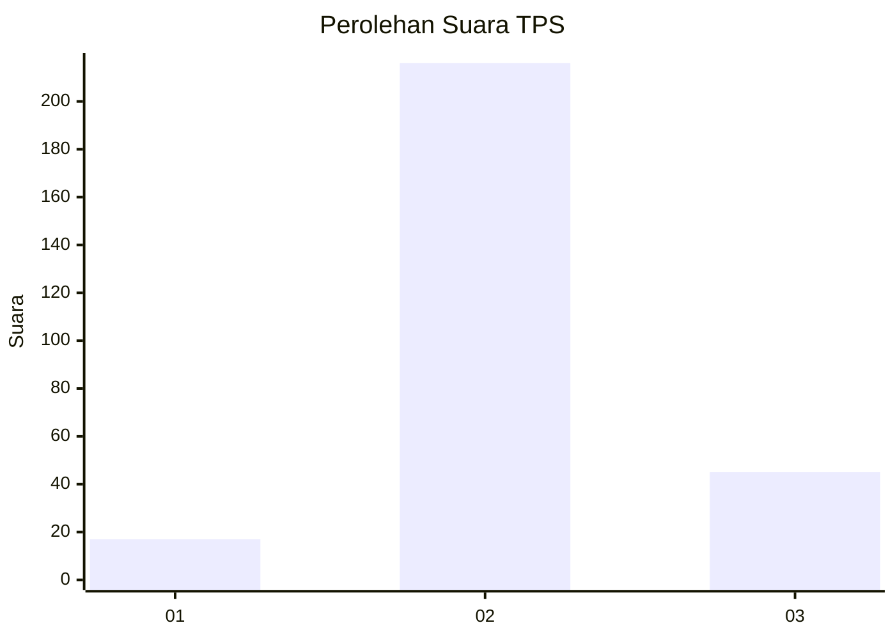
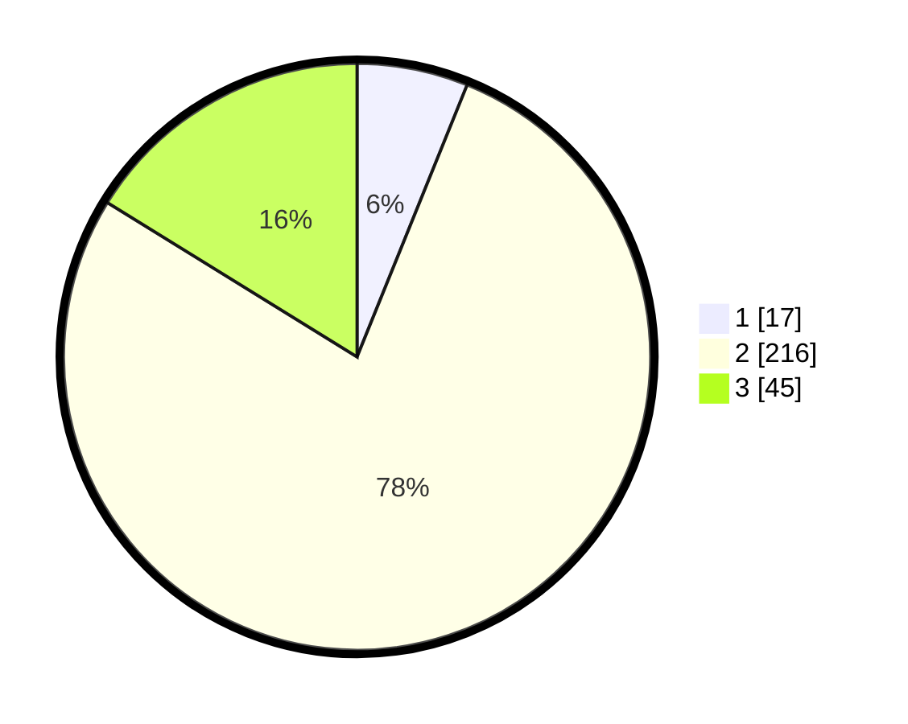

# Hasil

## Grafik

## Tabel

| No. | Nama Paslon    | Suara | Suara (raw) | Persentase |
|:--- |:-------------- | -----:| -----------:| ----------:|
| 1   | ANIES MUHAIMIN | 17    | [17][p-1]   | 6,12       |
| 2   | PRABOWO GIBRAN | 216   | [216][p-2]  | 77,70      |
| 3   | GANJAR MAHFUD  | 45    | [45][p-3]   | 16,19      |

[p-1]: https://github.com/gigit-pemilu/pemilu-2024-16-sumatera-selatan/blob/main/pilpres/hitung-suara/sub/16-sumatera-selatan/sub/02-ogan-komering-ilir/sub/22-lempuing-jaya/sub/2011-rantau-durian-ii/sub/003-tps/sub/paslon-1.txt
[p-2]: https://github.com/gigit-pemilu/pemilu-2024-16-sumatera-selatan/blob/main/pilpres/hitung-suara/sub/16-sumatera-selatan/sub/02-ogan-komering-ilir/sub/22-lempuing-jaya/sub/2011-rantau-durian-ii/sub/003-tps/sub/paslon-2.txt
[p-3]: https://github.com/gigit-pemilu/pemilu-2024-16-sumatera-selatan/blob/main/pilpres/hitung-suara/sub/16-sumatera-selatan/sub/02-ogan-komering-ilir/sub/22-lempuing-jaya/sub/2011-rantau-durian-ii/sub/003-tps/sub/paslon-3.txt

## Foto C Plano

https://sirekap-obj-formc.kpu.go.id/cb3f/pemilu/ppwp/16/02/22/20/11/1602222011003-20240214-185534--51f3b601-a35b-45e8-953d-d94b73463ced.jpg

https://sirekap-obj-formc.kpu.go.id/cb3f/pemilu/ppwp/16/02/22/20/11/1602222011003-20240214-185108--411eeec7-70e4-4d26-8d3a-e4fc55c1d290.jpg

https://sirekap-obj-formc.kpu.go.id/cb3f/pemilu/ppwp/16/02/22/20/11/1602222011003-20240214-185808--64f21daa-c212-4e46-a852-6e6f0e6caff6.jpg

## Metadata

| Key        | Value               |
| ---------- | ------------------- |
| Time Stamp | 2024-02-19 06:16:00 |

