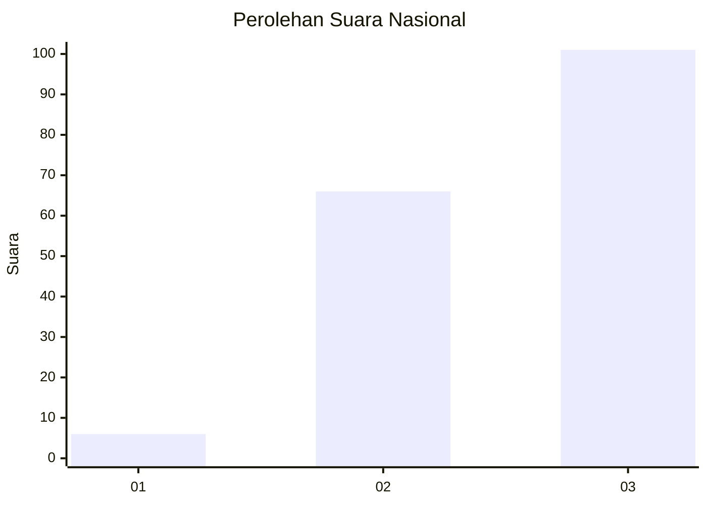
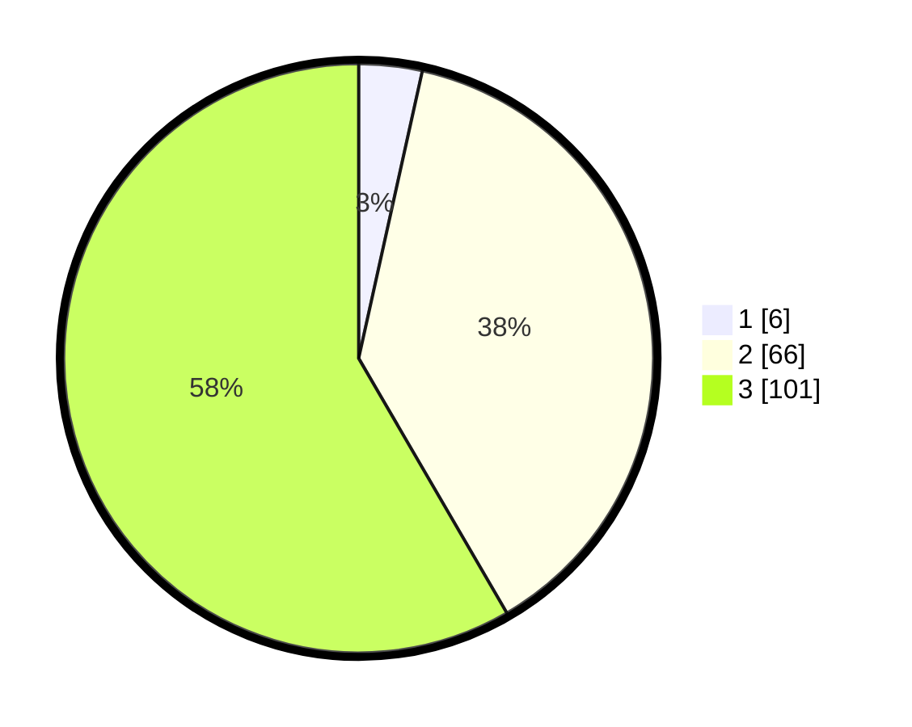

# Hasil

## Grafik

## Tabel

| No. | Nama Paslon    | Suara | Suara (raw) | Persentase |
|:--- |:-------------- | -----:| -----------:| ----------:|
| 1   | ANIES MUHAIMIN | 6     | [6][p-1]    | 3,47       |
| 2   | PRABOWO GIBRAN | 66    | [66][p-2]   | 38,15      |
| 3   | GANJAR MAHFUD  | 101   | [101][p-3]  | 58,38      |

[p-1]: https://github.com/gigit-pemilu/pemilu-2024/blob/main/pilpres/hitung-suara/sub/16-sumatera-selatan/sub/02-ogan-komering-ilir/sub/22-lempuing-jaya/sub/2011-rantau-durian-ii/sub/009-tps/sub/paslon-1.txt
[p-2]: https://github.com/gigit-pemilu/pemilu-2024/blob/main/pilpres/hitung-suara/sub/16-sumatera-selatan/sub/02-ogan-komering-ilir/sub/22-lempuing-jaya/sub/2011-rantau-durian-ii/sub/009-tps/sub/paslon-2.txt
[p-3]: https://github.com/gigit-pemilu/pemilu-2024/blob/main/pilpres/hitung-suara/sub/16-sumatera-selatan/sub/02-ogan-komering-ilir/sub/22-lempuing-jaya/sub/2011-rantau-durian-ii/sub/009-tps/sub/paslon-3.txt

## Foto C Plano

https://sirekap-obj-formc.kpu.go.id/308b/pemilu/ppwp/16/02/22/20/11/1602222011009-20240215-033554--a057b9cf-5671-43a7-a123-9b31f789ce80.jpg

https://sirekap-obj-formc.kpu.go.id/308b/pemilu/ppwp/16/02/22/20/11/1602222011009-20240215-033712--51cc7ca5-c0f1-4479-9045-814358ef5dec.jpg

https://sirekap-obj-formc.kpu.go.id/308b/pemilu/ppwp/16/02/22/20/11/1602222011009-20240215-033827--22958dee-d46f-4531-97b7-366d6564e896.jpg

## Metadata

| Key        | Value               |
| ---------- | ------------------- |
| Time Stamp | 2024-02-19 15:00:00 |

