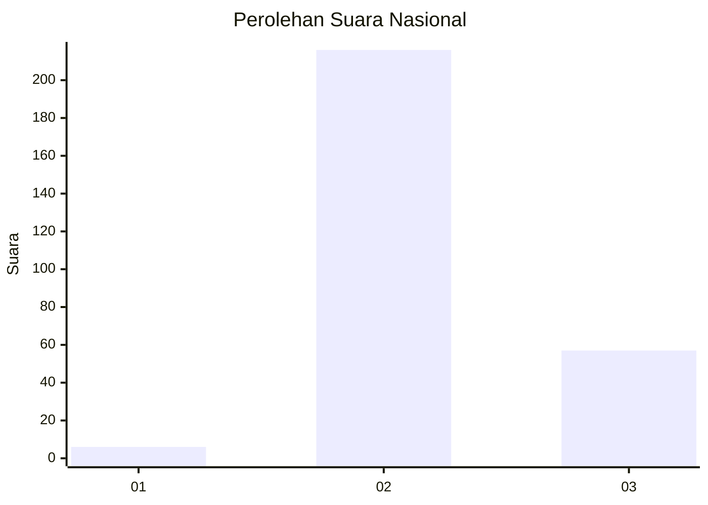

# Hasil

## Grafik

## Tabel

| No. | Nama Paslon    | Suara | Suara (raw) | Persentase |
|:--- |:-------------- | -----:| -----------:| ----------:|
| 1   | ANIES MUHAIMIN | 6     | [6][p-1]    | 2,15       |
| 2   | PRABOWO GIBRAN | 216   | [216][p-2]  | 77,42      |
| 3   | GANJAR MAHFUD  | 57    | [57][p-3]   | 20,43      |

[p-1]: https://github.com/gigit-pemilu/pemilu-2024/blob/main/pilpres/hitung-suara/sub/16-sumatera-selatan/sub/02-ogan-komering-ilir/sub/22-lempuing-jaya/sub/2011-rantau-durian-ii/sub/011-tps/sub/paslon-1.txt
[p-2]: https://github.com/gigit-pemilu/pemilu-2024/blob/main/pilpres/hitung-suara/sub/16-sumatera-selatan/sub/02-ogan-komering-ilir/sub/22-lempuing-jaya/sub/2011-rantau-durian-ii/sub/011-tps/sub/paslon-2.txt
[p-3]: https://github.com/gigit-pemilu/pemilu-2024/blob/main/pilpres/hitung-suara/sub/16-sumatera-selatan/sub/02-ogan-komering-ilir/sub/22-lempuing-jaya/sub/2011-rantau-durian-ii/sub/011-tps/sub/paslon-3.txt

## Foto C Plano

https://sirekap-obj-formc.kpu.go.id/631e/pemilu/ppwp/16/02/22/20/11/1602222011011-20240215-050535--9aac6b67-fae7-41ae-9c04-690b6071a4f3.jpg

https://sirekap-obj-formc.kpu.go.id/631e/pemilu/ppwp/16/02/22/20/11/1602222011011-20240215-051237--6dd2bffb-7189-4d55-8865-9de88d1f03d4.jpg

https://sirekap-obj-formc.kpu.go.id/631e/pemilu/ppwp/16/02/22/20/11/1602222011011-20240215-051344--336c69a3-0286-43b8-9b7e-187aa5a6d82f.jpg

## Metadata

| Key        | Value               |
| ---------- | ------------------- |
| Time Stamp | 2024-02-19 06:16:00 |

