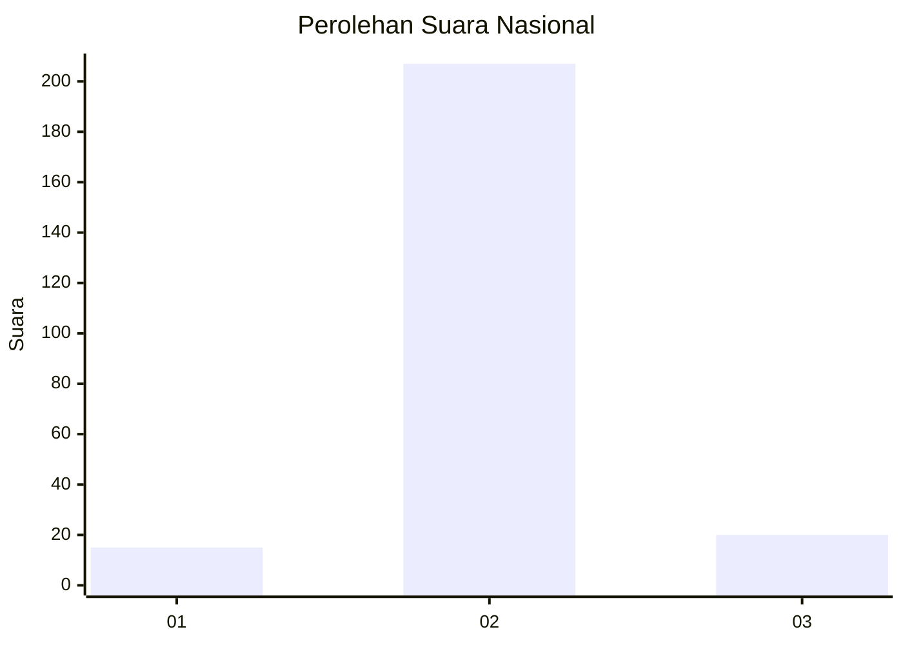
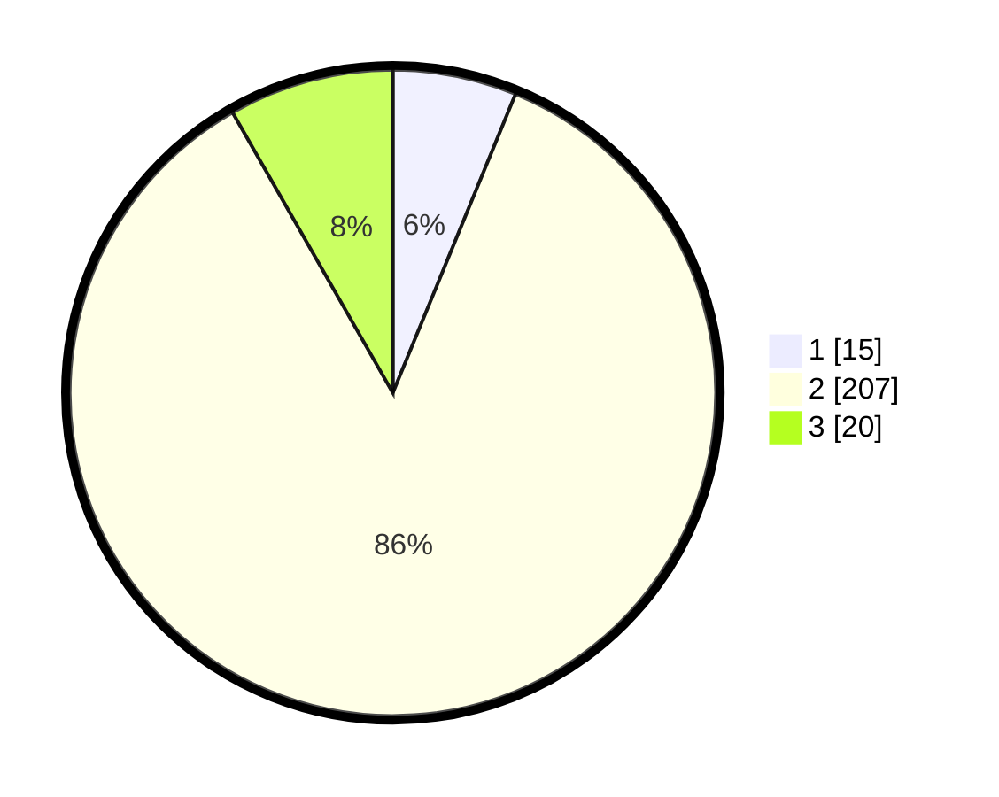

# Hasil

## Grafik

## Tabel

| No. | Nama Paslon    | Suara | Suara (raw) | Persentase |
|:--- |:-------------- | -----:| -----------:| ----------:|
| 1   | ANIES MUHAIMIN | 15    | [15][p-1]   | 6,20       |
| 2   | PRABOWO GIBRAN | 207   | [207][p-2]  | 85,54      |
| 3   | GANJAR MAHFUD  | 20    | [20][p-3]   | 8,26       |

[p-1]: https://github.com/gigit-pemilu/pemilu-2024/blob/main/pilpres/hitung-suara/sub/16-sumatera-selatan/sub/02-ogan-komering-ilir/sub/22-lempuing-jaya/sub/2012-tanjung-sari-ii/sub/005-tps/sub/paslon-1.txt
[p-2]: https://github.com/gigit-pemilu/pemilu-2024/blob/main/pilpres/hitung-suara/sub/16-sumatera-selatan/sub/02-ogan-komering-ilir/sub/22-lempuing-jaya/sub/2012-tanjung-sari-ii/sub/005-tps/sub/paslon-2.txt
[p-3]: https://github.com/gigit-pemilu/pemilu-2024/blob/main/pilpres/hitung-suara/sub/16-sumatera-selatan/sub/02-ogan-komering-ilir/sub/22-lempuing-jaya/sub/2012-tanjung-sari-ii/sub/005-tps/sub/paslon-3.txt

## Foto C Plano

https://sirekap-obj-formc.kpu.go.id/8173/pemilu/ppwp/16/02/22/20/12/1602222012005-20240217-200109--d5a60c4c-4f7c-4298-8467-f17eb0e8418d.jpg

https://sirekap-obj-formc.kpu.go.id/8173/pemilu/ppwp/16/02/22/20/12/1602222012005-20240215-031153--66e24bb7-73b9-4bef-8f38-bc22c33abe17.jpg

https://sirekap-obj-formc.kpu.go.id/8173/pemilu/ppwp/16/02/22/20/12/1602222012005-20240214-204026--fc33e41e-4646-41e2-b020-a9f8d5e58dd2.jpg

## Metadata

| Key        | Value               |
| ---------- | ------------------- |
| Time Stamp | 2024-02-19 06:16:00 |

