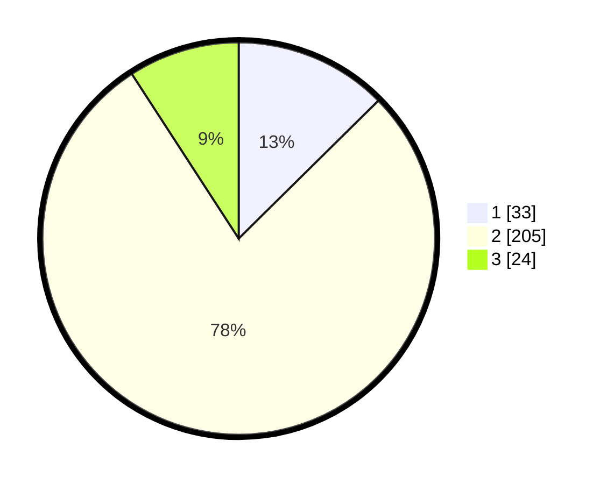

# Hasil

## Grafik

## Tabel

| No. | Nama Paslon    | Suara | Suara (raw) | Persentase |
|:--- |:-------------- | -----:| -----------:| ----------:|
| 1   | ANIES MUHAIMIN | 33    | [33][p-1]   | 12,60      |
| 2   | PRABOWO GIBRAN | 205   | [205][p-2]  | 78,24      |
| 3   | GANJAR MAHFUD  | 24    | [24][p-3]   | 9,16       |

[p-1]: https://github.com/gigit-pemilu/pemilu-2024-16-sumatera-selatan/blob/main/pilpres/hitung-suara/sub/16-sumatera-selatan/sub/02-ogan-komering-ilir/sub/22-lempuing-jaya/sub/2014-muara-burnai-i/sub/021-tps/sub/paslon-1.txt
[p-2]: https://github.com/gigit-pemilu/pemilu-2024-16-sumatera-selatan/blob/main/pilpres/hitung-suara/sub/16-sumatera-selatan/sub/02-ogan-komering-ilir/sub/22-lempuing-jaya/sub/2014-muara-burnai-i/sub/021-tps/sub/paslon-2.txt
[p-3]: https://github.com/gigit-pemilu/pemilu-2024-16-sumatera-selatan/blob/main/pilpres/hitung-suara/sub/16-sumatera-selatan/sub/02-ogan-komering-ilir/sub/22-lempuing-jaya/sub/2014-muara-burnai-i/sub/021-tps/sub/paslon-3.txt

## Foto C Plano

https://sirekap-obj-formc.kpu.go.id/e1f3/pemilu/ppwp/16/02/22/20/14/1602222014021-20240215-031530--b9729c18-1817-4ec8-ab3a-f648804b859f.jpg

https://sirekap-obj-formc.kpu.go.id/e1f3/pemilu/ppwp/16/02/22/20/14/1602222014021-20240215-031913--54ffe027-996e-4099-a240-7130a6802a1d.jpg

https://sirekap-obj-formc.kpu.go.id/e1f3/pemilu/ppwp/16/02/22/20/14/1602222014021-20240215-033058--cfc1dd0e-be87-466b-a0c3-d4d54f54a0d6.jpg

## Metadata

| Key        | Value               |
| ---------- | ------------------- |
| Time Stamp | 2024-02-19 06:16:00 |

