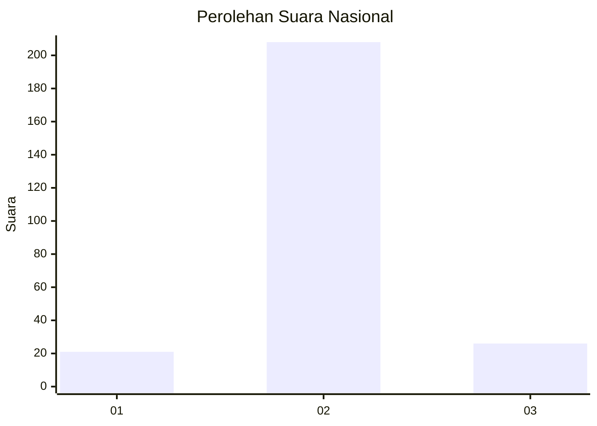
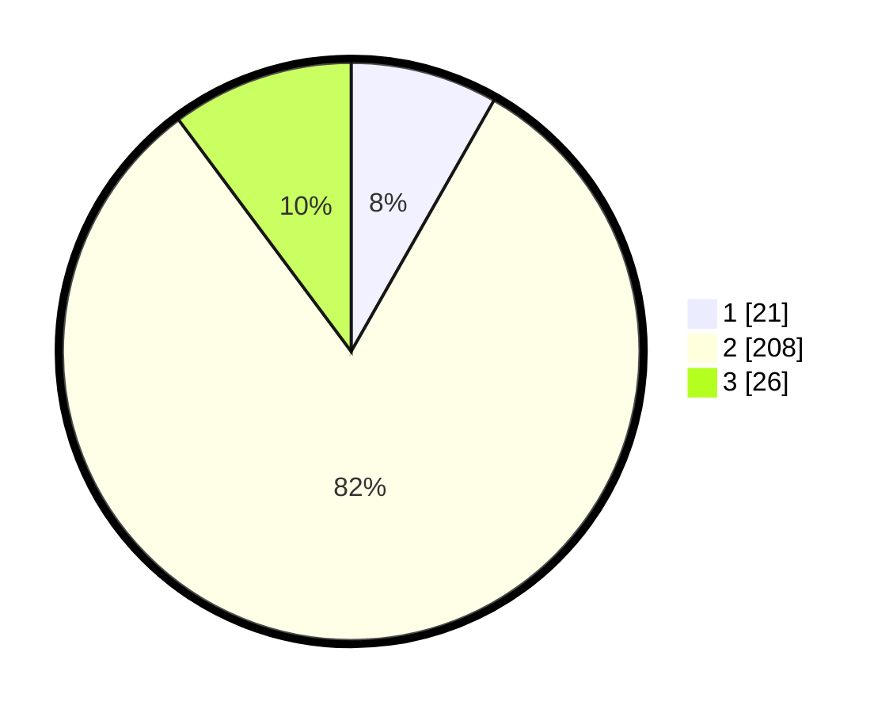

# Hasil

## Grafik

## Tabel

| No. | Nama Paslon    | Suara | Suara (raw) | Persentase |
|:--- |:-------------- | -----:| -----------:| ----------:|
| 1   | ANIES MUHAIMIN | 21    | [21][p-1]   | 8,24       |
| 2   | PRABOWO GIBRAN | 208   | [208][p-2]  | 81,57      |
| 3   | GANJAR MAHFUD  | 26    | [26][p-3]   | 10,20      |

[p-1]: https://github.com/gigit-pemilu/pemilu-2024/blob/main/pilpres/hitung-suara/sub/16-sumatera-selatan/sub/02-ogan-komering-ilir/sub/22-lempuing-jaya/sub/2015-lubuk-makmur/sub/004-tps/sub/paslon-1.txt
[p-2]: https://github.com/gigit-pemilu/pemilu-2024/blob/main/pilpres/hitung-suara/sub/16-sumatera-selatan/sub/02-ogan-komering-ilir/sub/22-lempuing-jaya/sub/2015-lubuk-makmur/sub/004-tps/sub/paslon-2.txt
[p-3]: https://github.com/gigit-pemilu/pemilu-2024/blob/main/pilpres/hitung-suara/sub/16-sumatera-selatan/sub/02-ogan-komering-ilir/sub/22-lempuing-jaya/sub/2015-lubuk-makmur/sub/004-tps/sub/paslon-3.txt

## Foto C Plano

https://sirekap-obj-formc.kpu.go.id/e6da/pemilu/ppwp/16/02/22/20/15/1602222015004-20240217-201908--24402091-f3a2-4f2d-a836-96f60e0b8e4c.jpg

https://sirekap-obj-formc.kpu.go.id/e6da/pemilu/ppwp/16/02/22/20/15/1602222015004-20240217-201916--b9b171b8-5c1d-4fef-b929-f7ca47d34a33.jpg

https://sirekap-obj-formc.kpu.go.id/e6da/pemilu/ppwp/16/02/22/20/15/1602222015004-20240217-201927--0e1c52cc-12d4-4aa6-8d04-c6b62d61b04d.jpg

## Metadata

| Key        | Value               |
| ---------- | ------------------- |
| Time Stamp | 2024-02-19 06:16:00 |

