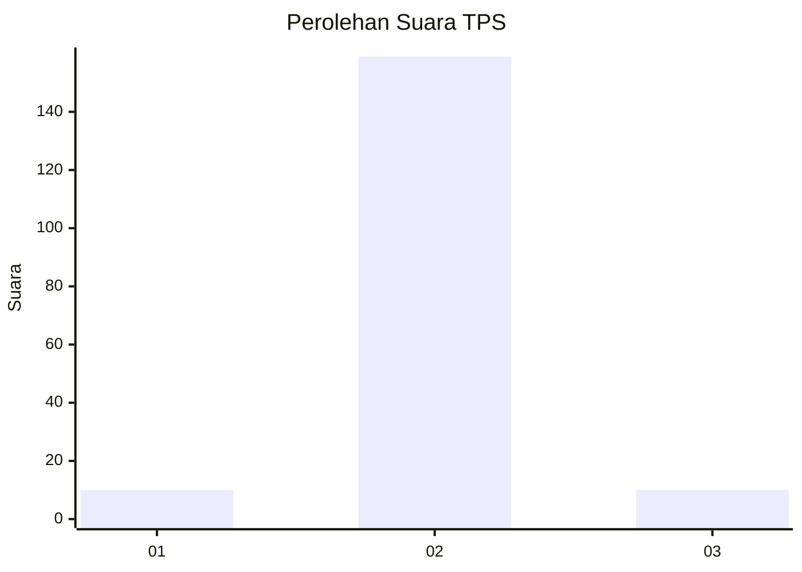
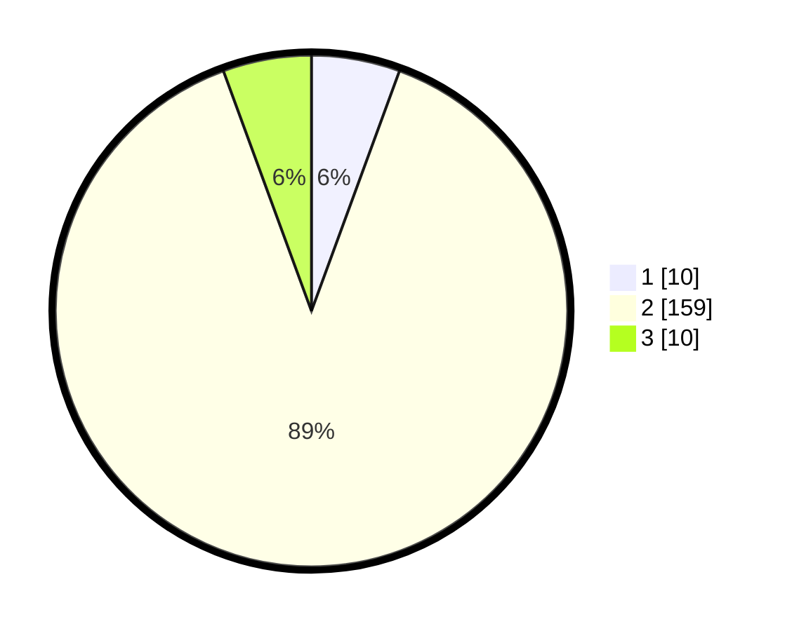

# Hasil

## Grafik

## Tabel

| No. | Nama Paslon    | Suara | Suara (raw) | Persentase |
|:--- |:-------------- | -----:| -----------:| ----------:|
| 1   | ANIES MUHAIMIN | 10    | [10][p-1]   | 5,59       |
| 2   | PRABOWO GIBRAN | 159   | [159][p-2]  | 88,83      |
| 3   | GANJAR MAHFUD  | 10    | [10][p-3]   | 5,59       |

[p-1]: https://github.com/gigit-pemilu/pemilu-2024-16-sumatera-selatan/blob/main/pilpres/hitung-suara/sub/16-sumatera-selatan/sub/02-ogan-komering-ilir/sub/22-lempuing-jaya/sub/2016-rantau-durian-asli/sub/001-tps/sub/paslon-1.txt
[p-2]: https://github.com/gigit-pemilu/pemilu-2024-16-sumatera-selatan/blob/main/pilpres/hitung-suara/sub/16-sumatera-selatan/sub/02-ogan-komering-ilir/sub/22-lempuing-jaya/sub/2016-rantau-durian-asli/sub/001-tps/sub/paslon-2.txt
[p-3]: https://github.com/gigit-pemilu/pemilu-2024-16-sumatera-selatan/blob/main/pilpres/hitung-suara/sub/16-sumatera-selatan/sub/02-ogan-komering-ilir/sub/22-lempuing-jaya/sub/2016-rantau-durian-asli/sub/001-tps/sub/paslon-3.txt

## Foto C Plano

https://sirekap-obj-formc.kpu.go.id/6264/pemilu/ppwp/16/02/22/20/16/1602222016001-20240216-120801--56c79c3c-703c-4f15-b860-0e992694f1dc.jpg

https://sirekap-obj-formc.kpu.go.id/6264/pemilu/ppwp/16/02/22/20/16/1602222016001-20240216-120731--a4dddc39-c127-498d-972b-3f30f74f50a1.jpg

https://sirekap-obj-formc.kpu.go.id/6264/pemilu/ppwp/16/02/22/20/16/1602222016001-20240216-122858--acf5d36e-691f-43e0-ba12-5b8a9eac1390.jpg

## Metadata

| Key        | Value               |
| ---------- | ------------------- |
| Time Stamp | 2024-02-16 12:51:22 |

