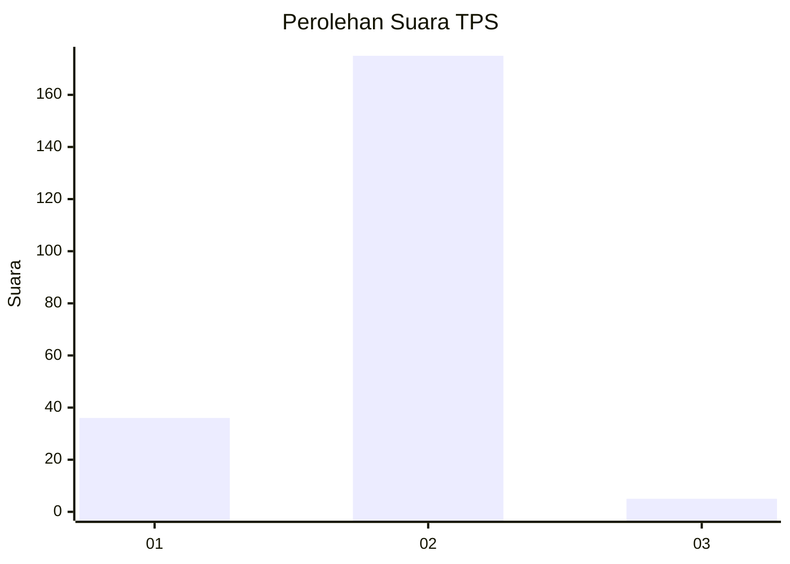
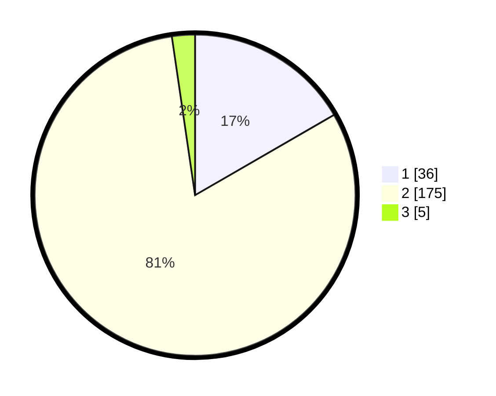

# Hasil

## Grafik

## Tabel

| No. | Nama Paslon    | Suara | Suara (raw) | Persentase |
|:--- |:-------------- | -----:| -----------:| ----------:|
| 1   | ANIES MUHAIMIN | 36    | [36][p-1]   | 16,67      |
| 2   | PRABOWO GIBRAN | 175   | [175][p-2]  | 81,02      |
| 3   | GANJAR MAHFUD  | 5     | [5][p-3]    | 2,31       |

[p-1]: https://github.com/gigit-pemilu/pemilu-2024-16-sumatera-selatan/blob/main/pilpres/hitung-suara/sub/16-sumatera-selatan/sub/02-ogan-komering-ilir/sub/23-teluk-gelam/sub/2001-benawa/sub/002-tps/sub/paslon-1.txt
[p-2]: https://github.com/gigit-pemilu/pemilu-2024-16-sumatera-selatan/blob/main/pilpres/hitung-suara/sub/16-sumatera-selatan/sub/02-ogan-komering-ilir/sub/23-teluk-gelam/sub/2001-benawa/sub/002-tps/sub/paslon-2.txt
[p-3]: https://github.com/gigit-pemilu/pemilu-2024-16-sumatera-selatan/blob/main/pilpres/hitung-suara/sub/16-sumatera-selatan/sub/02-ogan-komering-ilir/sub/23-teluk-gelam/sub/2001-benawa/sub/002-tps/sub/paslon-3.txt

## Foto C Plano

https://sirekap-obj-formc.kpu.go.id/6ad1/pemilu/ppwp/16/02/23/20/01/1602232001002-20240215-052951--a8a7190d-a042-44dc-abe4-d5f275ae4236.jpg

https://sirekap-obj-formc.kpu.go.id/6ad1/pemilu/ppwp/16/02/23/20/01/1602232001002-20240215-053112--402d3f02-f56f-401b-b6b6-a3494adee103.jpg

https://sirekap-obj-formc.kpu.go.id/6ad1/pemilu/ppwp/16/02/23/20/01/1602232001002-20240215-053152--eceb6c33-32cb-427d-b7b4-689afaa69f99.jpg

## Metadata

| Key        | Value               |
| ---------- | ------------------- |
| Time Stamp | 2024-02-19 06:16:00 |

