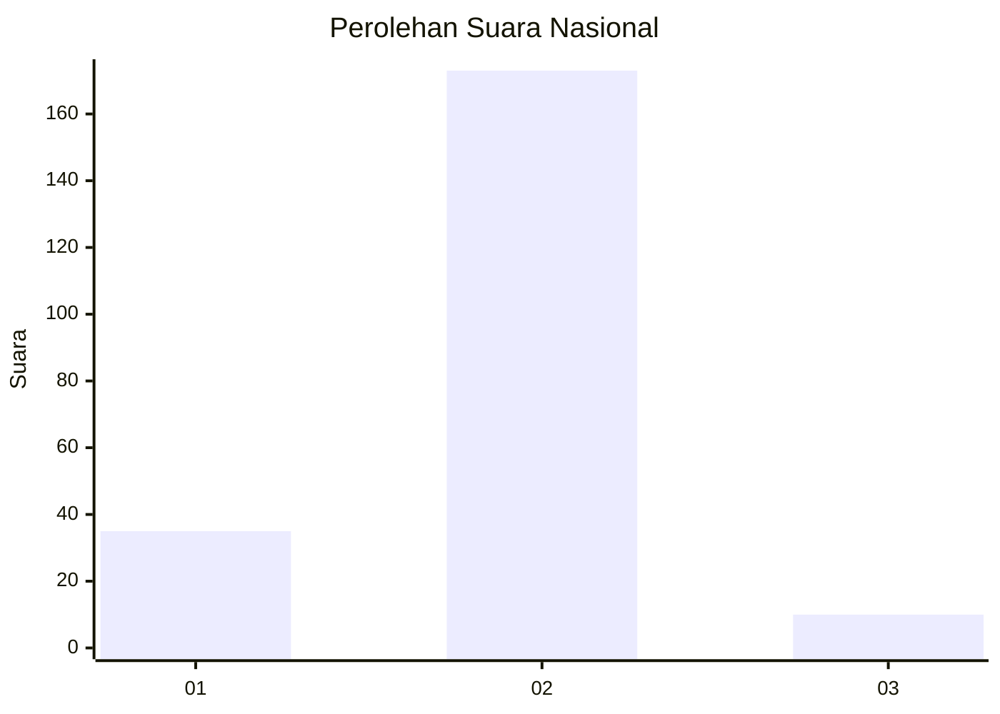
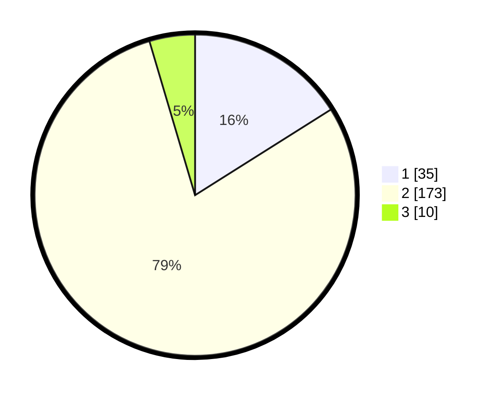

# Hasil

## Grafik

## Tabel

| No. | Nama Paslon    | Suara | Suara (raw) | Persentase |
|:--- |:-------------- | -----:| -----------:| ----------:|
| 1   | ANIES MUHAIMIN | 35    | [35][p-1]   | 16,06      |
| 2   | PRABOWO GIBRAN | 173   | [173][p-2]  | 79,36      |
| 3   | GANJAR MAHFUD  | 10    | [10][p-3]   | 4,59       |

[p-1]: https://github.com/gigit-pemilu/pemilu-2024/blob/main/pilpres/hitung-suara/sub/16-sumatera-selatan/sub/02-ogan-komering-ilir/sub/23-teluk-gelam/sub/2001-benawa/sub/003-tps/sub/paslon-1.txt
[p-2]: https://github.com/gigit-pemilu/pemilu-2024/blob/main/pilpres/hitung-suara/sub/16-sumatera-selatan/sub/02-ogan-komering-ilir/sub/23-teluk-gelam/sub/2001-benawa/sub/003-tps/sub/paslon-2.txt
[p-3]: https://github.com/gigit-pemilu/pemilu-2024/blob/main/pilpres/hitung-suara/sub/16-sumatera-selatan/sub/02-ogan-komering-ilir/sub/23-teluk-gelam/sub/2001-benawa/sub/003-tps/sub/paslon-3.txt

## Foto C Plano

https://sirekap-obj-formc.kpu.go.id/ceb4/pemilu/ppwp/16/02/23/20/01/1602232001003-20240215-035824--7c562488-ffb7-4735-a3dd-1f39d801b59c.jpg

https://sirekap-obj-formc.kpu.go.id/ceb4/pemilu/ppwp/16/02/23/20/01/1602232001003-20240215-040028--691c2d0f-9de5-49aa-b30f-35c80b852047.jpg

https://sirekap-obj-formc.kpu.go.id/ceb4/pemilu/ppwp/16/02/23/20/01/1602232001003-20240215-040135--da3c8036-f4fb-4986-933b-b16dd410a02f.jpg

## Metadata

| Key        | Value               |
| ---------- | ------------------- |
| Time Stamp | 2024-02-19 06:16:00 |

