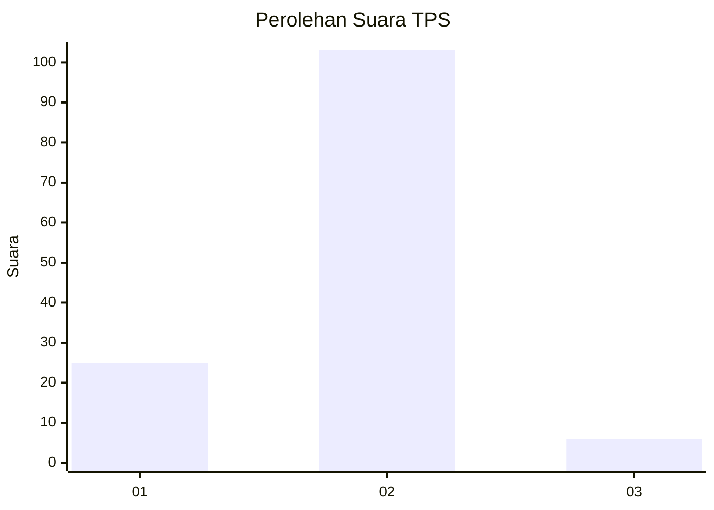
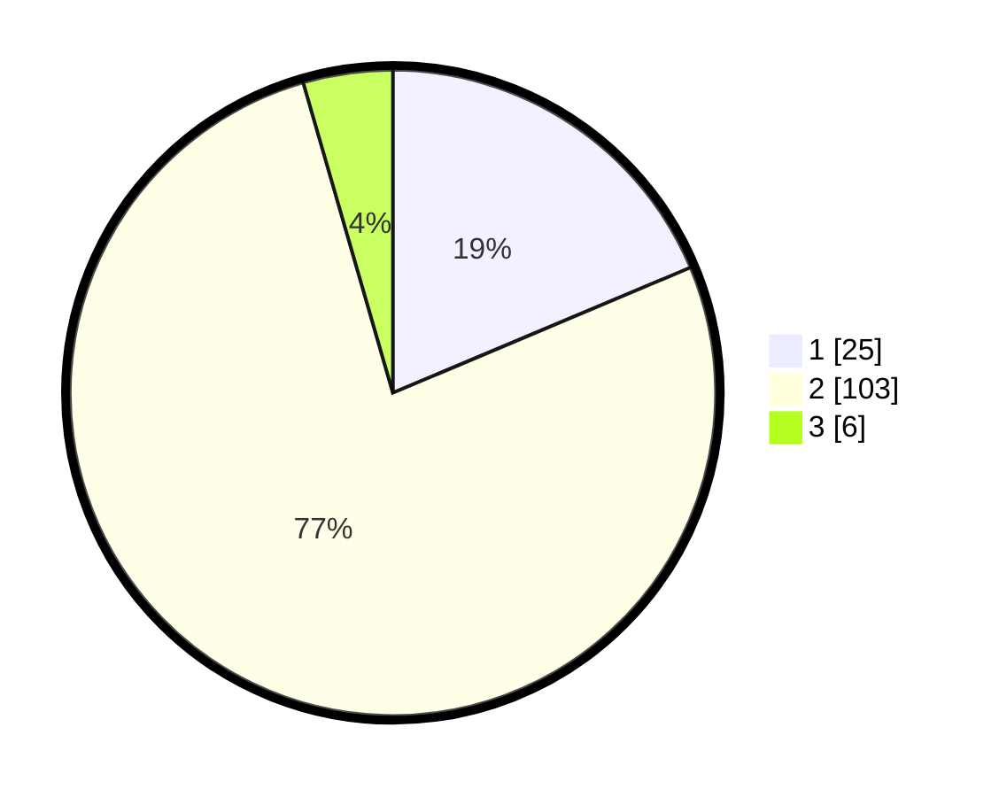

# Hasil

## Grafik

## Tabel

| No. | Nama Paslon    | Suara | Suara (raw) | Persentase |
|:--- |:-------------- | -----:| -----------:| ----------:|
| 1   | ANIES MUHAIMIN | 25    | [25][p-1]   | 18,66      |
| 2   | PRABOWO GIBRAN | 103   | [103][p-2]  | 76,87      |
| 3   | GANJAR MAHFUD  | 6     | [6][p-3]    | 4,48       |

[p-1]: https://github.com/gigit-pemilu/pemilu-2024-16-sumatera-selatan/blob/main/pilpres/hitung-suara/sub/16-sumatera-selatan/sub/02-ogan-komering-ilir/sub/23-teluk-gelam/sub/2006-cinta-marga/sub/002-tps/sub/paslon-1.txt
[p-2]: https://github.com/gigit-pemilu/pemilu-2024-16-sumatera-selatan/blob/main/pilpres/hitung-suara/sub/16-sumatera-selatan/sub/02-ogan-komering-ilir/sub/23-teluk-gelam/sub/2006-cinta-marga/sub/002-tps/sub/paslon-2.txt
[p-3]: https://github.com/gigit-pemilu/pemilu-2024-16-sumatera-selatan/blob/main/pilpres/hitung-suara/sub/16-sumatera-selatan/sub/02-ogan-komering-ilir/sub/23-teluk-gelam/sub/2006-cinta-marga/sub/002-tps/sub/paslon-3.txt

## Foto C Plano

https://sirekap-obj-formc.kpu.go.id/d519/pemilu/ppwp/16/02/23/20/06/1602232006002-20240214-215759--69d0c21e-ab26-4f69-afcb-bc5851d200fe.jpg

https://sirekap-obj-formc.kpu.go.id/d519/pemilu/ppwp/16/02/23/20/06/1602232006002-20240218-132815--839c9674-c7c5-4092-ac79-50f3483bb6fb.jpg

https://sirekap-obj-formc.kpu.go.id/d519/pemilu/ppwp/16/02/23/20/06/1602232006002-20240214-215835--8800cd12-bf3f-450e-a848-434d39d23d34.jpg

## Metadata

| Key        | Value               |
| ---------- | ------------------- |
| Time Stamp | 2024-02-19 11:00:00 |

