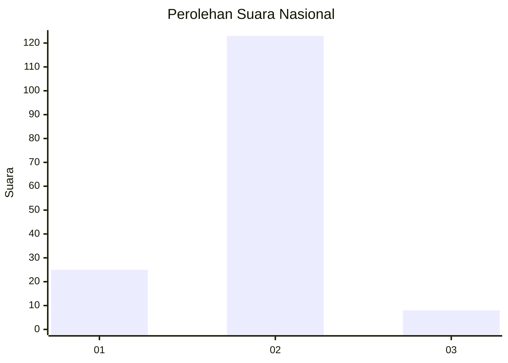
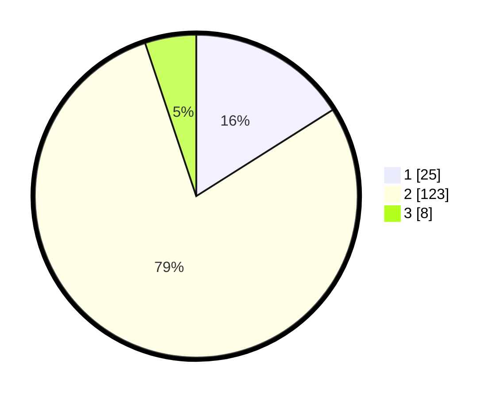

# Hasil

## Grafik

## Tabel

| No. | Nama Paslon    | Suara | Suara (raw) | Persentase |
|:--- |:-------------- | -----:| -----------:| ----------:|
| 1   | ANIES MUHAIMIN | 25    | [25][p-1]   | 16,03      |
| 2   | PRABOWO GIBRAN | 123   | [123][p-2]  | 78,85      |
| 3   | GANJAR MAHFUD  | 8     | [8][p-3]    | 5,13       |

[p-1]: https://github.com/gigit-pemilu/pemilu-2024/blob/main/pilpres/hitung-suara/sub/16-sumatera-selatan/sub/02-ogan-komering-ilir/sub/23-teluk-gelam/sub/2006-cinta-marga/sub/003-tps/sub/paslon-1.txt
[p-2]: https://github.com/gigit-pemilu/pemilu-2024/blob/main/pilpres/hitung-suara/sub/16-sumatera-selatan/sub/02-ogan-komering-ilir/sub/23-teluk-gelam/sub/2006-cinta-marga/sub/003-tps/sub/paslon-2.txt
[p-3]: https://github.com/gigit-pemilu/pemilu-2024/blob/main/pilpres/hitung-suara/sub/16-sumatera-selatan/sub/02-ogan-komering-ilir/sub/23-teluk-gelam/sub/2006-cinta-marga/sub/003-tps/sub/paslon-3.txt

## Foto C Plano

https://sirekap-obj-formc.kpu.go.id/135f/pemilu/ppwp/16/02/23/20/06/1602232006003-20240214-224942--55b3c77e-7c3c-41d1-ad3f-7fa0ef1afad2.jpg

https://sirekap-obj-formc.kpu.go.id/135f/pemilu/ppwp/16/02/23/20/06/1602232006003-20240214-225109--69e6e9ae-6cfe-4dd0-87ad-6055449d52b3.jpg

https://sirekap-obj-formc.kpu.go.id/135f/pemilu/ppwp/16/02/23/20/06/1602232006003-20240214-225315--7193a70a-8adc-4365-b781-6e6a31099ee0.jpg

## Metadata

| Key        | Value               |
| ---------- | ------------------- |
| Time Stamp | 2024-02-19 11:00:00 |

